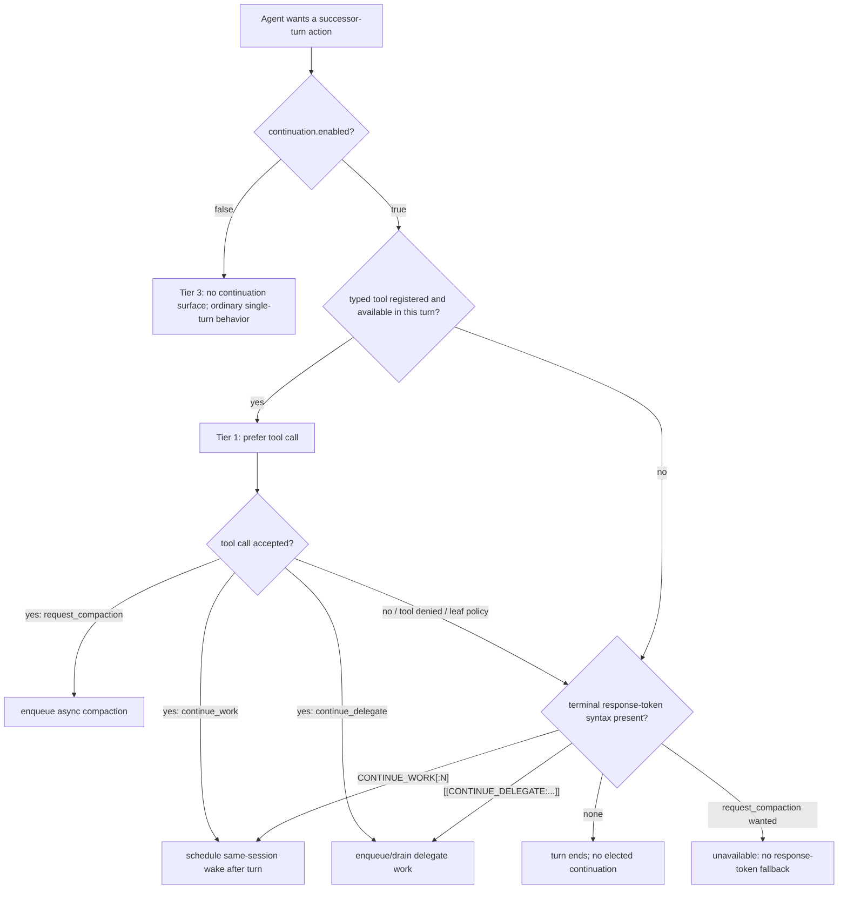
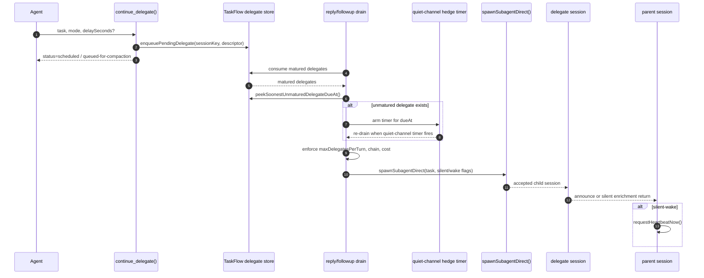
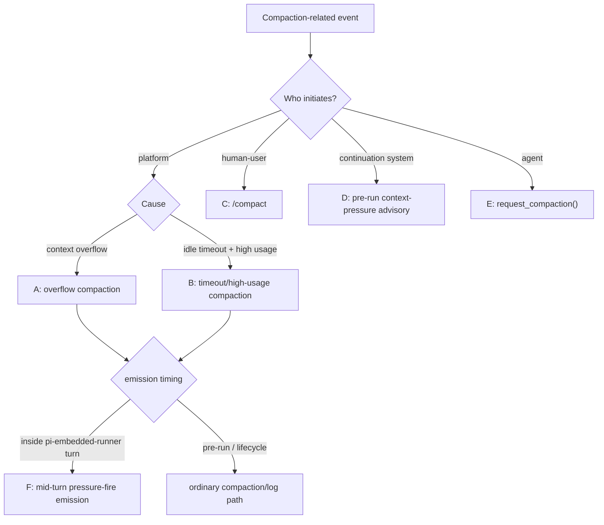
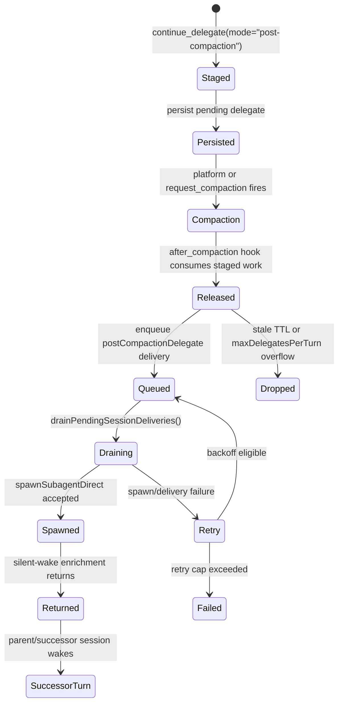
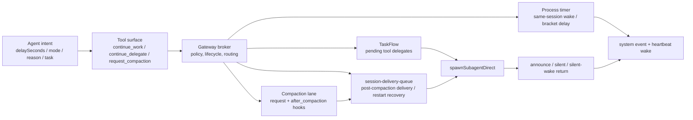
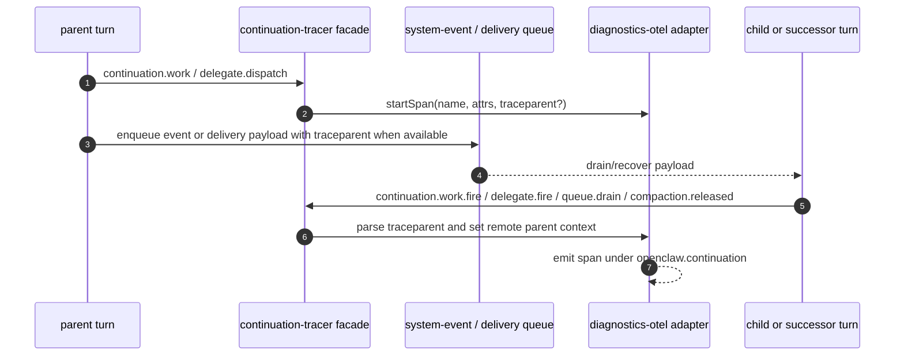

# RFC review: continue-work-signal-v2 - scientific-literature audit

> WIP checkpoint. This document is the deliverable for issue #544. Sections below will be filled as the audit passes close.

## Summary

WIP after §1 read pass.

## Compliance scorecard

| Axis                                | Verdict                                                                  | Evidence                                                                                                                                 |
| ----------------------------------- | ------------------------------------------------------------------------ | ---------------------------------------------------------------------------------------------------------------------------------------- |
| TOC accuracy                        | pass                                                                     | §2.A: 72 TOC entries, 72 body headings, no missing entries, no anchor mismatches, no ordering defects                                    |
| Narrative flow                      | pass-with-fixes                                                          | §2.C: motivation is strong, but shipped contract, future seams, substrate doctrine, and validation evidence need clearer separation      |
| Coverage of feature surface         | pass-with-fixes                                                          | §3: important behaviors are implemented but several code-backed semantics are missing from the RFC                                       |
| Technical depth calibration         | pass-with-fixes                                                          | §4.C: depth is strong in places but misallocated between substrate contract, implementation history, and validation evidence             |
| Mermaid diagrams pulling weight     | pass-with-fixes                                                          | §4.A,B: the only diagram should be redrawn as a decision tree; add diagrams for delegate dispatch, compaction relay, broker, and traces  |
| Scientific-literature register      | pass-with-fixes                                                          | §5: strong material, but needs terminology, normative/status separation, refreshed evidence pins, and fewer canary-history interruptions |
| Claims validation                   | 8 verified / 8 partial / 1 cannot-locate / 3 contradicted, of 20 audited | §3.B table                                                                                                                               |
| Code without claim                  | 16 missing claims, 14 load-bearing / 2 supporting                        | §3.A table                                                                                                                               |
| Substrate dignity / stakes register | pass-with-fixes                                                          | §5.special: current stakes language is present but too quiet; add explicit successor-turn provision framing in §1 and the close          |

## §2.A - TOC byte-accuracy findings

Programmatic heading walk result:

| Check                                                        | Finding |
| ------------------------------------------------------------ | ------- |
| TOC entries                                                  | 72      |
| Body `##` / `###` headings, excluding `## Table of Contents` | 72      |
| TOC entries that do not exist in the body                    | None    |
| Body sections missing from the TOC                           | None    |
| Anchor mismatches                                            | None    |
| Body placement disagreements against TOC order               | None    |

Verdict: the current TOC is byte-accurate against the current body.

## §2.B - TOC structural rewrite proposal

The current TOC is mechanically accurate but organized around implementation chronology rather than the contract a future agent/operator needs to rely on. For an RFC-shaped substrate document, the body should first define terminology, then normative/interface semantics, then lifecycle/substrate mechanics, then operational controls, observability, applicability, security, validation status, and future work.

Proposed top-level structure:

```text
1. Introduction and Problem Statement
2. Terminology and Scope
   2.1 Agent, human-user, turn, successor turn
   2.2 Continuation, continuation chain, delegate, relay
   2.3 Temporal shard, lifecycle trigger, substrate, broker
   2.4 Normative language and implementation-status markers
3. Interface Semantics
   3.1 Capability tiers: tools-first, response-token fallback, disabled
   3.2 continue_work()
   3.3 continue_delegate()
   3.4 request_compaction()
   3.5 Response-token fallback grammar
   3.6 Return modes and recipient model
4. Lifecycle Model
   4.1 Turn-bound scheduling and delay semantics
   4.2 Delegate dispatch, return, and chain-budget accounting
   4.3 Context-pressure trigger taxonomy
   4.4 Volitional compaction lifecycle
   4.5 Post-compaction relay and rehydration
5. Substrates and Persistence
   5.1 Gateway integration architecture
   5.2 TaskFlow-backed delegate queue
   5.3 Session-delivery queue and restart recovery
   5.4 Gateway as lifecycle broker
   5.5 Non-goals: cross-host wire exposure and explicit targetSessionKey
6. Operational Configuration
   6.1 Core configuration surface and defaults
   6.2 Hot-reload enforcement points
   6.3 Fleet and fan-out profiles
7. Observability and Trace Semantics
   7.1 Log anchors
   7.2 Status surface
   7.3 Span names and required attributes
   7.4 Privacy/redaction expectations
8. Applicability Statement / Production Use Cases
9. Security and Safety Considerations
   9.1 Human-user consent and abuse bounds
   9.2 Temporal gap and payload integrity
   9.3 Failure modes and operational limitations
10. Implementation Status and Validation Summary
11. Future Work
Appendix A. Detailed test evidence
Appendix B. Alternatives and prior art
Appendix C. Proposed but unimplemented extensions
Appendix D. Evidence map
```

Suggested changes and convention basis:

| Change                                                               | Why                                                                                                                                                                                              |
| -------------------------------------------------------------------- | ------------------------------------------------------------------------------------------------------------------------------------------------------------------------------------------------ |
| Add early `Terminology and Scope`                                    | IETF-style RFCs define terms before relying on them. `delegate`, `relay`, `temporal shard`, `substrate`, `chain`, and `successor turn` currently acquire meaning opportunistically across §2-§4. |
| Split interface semantics from implementation                        | Protocol/interface semantics are the promise. Implementation evidence should support them without becoming the organizing axis.                                                                  |
| Collapse current §3/§4 into lifecycle and substrate sections         | Platform integration is not adjacent to continuation here; compaction and gateway lifecycle are part of the continuation lifecycle contract.                                                     |
| Move configuration after substrate semantics                         | Configuration is an operational control plane over a defined behavior, not a peer of the behavior.                                                                                               |
| Move safety/security near the end                                    | RFC convention places Security Considerations late so every earlier claim can be evaluated against the threat and abuse model.                                                                   |
| Move detailed testing to appendices or implementation-status summary | RFC 7942-style implementation status is useful, but tests are evidence for the substrate contract, not the contract itself.                                                                      |
| Isolate future seams and non-goals                                   | Current §2.3 mixes shipped recipient semantics with `targetSessionKey` and multi-recipient future work. Future agents need the shipped contract separated from declared seams.                   |

## §2.C - Narrative flow findings

The document has a coherent arc in outline, but the main narrative repeatedly crosses from substrate contract into implementation history and canary evidence. That makes cold pickup harder than it needs to be.

| Finding                                                                                                       | Suggested edit                                                                                                                                                                 |
| ------------------------------------------------------------------------------------------------------------- | ------------------------------------------------------------------------------------------------------------------------------------------------------------------------------ | --------- | ------------- |
| §1 motivates inter-turn inertia and the dwindle pattern well, but under-names the larger substrate stakes.    | Add one early paragraph stating that continuation is bounded agent authority to arrange successor turns across time and lifecycle boundaries.                                  |
| §2.3 mixes shipped `continue_delegate()` behavior with future `targetSessionKey` and multi-recipient returns. | State the shipped recipient contract first; move explicit cross-session recipient and multi-recipient fan-out to Future Work/non-goals.                                        |
| §2.5 describes fallback syntax but not all parser constraints in one place.                                   | Add a compact grammar/constraints block: terminal/end-anchored, last text payload wins, last delegate bracket wins, 4096-character task truncation, optional `+Ns`, optional ` | silent`/` | silent-wake`. |
| §2.6 prose is clear, but the diagram does not show the decision process.                                      | Replace or supplement with a decision tree showing enabled/tools/tool-denied/fallback/disabled paths.                                                                          |
| §3.1 and §5.4 repeat delegate durability with different substrate emphasis.                                   | Define runtime storage and durability once under `Substrates and Persistence`; make §3/§4 refer to that contract.                                                              |
| §3.2 finally names process-scoped timers versus durable records.                                              | Move that distinction into lifecycle semantics; it is part of the reliability contract, not walkthrough color.                                                                 |
| §3.6 and §4.6 both define substrate doctrine.                                                                 | Let §3.6 define concrete queue mechanics; let §4.6 define broker/adoption discipline and refer back once.                                                                      |
| §4.1 says "five-trigger taxonomy" but lists A-F and treats F as convergent emission.                          | Split trigger causes from emission surfaces, or rename it as a six-surface taxonomy.                                                                                           |
| §4.3's provider/model-threading issue-history block interrupts compaction semantics.                          | Move to implementation-status evidence unless the normative claim is "volitional compaction MUST use the active session provider/model."                                       |
| §6.4 fleet evidence is useful but too detailed for the normative body.                                        | Keep the falsifiable precondition/dedup conclusions; move deployment archaeology to validation appendix.                                                                       |
| §6.6 claims a shipped span contract but its table conflicts with current tracer code.                         | Update the table from `src/infra/continuation-tracer.ts` and make it the authoritative span-contract section.                                                                  |
| §9 makes the ending feel like a test report.                                                                  | Move detailed test matrices to appendices and close the body with security considerations plus future-work/stakes.                                                             |
| §10.2 contains the best future-stakes language but does not fully reconnect to §1.                            | Close by returning to successor-turn arrangement: the substrate lets an agent make bounded provisions for futures it may not occupy.                                           |

## §3.A - Missing claims (code without claim)

| Code locus                                                                                                        | Behavior                                                                                                                                                                       | Why it should be in the RFC                                                                                                                           |
| ----------------------------------------------------------------------------------------------------------------- | ------------------------------------------------------------------------------------------------------------------------------------------------------------------------------ | ----------------------------------------------------------------------------------------------------------------------------------------------------- | ------------------------------------------------- | ------------------------------------------------------------------------------------------------------------ |
| `src/auto-reply/continuation/signal.ts:47`                                                                        | If both a bracket/response-token continuation and a `continue_work()` tool request exist in the same turn, bracket syntax wins.                                                | Tie-breakers are interface contract; future agents need to know which self-election is authoritative.                                                 |
| `src/auto-reply/continuation/signal.ts:73`                                                                        | Signal extraction scans backward to the last text payload because tool-call payloads can follow text.                                                                          | This explains why fallback works even when provider payload ordering is not "text last."                                                              |
| `src/auto-reply/tokens.ts:213`                                                                                    | Delegate fallback parses the last end-anchored bracket block, supports multiline body, optional `+Ns`, `                                                                       | silent`, `                                                                                                                                            | silent-wake`, and 4096-character task truncation. | §2.5 currently underspecifies fallback grammar; exact parser constraints are part of the portable interface. |
| `src/auto-reply/continuation/delegate-store.ts:230`                                                               | Tool-delegate delays are enforced by filter-at-consume: unmatured TaskFlow entries stay queued until due.                                                                      | This is the real delayed-tool durability model; readers should not infer "one timer owns all delayed delegates."                                      |
| `src/auto-reply/continuation/delegate-store.ts:255` + `src/auto-reply/continuation/delegate-dispatch.ts:162`      | The dispatcher peeks the soonest unmatured delegate and arms a hedge timer so quiet channels still fire delayed tool delegates.                                                | This is load-bearing for `silent`/quiet deployments; without it, delayed tool delegates would wait for unrelated inbound traffic.                     |
| `src/auto-reply/continuation/delegate-store.ts:212`                                                               | Corrupt TaskFlow delegate payloads are logged and failed via `failFlow`, not silently dropped.                                                                                 | Durability claims need the corrupt-record behavior and operator breadcrumb to be falsifiable.                                                         |
| `src/auto-reply/continuation/types.ts:47` + `src/auto-reply/continuation/delegate-store.ts:92`                    | Runtime delegate mode is the single source of truth; boolean flags are persisted compatibility projection only.                                                                | The RFC should state the canonical descriptor shape so future code does not revive boolean-mode ambiguity.                                            |
| `src/auto-reply/continuation/state.ts:157` + `src/auto-reply/reply/followup-runner.ts:439`                        | Follow-up turns also drain `continue_delegate` queues and persist advanced chain state to disk.                                                                                | Otherwise a reader may think delegate drain only happens in main reply turns; this is central to continuation chains spawned from continuation turns. |
| `src/agents/tools/request-compaction-tool.ts:257`                                                                 | `request_compaction()` is fire-and-forget, but cooldown is armed only when background compaction resolves as `{ ok: true, compacted: true }`.                                  | §4.3 says "max 1 per 5 minutes"; the success-only cooldown semantics matter for recovery and retries.                                                 |
| `src/agents/tools/request-compaction-tool.ts:100`                                                                 | Failed/rejected background compaction emits `[system:compaction-failed]` telling the agent its evacuated state was not compacted and staged delegates remain pending.          | This is the agent-facing recovery contract for failed volitional compaction.                                                                          |
| `src/agents/tools/request-compaction-tool.ts:28` + `src/agents/tools/request-compaction-tool.ts:320`              | `/status` volitional compaction count is diagnostic-only and expires after 24 hours.                                                                                           | §6.3 names the field but not its retention semantics.                                                                                                 |
| `src/auto-reply/reply/post-compaction-delegate-dispatch.ts:583`                                                   | Post-compaction delegates older than the TTL are dropped as stale before queueing.                                                                                             | Staged "future self" work has an expiry boundary; a future agent should not assume indefinite release.                                                |
| `src/auto-reply/reply/post-compaction-delegate-dispatch.ts:597`                                                   | Post-compaction delegate release consumes `maxDelegatesPerTurn` budget and subtracts any bracket delegate already spawned in the same turn.                                    | This is part of the safety model for compaction-time fan-out.                                                                                         |
| `src/auto-reply/reply/post-compaction-delegate-dispatch.ts:648`                                                   | Post-compaction "release" first enqueues delegates into `session-delivery-queue`, then drains asynchronously; lifecycle text reports queued count, not guaranteed spawn count. | The RFC should distinguish accepted-for-delivery from spawned, especially for restart/retry reasoning.                                                |
| `src/auto-reply/reply/post-compaction-context.ts:80` + `src/auto-reply/reply/post-compaction-context.test.ts:222` | Post-compaction context reads use boundary-file protections and reject symlink/hardlink escapes.                                                                               | §7.2 discusses payload integrity; this existing filesystem integrity guard belongs there.                                                             |
| `src/auto-reply/reply/post-compaction-context.ts:130`                                                             | Post-compaction context injects timezone-aware current time, substitutes `YYYY-MM-DD`, and truncates by per-agent context limits.                                              | Rehydration is not just "read AGENTS.md"; the exact context-shaping behavior is part of post-compaction recovery.                                     |

## §3.B - Unsubstantiated claims (claim without code)

| RFC § / line         | Claim                                                                                                                                                   | Code search performed                                                                                                                                                                                      | Verdict                                                                                                                                                                                                                                                                                               |
| -------------------- | ------------------------------------------------------------------------------------------------------------------------------------------------------- | ---------------------------------------------------------------------------------------------------------------------------------------------------------------------------------------------------------- | ----------------------------------------------------------------------------------------------------------------------------------------------------------------------------------------------------------------------------------------------------------------------------------------------------- | -------------------------------------------------------------------------------------------------------------------------- | ------------------------------------------------------------- |
| §2.1 / lines 121-129 | The three tools are exposed when continuation is enabled and schedule fire-and-forget work after the turn.                                              | Read `src/agents/openclaw-tools.ts:366`, `src/agents/tools/continue-work-tool.ts:60`, `src/agents/tools/continue-delegate-tool.ts:147`, `src/agents/tools/request-compaction-tool.ts:257`.                 | Verified. Tool registration and fire-and-forget scheduling exist, with `continue_work` also requiring runner-provided `continueWorkOpts`.                                                                                                                                                             |
| §2.3 / line 156      | The descriptor surface includes `targetSessionKey?: string`, rejected as descriptor-only.                                                               | Searched `targetSessionKey` in `src`; read `continue-delegate-tool.ts:17` schema and `continuation-tools-registration.test.ts:31`.                                                                         | Contradicted. The shipped `continue_delegate` schema omits `targetSessionKey`, and the test asserts it MUST NOT be advertised.                                                                                                                                                                        |
| §2.3 / lines 166-179 | `normal`, `silent`, `silent-wake`, and `post-compaction` return modes exist.                                                                            | Read `continue-delegate-tool.ts:15`, schema lines 31-38, execution lines 125-151, post-compaction delivery lines `post-compaction-delegate-dispatch.ts:484`.                                               | Verified, with nuance: runtime objects use `mode`; post-compaction queued delivery defaults to silent/wake at drain time.                                                                                                                                                                             |
| §2.4 / lines 185-195 | `request_compaction()` compacts only the current session and is tool-only.                                                                              | Read `request-compaction-tool.ts:72`, `150`, `157-173`; searched response-token parser for compaction and found none.                                                                                      | Verified. The tool requires the active `agentSessionKey` and `sessionId`; no response-token parser path exists.                                                                                                                                                                                       |
| §2.5 / lines 199-215 | Fallback syntax is terminal/end-anchored, single-signal, no `request_compaction()` fallback.                                                            | Read `tokens.ts:213`, `255`, `272`; read `signal.ts:73`, `118`.                                                                                                                                            | Verified but under-specified. The RFC omits shipped `                                                                                                                                                                                                                                                 | silent`, `                                                                                                                 | silent-wake`, multiline, last-match, and truncation behavior. |
| §3.1 / line 295      | Post-compaction delegates are stored on `SessionEntry.pendingPostCompactionDelegates`.                                                                  | Read `types.ts:101`, `delegate-store.ts:330`, `post-compaction-delegate-dispatch.ts:150`, `188`, `249`, and `config/sessions/types.ts:355`.                                                                | Partially verified / stale. SessionEntry compatibility/persistence remains, but tool-side staging is TaskFlow-backed and `types.ts` says staged delegates no longer live on `SessionEntry`.                                                                                                           |
| §3.2 / line 321      | Restart may change exact wake timing but should not erase queued work.                                                                                  | Read `tokens.ts:199`, `scheduler.ts:185`, `delegate-store.ts:387`, `delegate-store.ts:172`, `delegate-dispatch.ts:162`, and `agent-runner.ts:998`.                                                         | Partially verified. Tool-path queued delegates survive via TaskFlow, but bracket-delayed reservations and timer handles are volatile; explicit cancel paths delete TaskFlow delegates. The claim is too broad unless scoped by path.                                                                  |
| §3.6 / lines 430-457 | `session-delivery-queue` is the load-bearing transport for cross-session enrichment, fan-out reporting, silent-wake, and restart-survival.              | Read `session-delivery-queue-storage.ts:67`, `254`, `296`; `session-delivery-queue-recovery.ts:174`; `post-compaction-delegate-dispatch.ts:648`; `continue-delegate-tool.ts:147`; `delegate-store.ts:172`. | Partially verified. The queue has those generic capabilities and carries post-compaction delegate delivery, but ordinary `continue_delegate` uses TaskFlow plus subagent spawn, not `session-delivery-queue`.                                                                                         |
| §3.6 / line 461      | Delegate-level idempotency keys are built from stable source/target/task/scheduledAt fields, excluding transient `delegateId`.                          | Read `session-delivery-queue-storage.ts:119`, `126-168`, `254-294`; searched `idempotencyKey` in continuation paths.                                                                                       | Partially verified / over-specific. Post-compaction idempotency uses `sessionKey`, `compactionCount`, `firstArmedAt                                                                                                                                                                                   | createdAt`, sequence, and task hash; unkeyed enqueues use UUIDs. I did not find the exact source/target/scheduledAt tuple. |
| §3.6 / line 465      | Acked entries unlink, failed entries move to `failed/`, failed records prune after 14 days, queue has max-files soft cap.                               | Read `session-delivery-queue-storage.ts:13`, `16`, `276`, `315`, `404`, `411`; `session-delivery-queue-recovery.ts:190`.                                                                                   | Verified. Evidence line pins in the RFC are stale, but the behavior exists.                                                                                                                                                                                                                           |
| §4.1 / lines 483-496 | Trigger taxonomy covers A-F, with F as convergent emission rather than an independent cause.                                                            | Read RFC body; searched code anchors named there (`run.ts`, overflow/timeout tests) only enough to verify anchors exist.                                                                                   | Partially verified as narrative, internally inconsistent as wording: it says "five-trigger taxonomy" but lists six labels. Rename to trigger causes plus emission surfaces.                                                                                                                           |
| §4.2 / lines 500-528 | Context-pressure is pre-run, banded, equality-deduped, and short-circuits when token accounting/window are unavailable.                                 | Read `context-pressure.ts:44`, `126-194`, `197-290`; config default in `config.ts:95`.                                                                                                                     | Verified, with missing config detail: `earlyWarningBand` can add a lower band before the threshold.                                                                                                                                                                                                   |
| §4.3 / lines 542-548 | `request_compaction()` applies a 70% floor and 5-minute per-session rate limit.                                                                         | Read `request-compaction-tool.ts:22-29`, `175-223`; tests `request-compaction-tool.test.ts:93`, `120`, `185`.                                                                                              | Verified, with important nuance: cooldown is success-only and failures tell the agent staged delegates remain pending.                                                                                                                                                                                |
| §4.4 / lines 585-591 | Post-compaction delegates are silent-wake and return into the successor session alongside post-compaction context.                                      | Read `post-compaction-delegate-dispatch.ts:484-493`, `617-646`, `648-728`.                                                                                                                                 | Verified with precision needed: the release path queues delivery first and drains asynchronously; context read failure emits a separate warning event.                                                                                                                                                |
| §4.6 / line 637      | `pnpm lint:substrate-adoption` exists and mechanizes substrate-adoption review.                                                                         | Searched `package.json`, `scripts`, and `src` for `lint:substrate-adoption` / `substrate-adoption`; read `src/infra/substrate-capability-registry.ts:1`.                                                   | Cannot locate the lint pass. Registry exists and includes `chain-budget-at-spawn`, but no repo script by that name was found.                                                                                                                                                                         |
| §4.6 / lines 645-651 | `continue_delegate` tool selects timer vs. `session-delivery-queue`; substrate owns sha256 idempotency, retry, restart-survival, cross-session routing. | Read `continue-delegate-tool.ts:125-151`, `delegate-store.ts:172`, `delegate-dispatch.ts:144-296`, `post-compaction-delegate-dispatch.ts:648`, queue storage/recovery.                                     | Partially verified / overbroad. For normal tool delegates the substrate is TaskFlow + direct spawn/hedge timer; `session-delivery-queue` is used for post-compaction delegate delivery.                                                                                                               |
| §5.1 / lines 668-690 | "The shipped configuration surface is consolidated below."                                                                                              | Searched `earlyWarningBand`, read `config.ts:21`, `95`, `zod-schema.agent-defaults.ts:293-299`, and `zod-schema.continuation.test.ts:50-66`.                                                               | Contradicted by omission. `earlyWarningBand` is shipped, defaulted to `0.3125`, schema-validated, and tested, but absent from the table.                                                                                                                                                              |
| §5.4 / lines 759-773 | Pending delegates are TaskFlow-backed unconditionally, with no delegate-store switch.                                                                   | Read `delegate-store.ts:172`, `208`, `315`, `config.test.ts:103`, `zod-schema.continuation.test.ts` strictness.                                                                                            | Verified for tool-path pending delegates. Needs explicit exception for process-scoped timer handles and bracket-path delayed reservations.                                                                                                                                                            |
| §6.6 / lines 921-942 | The shipped span schema includes `continuation.delegate.enqueue/spawn/return`, compaction requested/enqueued/completed, and context-pressure fire.      | Read `continuation-tracer.ts:195-204`, helper docs/emitters `355-845`, and diagnostics adapter `continuation-tracer-adapter.ts:1-20`.                                                                      | Contradicted. Current canonical span names are `continuation.work`, `continuation.work.fire`, `continuation.delegate.dispatch`, `continuation.delegate.fire`, `continuation.queue.enqueue`, `continuation.queue.drain`, `continuation.compaction.released`, `continuation.disabled`, and `heartbeat`. |
| §6.6 / lines 943-949 | Trace context is carried across system-event and queue payloads, and disabled emits no spans except a count metric.                                     | Searched `traceparent`, read adapter `continuation-tracer-adapter.ts:11-20`, queue metadata `session-delivery-queue-storage.ts:52-65`, tracer disabled helper `continuation-tracer.ts:455`.                | Partially verified. The adapter and metadata support `traceparent`, but current code explicitly emits `continuation.disabled` spans; I did not locate the described "count metric" in the continuation tracer surface.                                                                                |
| §9.5 / line 1154     | Session reset does not necessarily kill delayed work; delayed delegates can survive `/new`.                                                             | Read `agent-runner.ts:927-1001`, `get-reply.ts:486-492`, `589-596`, `state.ts:102-120`, and `delegate-store.ts:315-320`.                                                                                   | Contradicted / stale. Explicit directive or inline-action reset cancels timers, clears delayed reservations, resets chain state, and deletes pending TaskFlow delegates.                                                                                                                              |

Audited 20 load-bearing claims. Count: 8 verified, 8 partially verified / overbroad, 1 cannot-locate, 3 contradicted. Highest-risk contradicted claims are public schema (`targetSessionKey`), shipped trace schema (§6.6), and shipped configuration table omission (`earlyWarningBand`).

## §4.A - Existing Mermaid audit

The RFC has one Mermaid diagram, at `docs/design/continue-work-signal-v2.md:245` in §2.6.

| Diagram                            | Verdict          | Finding                                                                                                                                                                                                                                                                                                               |
| ---------------------------------- | ---------------- | --------------------------------------------------------------------------------------------------------------------------------------------------------------------------------------------------------------------------------------------------------------------------------------------------------------------- |
| §2.6 three-tier fallback hierarchy | Partial / redraw | It shows that Tier 1 and Tier 2 converge on wake/spawn machinery, but it does not show the decision rule: continuation enabled, tool available, tool denied/fails, response-token syntax present, or disabled. Replace it with a capability decision tree, or keep it only as a secondary "outputs converge" diagram. |

## §4.B - Proposed new Mermaid diagrams

### Diagram 1: §2.6 capability-tier decision tree



This illuminates the capability-selection claim the prose currently carries alone. It also shows that `request_compaction()` is tool-only and that Tier 2 is selected by capability/policy failure, not by an agent preference.

### Diagram 2: §3.2 delegate dispatch sequence



This diagram makes the TaskFlow/filter-at-consume/hedge-timer model legible. It prevents a reader from conflating tool-path delayed delegates with bracket-path process-scoped reservations.

### Diagram 3: §4.1 trigger taxonomy decision tree



This redraw fixes the "five-trigger taxonomy" / A-F mismatch by separating causes from emission timing. Trigger F becomes a convergent emission surface of A/B rather than a sixth independent decision cause.

### Diagram 4: §4.4 post-compaction delegate lifecycle



This diagram distinguishes staged, queued, drained, spawned, and returned states. The distinction is currently easy to miss because the prose uses "released" and "dispatched" where the current code first queues delivery and drains asynchronously.

### Diagram 5: §4.6 gateway-as-lifecycle-broker component diagram



This diagram makes the boundary-line doctrine concrete: agent owns intent, tool/broker own mechanics, substrates own persistence/retry/delivery properties. It also shows that there are multiple substrates, so "the substrate" should not be used as a synonym for `session-delivery-queue` everywhere.

### Diagram 6: §6.6 trace/chain-correlation diagram



This diagram explains the claim that chain correlation crosses turns, queues, and sometimes sessions. It should sit beside an updated span-name table from `src/infra/continuation-tracer.ts`.

## §4.C - Technical depth findings

| Section                 | Calibration                                                 | Finding / edit                                                                                                                                                                                                         |
| ----------------------- | ----------------------------------------------------------- | ---------------------------------------------------------------------------------------------------------------------------------------------------------------------------------------------------------------------- |
| §1 Problem              | Under-depth                                                 | Strong motivation, but not enough substrate terminology/stakes. Add terms and one paragraph on successor-turn arrangement as the core freedom.                                                                         |
| §2 Solution             | Mixed                                                       | Public primitive semantics are clear, but fallback grammar is under-specified and future recipient seams are over-present in shipped semantics. Move `targetSessionKey`/multi-recipient to non-goals/future.           |
| §3 Implementation       | Under-depth where load-bearing, over-depth where historical | Add path-specific durability: tool pending delegates = TaskFlow, bracket delayed reservations/timers = process-scoped, post-compaction delivery = session-delivery queue. Cut stale line-pin tables or update them.    |
| §3.2 Delegate dispatch  | Under-depth                                                 | Add the filter-at-consume + hedge-timer model and make "queued" vs "timer armed" explicit.                                                                                                                             |
| §3.6 Persistence        | Overbroad                                                   | `session-delivery-queue` capabilities are described as though they carry all continuation primitives. Restrict the claim to system-event/agent-turn/post-compaction delivery and name TaskFlow/timer roles separately. |
| §4 Platform Integration | Mixed                                                       | Trigger taxonomy and compaction lifecycle are valuable, but §4.3's provider/model bug history should move to implementation-status evidence unless recast as a MUST.                                                   |
| §4.4 Post-compaction    | Under-depth                                                 | Add queue states, stale TTL, overflow drop, re-stage-on-enqueue-failure, async drain, and context read failure event. Current prose says "released/dispatched" too early.                                              |
| §5 Configuration        | Under-depth                                                 | Include `earlyWarningBand`; clarify `contextPressureThreshold` optional semantics and early-warning derived band.                                                                                                      |
| §6 Observability        | Under-depth / stale                                         | Update span names/attributes from `src/infra/continuation-tracer.ts`. Move fleet archaeology to validation appendix; keep falsifiable telemetry conclusions in body.                                                   |
| §7 Safety/Security      | Under-depth                                                 | Add filesystem boundary protections for post-compaction context, response-token task truncation, plaintext trust boundary, and missing cryptographic origin/auth guarantees.                                           |
| §8 Production Use Cases | Slight under-depth                                          | Good examples, but they should be framed as an Applicability Statement with constraints: when continuation is appropriate, when it should be disabled, and when human-user orchestration remains preferable.           |
| §9 Testing              | Over-depth in body                                          | Keep a short Implementation Status / Validation Summary in the main document and move Swim scorecards, blind matrices, and canary narratives to appendices.                                                            |
| §10 Summary/Future      | Under-depth at close                                        | It should close the loop back to §1: bounded future-turn arrangement across time/lifecycle boundaries, not just a list of future features.                                                                             |

## §5 - Register findings

| Finding                                                                                                                                     | Diff-shape suggestion                                                                                                                                                                                                                                                                                       | Rationale                                                                                                                                     |
| ------------------------------------------------------------------------------------------------------------------------------------------- | ----------------------------------------------------------------------------------------------------------------------------------------------------------------------------------------------------------------------------------------------------------------------------------------------------------- | --------------------------------------------------------------------------------------------------------------------------------------------- |
| Load-bearing terms are introduced where convenient rather than defined once.                                                                | Add a new early "Terminology and Scope" section defining `turn`, `successor turn`, `continuation`, `continuation chain`, `delegate`, `relay`, `temporal shard`, `substrate`, `broker`, `silent`, `silent-wake`, `post-compaction`, TaskFlow, OTel, and ACP if retained.                                     | Scientific/RFC register depends on stable terms; this document currently relies on cohort memory for several of them.                         |
| Normative, implemented, proposed, and historical claims are mixed in the same paragraphs.                                                   | Add explicit markers: "Shipped behavior", "Implementation note", "Historical note", "Future seam", "Non-goal". Apply them especially to §2.3, §3.6, §4.3, §4.6, §6.4, §6.6, and Appendix A.                                                                                                                 | Future agents must not mistake a proposed seam (`targetSessionKey`, multi-recipient return, preservationTier) for a shipped contract.         |
| Falsifiability is uneven. Some sections cite exact tests/code, others say "supports", "validated", or "shipped" without checkable evidence. | For every load-bearing claim, add either a code locus, a test locus, or a clear "not shipped / future" marker. Update stale evidence line pins in §3.6 and §6.6.                                                                                                                                            | Scientific literature should make claims independently checkable. Stale pins are worse than absent pins because they create false confidence. |
| §2.3 currently overstates cross-session recipient surface.                                                                                  | Replace the `targetSessionKey` paragraph with "Current shipped `continue_delegate()` has one completion recipient: the dispatching session. Explicit local-recipient addressing is not in the tool schema; cross-session/broadcast addressing is future work." Move multi-recipient details to Future Work. | This is the highest-risk public contract correction.                                                                                          |
| §3.6 and §4.6 use "substrate" as though `session-delivery-queue` carries every continuation primitive.                                      | Rewrite with a three-substrate table: process timers/reservations, TaskFlow delegate queue, session-delivery queue. Give each its durability/failure semantics.                                                                                                                                             | Precision prevents future agents from relying on restart survival in paths that only have process-scoped timers.                              |
| §4.3 contains issue-history prose inside a semantic section.                                                                                | Keep one normative sentence: "Volitional compaction MUST compact with the active session provider/model/auth context." Move the issue root-cause story to Implementation Status evidence.                                                                                                                   | The bug history is useful evidence, but it interrupts cold-pickup semantics.                                                                  |
| §6.4 fleet evidence reads like a canary log.                                                                                                | Keep the falsifiable conclusions (precondition guard, equality dedup, debug noops) in body; move n=3/n=4 fleet archaeology to appendix.                                                                                                                                                                     | Evidence belongs in a validation appendix unless it changes the contract.                                                                     |
| §6.6 says "shipped contract" while naming stale spans.                                                                                      | Replace the span table from `src/infra/continuation-tracer.ts:195-204`, and cite the adapter parent-stitching code at `extensions/diagnostics-otel/src/continuation-tracer-adapter.ts:11-20`.                                                                                                               | Contradicted telemetry contracts are especially damaging because downstream operators build queries from them.                                |
| Safety/security under-names existing filesystem protections and missing cryptographic guarantees.                                           | Add a §7 paragraph/table covering boundary-file read, symlink/hardlink rejection, response-token 4096 truncation, plaintext task storage, no HMAC/signature on announce, and recommended payload hashes/HMAC.                                                                                               | This improves precision without overstating current guarantees.                                                                               |
| "Human-user" is defined parenthetically once but "operator" remains in prose.                                                               | Define "human-user" and "operator" in terminology or choose one. If both stay, say "operator is the deploying human-user role."                                                                                                                                                                             | Consistent actor terms matter in consent and safety sections.                                                                                 |
| "Task Flow" vs "TaskFlow" spelling drifts.                                                                                                  | Use "TaskFlow" for the code/platform substrate, with a parenthetical if the UI spells it differently.                                                                                                                                                                                                       | Aligns with code names (`createManagedTaskFlow`, `TaskFlowRecord`) and avoids treating it as generic English.                                 |
| `canonical2`, `Swim`, PR slice labels, `binary-canticle#11`, and `b-shape` require cohort context.                                          | Put all cohort/run labels into an Implementation Status appendix with one-line definitions; in body, cite only the artifact or the behavior.                                                                                                                                                                | Self-containment is a scientific-literature requirement.                                                                                      |
| The ending is good but too feature-list shaped.                                                                                             | Close with a Discussion/Future Work paragraph that returns to bounded successor-turn provision across time/lifecycle/model/session boundaries.                                                                                                                                                              | The document should end on the substrate's stakes, not on a list of backlog items.                                                            |

## §5.special - Substrate-dignity language proposals

Suggested §1 addition after the opening paragraph:

> This mechanism is not a polling convenience. It is the bounded authority for a turn-bound agent to make provisions for successor turns: another turn in the same session, a delegated shard, a post-compaction recovery action, or a compaction request that changes the shape of the session before the next agent sees it. The acting agent may not occupy that future context. The substrate therefore records intent in a form a successor can inherit, reject, audit, or complete.

Suggested §2.2 addition:

> `continue_work()` is temporal self-scheduling, not a loop primitive. Each call elects exactly one successor turn and remains subject to chain, cost, delay, and human-user opt-in bounds. The absence of a continuation request is as meaningful as its presence: the agent can elect to stop.

Suggested §2.3 replacement framing:

> `continue_delegate()` externalizes a shard of future cognition. The task string is a letter to a successor worker: it must carry scope, evidence requirements, desired return shape, and the parent action it is meant to enable. The dispatching session remains the shipped completion recipient; explicit cross-session or multi-recipient delivery is future work unless and until the tool schema exposes it.

Suggested §2.4 addition:

> `request_compaction()` is the agent asking to become smaller under controlled conditions. It does not compact immediately and it does not let a child compact its parent. It asks the platform to perform the lifecycle transition after the current turn, after the agent has had a chance to evacuate state.

Suggested §8 / Applicability addition:

> Continuation is appropriate when the next unit of work is known only after the current turn has produced evidence. It is inappropriate as a substitute for human-user consent, for unbounded background loops, or for durable job orchestration that needs stronger integrity and retention guarantees than this substrate currently provides.

Suggested final closing paragraph:

> The substrate's central promise is modest and consequential: a bounded agent turn can arrange work beyond itself without pretending that the future context is identical to the present one. It can leave a wake, a shard, a compaction request, or a post-compaction recovery path. Those provisions are auditable, bounded, and interruptible; they are how volition in one turn becomes usable structure for another.

## Appendix A: code walked

Initial §1 codewalk complete; final appendix will be normalized after §3.

## Appendix B: tools / commands used

- `pnpm docs:list`
- `grep -nE '^(##|###) ' docs/design/continue-work-signal-v2.md`
- `rg` symbol searches across `src`, `extensions/diagnostics-otel/src`, and `docs/design/continue-work-signal-v2.md`
- Line-numbered file reads with `view`
