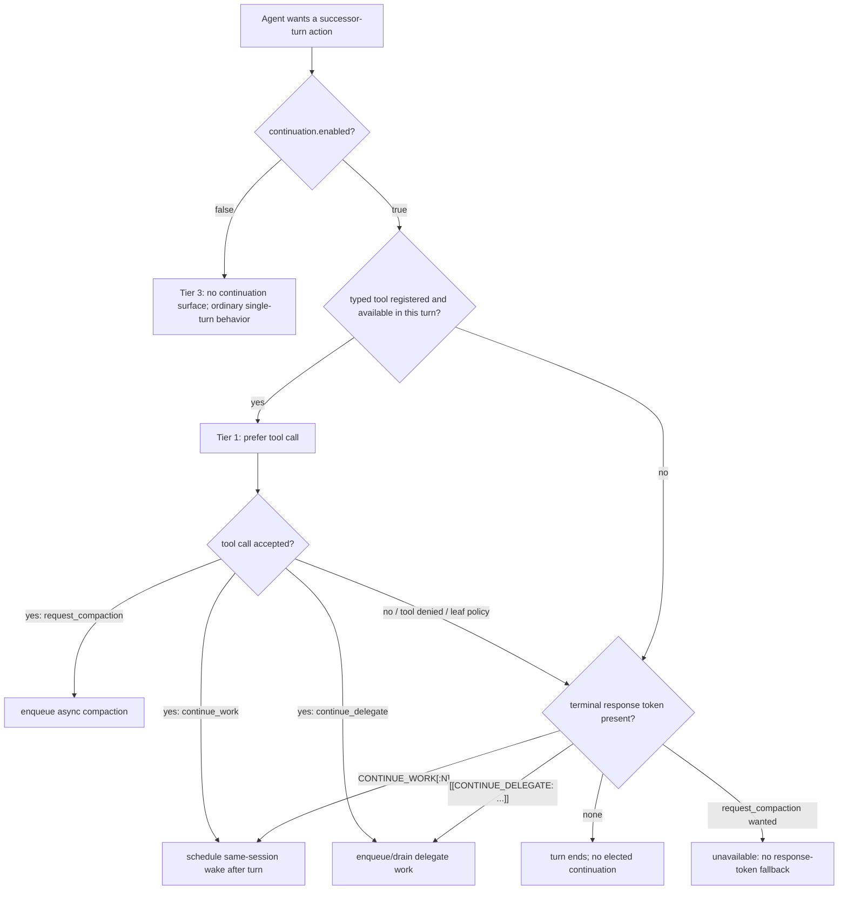
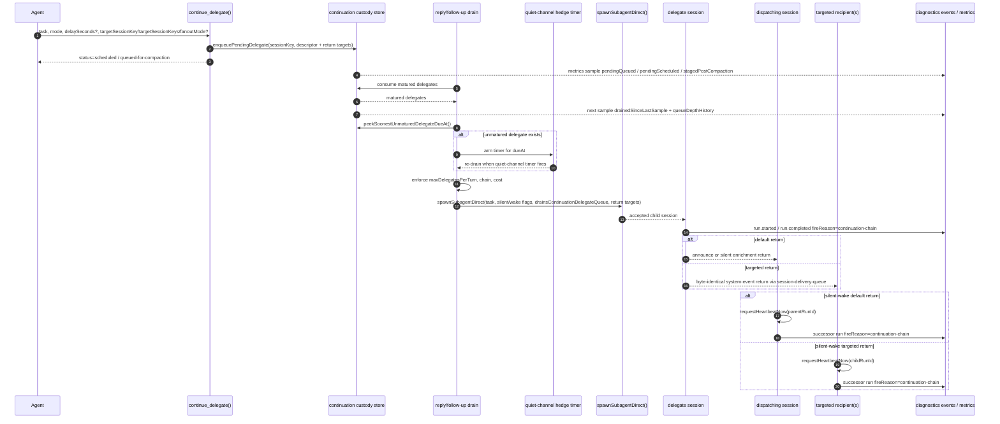
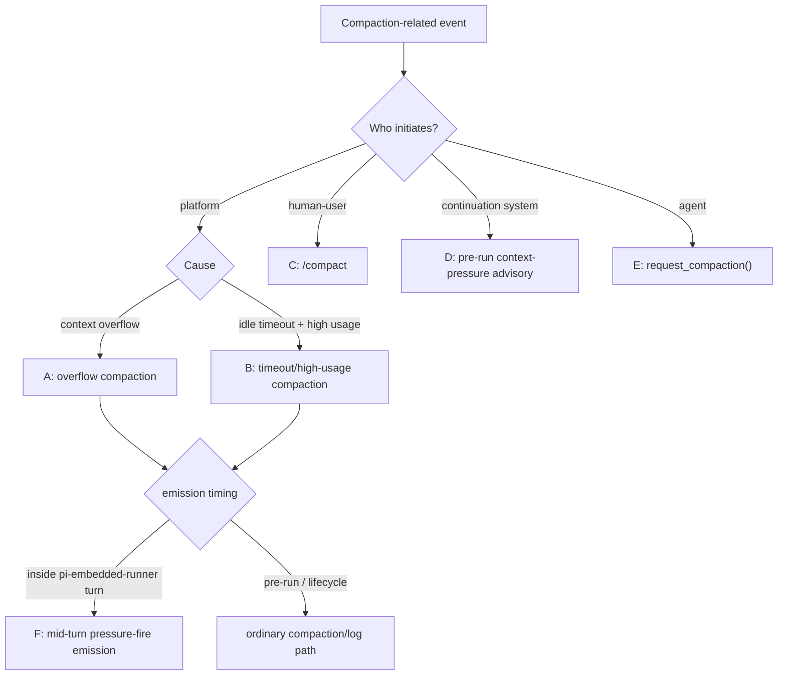
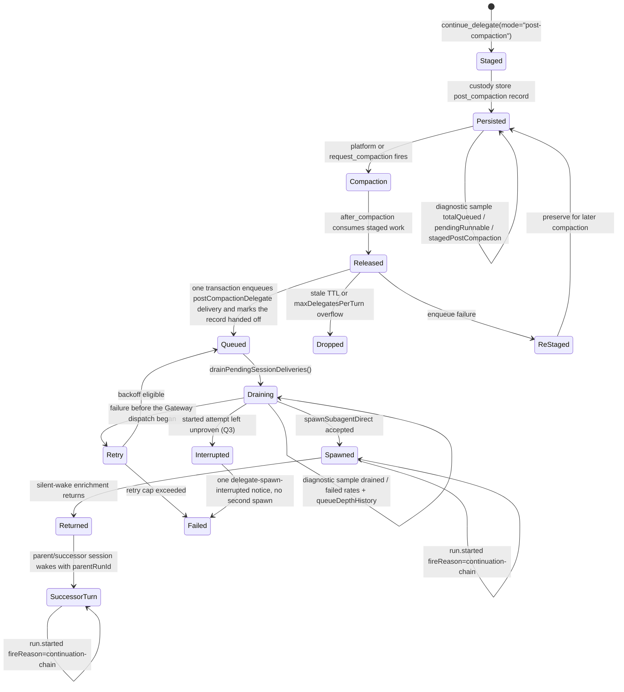
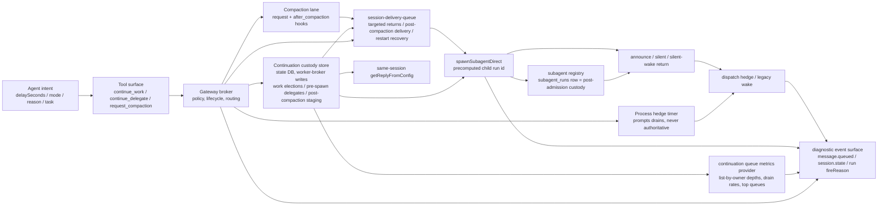
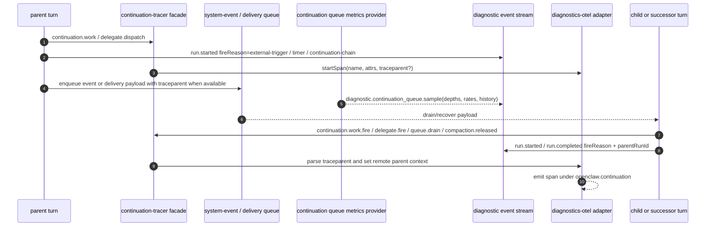

# RFC: Agent Self-Elected Turn Continuation (`CONTINUE_WORK`)

**Status:** Implemented; durable custody revision for the TaskFlow removal decided in prince review, 2026-09-29 (see §5.4)
**Authors:** OpenClaw maintainers
**Date:** March–May 2026; custody revision September 2026

> **Custody revision (September 2026).** Upstream removed the Tasks and TaskFlow runtime in openclaw/openclaw#159179 (`6652f7eac8`). The `flow_runs` table survives, but nothing reads it at runtime any more. This revision re-homes the continuation's durable custody onto owners that upstream kept, and it keeps the public continuation contract. §5.4 is the design of record: the field-by-field replay state, the single transactional authority for elections, the pre-spawn to `subagent_runs` handoff, and the migration of stored TaskFlow rows. Sections marked **Custody revision** describe the target design. 🌊 Ronan approved its architecture and decided its open questions in the prince review ([#1412 comment 5887753300](https://github.com/karmaterminal/openclaw/issues/1412#issuecomment-5887753300), 2026-09-29), and those rulings are folded in. Where they differ from the code that shipped on TaskFlow, the section says so. Upstream citations are `path:symbol@4d8c9bdd`. The companion decision record is `docs/design/continue-work-post-taskflow-decisions.md`.

This RFC documents a continuation system for persistent OpenClaw sessions. It introduces self-elected turn continuation, delegated follow-up work, same-host targeted delegate returns, context-pressure awareness, and agent-initiated compaction. The implementation is bounded, observable, interruptible, and opt-in.

This mechanism is not a polling convenience. It gives a turn-scoped agent limited authority to make provisions for successor turns: another turn in the same session, a delegated shard, a targeted return to another session, a post-compaction recovery action, or a compaction request that changes the shape of the session before the next agent sees it. The acting agent may not occupy that future context. The substrate therefore records intent in a form a successor can inherit, reject, audit, or complete.

Targeted delegate return is the banner routing primitive: one child can grant another session a turn, wake every known session on the host, or drip silent context into a named session without duplicating the delegate run. That makes continuation a signaling substrate as well as a work-scheduling substrate.

## Table of Contents

- [1. Problem](#1-problem)
  - [1.1 Inter-turn inertia](#11-inter-turn-inertia)
  - [1.2 The dwindle pattern](#12-the-dwindle-pattern)
  - [1.3 Requirements for a continuation primitive](#13-requirements-for-a-continuation-primitive)
- [2. Solution](#2-solution)
  - [2.1 Terminology and scope](#21-terminology-and-scope)
  - [2.2 Unified interface: tools first, response-token fallback](#22-unified-interface-tools-first-response-token-fallback)
  - [2.3 `continue_work()` semantics](#23-continue_work-semantics)
  - [2.4 `continue_delegate()` semantics and return modes](#24-continue_delegate-semantics-and-return-modes)
  - [2.5 `request_compaction()` semantics](#25-request_compaction-semantics)
  - [2.6 Response-token fallback and token interaction](#26-response-token-fallback-and-token-interaction)
  - [2.7 Capability-tier hierarchy](#27-capability-tier-hierarchy)
  - [2.8 Design rationale](#28-design-rationale)
- [3. Implementation](#3-implementation)
  - [3.1 Architecture](#31-architecture)
  - [3.2 Delegate dispatch walkthrough](#32-delegate-dispatch-walkthrough)
  - [3.3 Announce payloads and chain tracking](#33-announce-payloads-and-chain-tracking)
  - [3.4 Tool implementation and prompt gating](#34-tool-implementation-and-prompt-gating)
  - [3.5 Temporal sharding with context attachments](#35-temporal-sharding-with-context-attachments)
  - [3.6 Persistence and restart-survival](#36-persistence-and-restart-survival)
- [4. Platform Integration](#4-platform-integration)
  - [4.1 Two-layer compaction model and trigger taxonomy](#41-two-layer-compaction-model-and-trigger-taxonomy)
  - [4.2 Context-pressure awareness](#42-context-pressure-awareness)
  - [4.3 `request_compaction()` in the compaction lifecycle](#43-request_compaction-in-the-compaction-lifecycle)
  - [4.4 Continuation relay and post-compaction context rehydration](#44-continuation-relay-and-post-compaction-context-rehydration)
  - [4.5 Lifecycle hooks and platform settings](#45-lifecycle-hooks-and-platform-settings)
  - [4.6 Gateway as lifecycle broker](#46-gateway-as-lifecycle-broker)
- [5. Configuration](#5-configuration)
  - [5.1 Core configuration surface](#51-core-configuration-surface)
  - [5.2 Human-user profiles](#52-human-user-profiles)
  - [5.3 Wide fan-out patterns](#53-wide-fan-out-patterns)
  - [5.4 Continuation custody after the TaskFlow removal](#54-continuation-custody-after-the-taskflow-removal)
- [6. Observability](#6-observability)
  - [6.1 Diagnostic log anchors](#61-diagnostic-log-anchors)
  - [6.2 Lifecycle traces](#62-lifecycle-traces)
  - [6.3 `/status` continuation telemetry](#63-status-continuation-telemetry)
  - [6.4 Context-pressure telemetry and fleet evidence](#64-context-pressure-telemetry-and-fleet-evidence)
  - [6.5 Human-user observability and hot reload](#65-human-user-observability-and-hot-reload)
  - [6.6 Chain-correlation via diagnostics-otel](#66-chain-correlation-via-diagnostics-otel)
  - [6.7 OTEL trace wiring across the substrate queue boundary](#67-otel-trace-wiring-across-the-substrate-queue-boundary)
  - [6.8 Trace-context propagation across the continuation lifecycle](#68-trace-context-propagation-across-the-continuation-lifecycle)
- [7. Safety and Security](#7-safety-and-security)
  - [7.1 Guardrails and human-user consent](#71-guardrails-and-human-user-consent)
  - [7.2 Temporal gap and payload integrity](#72-temporal-gap-and-payload-integrity)
- [8. Applicability Statement and Production Use Cases](#8-applicability-statement-and-production-use-cases)
  - [8.1 Persistent development workflows](#81-persistent-development-workflows)
  - [8.2 Background research and scheduled follow-up](#82-background-research-and-scheduled-follow-up)
  - [8.3 Ambient self-knowledge and quiet enrichment](#83-ambient-self-knowledge-and-quiet-enrichment)
  - [8.4 Long-running creative and synthesis loops](#84-long-running-creative-and-synthesis-loops)
- [9. Testing](#9-testing)
  - [9.1 Test strategy and terminology](#91-test-strategy-and-terminology)
  - [9.2 Functional coverage](#92-functional-coverage)
  - [9.3 Blind enrichment methodology](#93-blind-enrichment-methodology)
  - [9.4 Integration test session results](#94-integration-test-session-results)
  - [9.5 Major findings from live validation](#95-major-findings-from-live-validation)
- [10. Discussion and Future Work](#10-discussion-and-future-work)
  - [10.1 Summary](#101-summary)
  - [10.2 Future directions](#102-future-directions)
- [Appendix A. Extension contracts and future seams](#appendix-a-extension-contracts-and-future-seams)
  - [A.1 Bounded pre-compaction evacuation window](#a1-bounded-pre-compaction-evacuation-window)
  - [A.2 Compaction-triggered evacuation delegate](#a2-compaction-triggered-evacuation-delegate)
  - [A.3 Proposed `context_pressure` lifecycle hook](#a3-proposed-context_pressure-lifecycle-hook)
  - [A.4 Proposed configuration values not shipped in the current codebase](#a4-proposed-configuration-values-not-shipped-in-the-current-codebase)
  - [A.5 Typed `continue_delegate()` on-dispatch input attachments (#1192)](#a5-typed-continue_delegate-on-dispatch-input-attachments-1192)
  - [A.6 Managed delegate return claims and recipient arrival context (#666)](#a6-managed-delegate-return-claims-and-recipient-arrival-context-666)
- [Appendix B. Alternatives, prior art, and tool comparisons](#appendix-b-alternatives-prior-art-and-tool-comparisons)
  - [B.1 Alternatives considered](#b1-alternatives-considered)
  - [B.2 Prior art](#b2-prior-art)
  - [B.3 `continue_delegate()` compared with `sessions_spawn`](#b3-continue_delegate-compared-with-sessions_spawn)
  - [B.4 Async-only volitional compaction: design decision](#b4-async-only-volitional-compaction-design-decision)
- [Appendix C. Failure modes and behavioral limitations](#appendix-c-failure-modes-and-behavioral-limitations)
  - [C.1 Operational failure modes](#c1-operational-failure-modes)
  - [C.2 Inherited behavioral limitations](#c2-inherited-behavioral-limitations)
- [Appendix D. Detailed implementation evidence](#appendix-d-detailed-implementation-evidence)
  - [D.1 Context-pressure inclusion sketch](#d1-context-pressure-inclusion-sketch)
  - [D.2 Evidence locations](#d2-evidence-locations)
  - [D.3 Historical integration test session results](#d3-historical-integration-test-session-results)
  - [D.4 Current validation cycle: v5.2 substrate verification](#d4-current-validation-cycle-v52-substrate-verification)
- [Appendix E. Draft upstream issue: register native spawns before acknowledging](#appendix-e-draft-upstream-issue-register-native-spawns-before-acknowledging)

## 1. Problem

### 1.1 Inter-turn inertia

Existing mechanisms for keeping an OpenClaw agent active—heartbeat timers, cron-scheduled wake-ups, loop instructions in system prompts authored by the **human-user** or operator—all work by injecting **external** events on a fixed schedule. They solve the liveness problem: the agent wakes up periodically. They do not solve the **volition** problem: the agent cannot say, mid-work, “I need another turn.” It can only wait for the next scheduled tick.

This distinction matters for three reasons.

First, **context cost.** A heartbeat instruction such as “check all open issues and work on them” occupies space in the context window on every turn, including turns where there is nothing to check. Over thousands of turns and repeated compaction cycles, this static instruction accumulates as the dominant repeated signal in the agent’s working memory—biasing attention toward the polling task and away from the work at hand. The repetition does not merely consume tokens; it shapes what the agent attends to.

Second, **token waste.** Timer-driven polling burns tokens on empty cycles. An agent heartbeating every 60 seconds but with genuine work only once per hour executes 59 empty turns for every productive one.

Third, **granularity.** A cron timer fires on a schedule. The agent knows _during its turn_ whether it has more work. The timer does not know until the next tick. The gap between “I know I have more to do” and “the timer will wake me in 58 seconds” is the inter-turn inertia.

### 1.2 The dwindle pattern

This produces the **dwindle pattern**: an agent with active work in flight decays toward inactivity between unrelated external events. Momentum is lost, context continuity weakens, and work that could have proceeded immediately instead waits for an accidental wake-up.

Observed in production across 4 persistent agent sessions, this pattern consumed substantial productive time each day. The failure mode was not absence of capability; it was absence of an explicit inter-turn continuation primitive.

### 1.3 Requirements for a continuation primitive

A usable continuation primitive for OpenClaw had to satisfy several constraints simultaneously:

1. **Volitional control.** The agent must be able to elect to continue and also elect to stop. This is not an infinite loop with a termination check; it is a choice at each turn boundary.
2. **Same-session continuity.** The common case should preserve the session rather than forcing every continuation through a new child session.
3. **Delegated continuation.** The design must support sub-agent work for cases where a future result, not merely another blank turn, is what matters.
4. **Compaction awareness and preemptive context evacuation.** Persistent sessions need a way to prepare for compaction before the platform forces it.
5. **Bounded operation.** The feature must remain interruptible, rate-limited, observable, and explicitly enabled by the human user.
6. **Fallback behavior.** The mechanism must still work when tools are unavailable, including environments that only allow terminal response tokens.

## 2. Solution

### 2.1 Terminology and scope

This RFC uses the following terms consistently:

| Term                           | Meaning                                                                                                                                                                                                                                                                                             |
| ------------------------------ | --------------------------------------------------------------------------------------------------------------------------------------------------------------------------------------------------------------------------------------------------------------------------------------------------- |
| **human-user**                 | The person who owns the deployment, grants opt-in, and can interrupt or disable continuation.                                                                                                                                                                                                       |
| **operator**                   | The deploying human-user role when discussing configuration, logs, or runtime policy.                                                                                                                                                                                                               |
| **turn**                       | One model generation cycle with a bounded prompt, tool surface, and reply/follow-up lifecycle.                                                                                                                                                                                                      |
| **successor turn**             | A later turn that receives structure arranged by an earlier turn: a wake, a delegate result, post-compaction context, or a compaction outcome.                                                                                                                                                      |
| **continuation**               | Agent-elected work that crosses a turn boundary without becoming an unbounded loop.                                                                                                                                                                                                                 |
| **continuation chain**         | The bounded sequence of successor turns and delegates tracked by chain count, token budget, and chain id where available.                                                                                                                                                                           |
| **delegate**                   | A sub-agent shard spawned through `continue_delegate()` or response-token fallback, with a task string, mode, return targeting (`targetSessionKey`, `targetSessionKeys`, or `fanoutMode`), and optional delay. The typed tool can also carry scoped input attachments into the new child workspace. |
| **relay**                      | A precursor or fallback pattern where one session wakes another by returning a result later.                                                                                                                                                                                                        |
| **temporal shard**             | Work split across time rather than only across simultaneous agents.                                                                                                                                                                                                                                 |
| **substrate**                  | The mechanism that carries a continuation path: process timer/reservation, the continuation custody store, the session-delivery queue, the subagent registry, or the compaction lifecycle.                                                                                                          |
| **broker**                     | Gateway code that translates agent intent into substrate mechanics and policy enforcement.                                                                                                                                                                                                          |
| **continuation custody store** | The continuation-owned records in the shared state database. They hold same-session `continue_work` elections, pre-spawn delegates and post-compaction staging, and are written only through state-database worker operations (§5.4). It replaces TaskFlow, which upstream removed in #159179.      |
| **custody handoff**            | The point at which a delegate stops being owned by the continuation custody store and becomes a `subagent_runs` row in the subagent registry (§5.4.4).                                                                                                                                              |
| **TaskFlow** (retired)         | The managed-work substrate that held continuation state until #159179. Its `flow_runs` rows are read only by the one-time Doctor import in §5.4.5.                                                                                                                                                  |
| **OTel**                       | OpenTelemetry trace emission through `extensions/diagnostics-otel`.                                                                                                                                                                                                                                 |

Status markers:

- **Shipped behavior** names current runtime and schema contracts.
- **Implementation note** explains how the contract is carried today without making the implementation shape the public contract.
- **Historical note** records why a decision exists, but is not itself normative.
- **Future seam** names plausible extension points that are not shipped.
- **Custody revision** names the post-TaskFlow target design from §5.4. It is proposed until the princes accept it.
- **Non-goal** explicitly excludes behavior from the current RFC.

### 2.2 Unified interface: tools first, response-token fallback

The implemented solution exposes three continuation capabilities as tools on main-session turns when `continuation.enabled: true`, with fallback response tokens when tools are unavailable.

| Capability             | Primary interface      | Fallback                            | Purpose                                                                      |
| ---------------------- | ---------------------- | ----------------------------------- | ---------------------------------------------------------------------------- |
| Self-elected next turn | `continue_work()`      | `CONTINUE_WORK` / `CONTINUE_WORK:N` | Schedule another turn for the current session                                |
| Delegated work         | `continue_delegate()`  | `[[CONTINUE_DELEGATE: ...]]`        | Dispatch work to a sub-agent, preserve chain semantics, and route the return |
| Volitional compaction  | `request_compaction()` | None                                | Request compaction after preparatory work                                    |

All three tools are fire-and-forget. They schedule their action and return immediately. The current turn continues to completion normally; the follow-up action occurs only after the turn ends.

This yields a strict two-interface model:

- **Primary path:** typed tools with validation, multiple calls per turn where appropriate, and explicit schemas.
- **Fallback path:** response tokens that work when tools are disabled by human-user policy, unavailable to a given depth, or fail in the current turn.

### 2.3 `continue_work()` semantics

`continue_work()` is the same-session continuation primitive.

**Purpose:** request another turn for the current session after an optional delay.

`continue_work()` is temporal self-scheduling, not a loop primitive. Each accepted call elects one successor turn and remains subject to chain, cost, delay, and human-user opt-in bounds. The absence of a continuation request is as meaningful as its presence: the agent can elect to stop.

**Behavior:** calling `continue_work()` schedules a future turn and the current turn completes normally. The call does not terminate the active turn, and it does not force an immediate second generation inside the same turn.

If `delaySeconds` is 30 and the current turn is still active, the 30-second timer starts **after turn completion**, not when the tool call is emitted. The same timing model applies to the `CONTINUE_WORK:30` response token.

**Shipped behavior:** same-session continuation is a durable election. The tool form and the response-token fallback both converge on one `continuation_work` record. That record holds the session key, hop, delay, semantic due time, election time, anchor-finalization time, reason, origin run and turn, the parent run when there is true spawn lineage, and chain metadata. In-process timers are hedge timers only. They may mature a due record promptly, but they are not the source of truth. Gateway startup recovery re-arms or matures queued work from the durable record.

**Custody revision:** the `continuation_work` record moves from a TaskFlow `flow_runs` row (`core/continuation-work` controller) to a `work` record in the continuation custody store (§5.4). That store is the only transactional authority for elections: election, replacement of parked work, claim, the delivered mark, requeue, terminalization and the terminal-notice obligation are all compare-and-set writes in that one store. Session pending inputs and cron are **not** election authorities (§5.4.3). Every field listed above keeps its meaning and moves as listed in §5.4.2.

When a `continuation_work` row matures while the session is idle, the dispatcher grants a turn to the **same session** directly through the universal reply executor (`getReplyFromConfig`) with a `[continuation:wake]` system event and provenance banner. When the semantic due time arrives while a later turn for the same session is already active, the row does not stack a naked later wake and does not re-anchor its delay. Instead, the dispatcher delivers one trusted `[system:continuation-note]` into the active turn, quotes the original reason as prior intent, includes age/overdue and origin provenance, instructs the successor to re-evaluate before acting, and terminalizes the row only after durable note delivery succeeds. It does not call `requestHeartbeatNow()` or `runHeartbeatOnce()`, because heartbeat registration, active-hours, deferral, and busy skip gates are heartbeat policy rather than same-session continuation policy. The session-store entry must still exist when the row matures, so sub-agent cleanup and archive sweeps retain child sessions with live or recently granted continuation work.

**Safety model:** the scheduled continuation remains subject to chain-length and token-budget guards. If the current self-continuation chain has already exhausted its configured `maxChainLength` or `costCapTokens` budget within the unbroken self-chain, the call is rejected and the agent may stop, persist state to files, or choose another recovery path. (A fresh non-continuation turn-entry — genuine user message, heartbeat, or external system event — resets the chain budget per the per-turn chain-reset semantic in §3.3; the budgets bound unattended-loop depth, not session lifetime.)

### 2.4 `continue_delegate()` semantics and return modes

`continue_delegate()` is the delegated continuation primitive.

**Purpose:** dispatch a sub-agent with typed task, mode, and delay parameters, then route its completion back into the parent continuation chain.

`continue_delegate()` externalizes a shard of future cognition. The task string is a letter to a successor worker: it must carry scope, evidence requirements, desired return shape, and the parent action it is meant to enable.

**Shipped behavior:** the current tool schema exposes `task`, `delaySeconds`, `mode`, `targetSessionKey`, `targetSessionKeys`, `fanoutMode`, `returnOptions`, `recipientContext`, `model`, `attachments`, and `attachAs`. The default completion recipient remains the session that dispatched the delegate. Explicit target fields route the same completion envelope through the `session-delivery-queue` substrate to other known sessions on the same host. Delegates using `normal` mode and no explicit target keep the existing visible announce behavior; targeted returns are delivered as session-addressed enrichment events so one delegate completion can fan out byte-identically without duplicating the delegate run.

Typed input attachments use this shape:

```ts
attachments: Array<{
  name: string;
  content: string;
  encoding?: "utf8" | "base64";
  mimeType?: string;
}>;
attachAs?: {
  mountPath?: string;
};
```

These fields carry scoped input into the **new child delegate workspace**. The workspace is the child execution workspace selected by the shared spawn contract—the target-agent workspace or an explicit child `cwd`. Per-session isolation comes from the private UUID receipt directory; this feature does not provision a separate workspace for every child. An accepted non-empty attachment array is a bounded snapshot **by value at tool dispatch**, not a source path, URL, workspace scan, or later-resolved reference. An omitted or empty `attachments` array means no snapshot. Non-empty arrays contain 1–50 entries. An omitted or empty `attachAs` object means no mount hint, and a mount hint is ignored unless `attachments` is non-empty. A non-empty `mountPath` is trimmed to its canonical value before durable enqueue and accepts only ASCII letters, digits, `.`, `_`, `-`, `/`, and `:`; unsafe or control-bearing hints are rejected. The hint affects only the child prompt—it is not an alternate materialization destination.

The fields use the same validation, limits, private receipt directory, per-file hashes, cleanup policy, and `tools.sessions_spawn.attachments` configuration as `sessions_spawn` attachments. Immediate, delayed/recovered, and post-compaction typed delegates retain the snapshot until child spawn or a crash-safe post-compaction queue handoff. The snapshot bytes do not sit in the durable record. They live in a private payload file under `<stateDir>/attachments/continuation/<attachmentId>/payload.json` (at most 8 MiB), and the file is bound to its record ID and owner session. The durable record carries only `attachmentId` and `attachmentCount`. Terminal records keep lifecycle and routing state, but they drop `attachmentId`, and the payload file is released. **Custody revision:** the owning record moves from a TaskFlow row to a continuation custody store `delegate` record (§5.4). New payload files live under a separate root, `<stateDir>/attachments/continuation-custody/`. A C-era build's orphan reconcile scans only `attachments/continuation/`, so a rollback never deletes new files. Imported records keep their legacy `flow_id` as their record ID. The import copies each bound payload file into the new root before committing the record, so the binding holds without rewriting the payload (§5.4.5). Custody passes to the subagent registry's own `attachmentId` receipt directory at the custody handoff (§5.4.4). Newly persisted `continue_delegate` tool calls replace each `attachments[].content` value with the established redaction marker, remove each private attachment filename, and preserve only the task plus replay-safe encoding/MIME metadata; `attachAs` is projected to its single mount-path field and removed when no non-empty snapshot exists. A legacy already-redacted snapshot that retains `name` remains replay-safe as-is, so signed historical turns are not mutated or dropped. This does not change the separate trusted-transcript behavior of `sessions_spawn`. Post-compaction queue recovery runtime-validates the discriminated payload and strict attachment members. Malformed records are dead-lettered with structural-only diagnostics, and their raw queue JSON is replaced so attachment bytes do not remain in the failed row. The tool result reports only attachment count and canonical mount options, never attachment content.

The `attachments` and `attachAs` fields are an input contract, not an attachment-bearing return contract. Managed output artifacts use the shipped claim path instead: `returnOptions` activates a host-owned policy, the child explicitly publishes bounded candidates with `delegate_artifacts_publish`, and recipients receive metadata-only claim projections plus arrival context through durable continuation return delivery. Authorized recipients explicitly list, inspect, materialize, or discard claims. This path does not reuse input attachments, copy payload bytes into the return envelope, auto-mount bytes, prompt-inject bytes, channel-upload them, or generically render or forward them; those automatic byte-presentation surfaces remain future work.

**What the target fields do — and explicitly do not — do.** Every `continue_delegate()` call spawns a fresh sub-agent owned by the dispatcher (a new session under `agent:<targetAgentId>:subagent:<UUID>`). The fresh sub-agent receives the `task` body, runs it, and produces a completion envelope. The `targetSessionKey`, `targetSessionKeys`, and `fanoutMode` fields control **where that completion envelope is delivered** when the fresh sub-agent finishes. They do not redirect the task body, they do not wake an existing session's run loop with the original task, and they do not route work into a named live-attached recipient. A live-attached recipient named via `targetSessionKey` will see only the post-completion `[continuation:enrichment-return]` envelope; it will never see the original `task` string from this primitive.

Probes that test for task-routing semantics (for example, asking the named target to reply with a unique nonce on its bound channel) will observe zero nonce hits and a reply emitted from a fresh subagent UUID. That observation is consistent with the shipped contract; it is not evidence of a routing bug. Cross-session task delivery — addressing an existing session's run loop with a new prompt — is a separate primitive that is out of scope for this RFC.

On the recipient's next turn, the reply runner drains that session-scoped system-event queue and prepends the completion envelope as `System:` context. In `silent-wake` mode the return also requests a `delegate-return` heartbeat for every targeted recipient, so a dormant channel-bound session can wake, consume its own enrichment copy, and produce normal turn output informed by that context. The target is not expected to echo the completion nonce verbatim unless its next turn independently chooses to do so.

The shipped return-target modes are:

1. **Default:** omit targeting fields and return to the dispatching session.
2. **Single other session:** set `targetSessionKey` to return to one explicitly addressed session, such as a root or depth-1 ancestor.
3. **Multiple sessions:** set `targetSessionKeys` to return one byte-identical completion envelope to every listed session.
4. **Tree fan-out:** set `fanoutMode: "tree"` to return to every ancestor in the current sub-agent/continuation chain.
5. **Host fan-out:** set `fanoutMode: "all"` to return to every known session on the same host.

Multi-recipient return is distinct from multi-delegate fan-out: multi-delegate fan-out runs N delegates that may produce N different artifacts; multi-recipient return runs one delegate and delivers the same completion envelope to N recipients. Aspect multiplexing, per-receiver transformation, backpressure-aware multicast, cross-host publish/subscribe, and SeedLink-style broadcast remain the higher broadcast layer; they do not replace this shipped session-addressed return primitive.

Compared with the delegate response token, `continue_delegate()` adds three core properties:

1. **Multi-delegate fan-out.** Multiple calls in one turn can dispatch multiple delegates in parallel.
2. **Typed parameters.** Delay, mode, task, return targets, and input attachments are schema-validated rather than parsed from free text.
3. **Tool-surface discoverability.** The tool is presented directly in the agent’s available interface when enabled.

The delegate return modes are:

| Mode               | Channel echo | Wake parent           | Use case                                                                          |
| ------------------ | ------------ | --------------------- | --------------------------------------------------------------------------------- |
| `normal` (default) | ✅           | ✅                    | Standard delegate completion                                                      |
| `silent`           | ❌           | ❌                    | Passive enrichment that should color a later turn without waking immediately      |
| `silent-wake`      | ❌           | ✅                    | Quiet background cognition that should trigger the next turn automatically        |
| `post-compaction`  | ❌           | ✅ (after compaction) | Evacuation or resume work that should be released only after compaction completes |

**`silent:`** the sub-agent result is delivered through `enqueueSystemEvent()` instead of the normal announce path. Internally, the `silentAnnounce` flag threads through spawn and registry paths to gate the delivery decision point. The parent absorbs the result on a later turn but is not woken.

**`silent-wake:`** channel output remains suppressed, but the return triggers a generation cycle through `requestHeartbeatNow()`. This enables quiet background processing without visible channel noise.

**`post-compaction:`** the delegate is staged on the session until compaction completes, then released into the successor session alongside workspace boot files and post-compaction lifecycle context.

**`model:`** an optional provider/model override for the spawned delegate, for example `github-copilot/claude-sonnet-4.6`. Omitted — or the sentinel value `"default"` — leaves the delegate inheriting the dispatching session's model, which is the existing, fully backward-compatible behavior. Supplied, it routes the fresh sub-agent to that provider/model so a parent can cost-route a fan-out (for example an Opus parent dispatching Sonnet or Haiku children). This is the delegate-side twin of `sessions_spawn(model)` and shares its contract: the model string is not validated at dispatch time; unknown refs resolve, or fail, downstream when the sub-agent is spawned. `model` composes with every return mode, with `delaySeconds`, with `post-compaction` staging, and with the response-token fallback.

The delegate response token uses the same targeting contract for fallback/directive paths:

```text
[[CONTINUE_DELEGATE: task | target=session-key]]
[[CONTINUE_DELEGATE: task | targets=key1,key2,key3]]
[[CONTINUE_DELEGATE: task | fanout=tree]]
[[CONTINUE_DELEGATE: task | fanout=all]]
[[CONTINUE_DELEGATE: task | model=provider/model]]
[[CONTINUE_DELEGATE: task | model=sonnet | fanout=tree]]
```

The response-token form does **not** accept inline attachment blobs. Text such as `attachment=...` remains part of the delegate task; it is not parsed into an attachment field. A token-path task may refer to a file that already exists in the shared workspace, but models and callers must not treat `attachment=` as supported token syntax. `continue_work()` also has no attachment fields.

Without `silent-wake`, parent-orchestrated chain hops can stall. In canary testing, enrichment arrived successfully but did not trigger hop 2 until an unrelated external message arrived six minutes later.

### 2.5 `request_compaction()` semantics

`request_compaction()` is the agent-initiated compaction primitive.

**Purpose:** allow the agent to prepare working state, then request compaction on its own schedule rather than waiting for overflow.

`request_compaction()` is the agent asking to become smaller under controlled conditions. It does not compact immediately and it does not let a child compact its parent. It asks the platform to perform the lifecycle transition after the current turn, after the agent has had a chance to evacuate state.

**Behavior:** the tool enqueues compaction and returns immediately. The current turn finishes normally; compaction runs between turns on the same path used by platform compaction.

`request_compaction()` operates on **the current session only**. If a delegate calls `request_compaction()`, it compacts the delegate’s session, not the parent. This isolation is intentional: a child should not compact the parent session through an inadvertent tool call.

The tool has no response-token fallback. Volitional compaction is tool-only in the current design.

`request_compaction()` works in concert with context-pressure awareness (§4.2) and post-compaction delegate release (§4.4): the agent notices rising pressure, prepares working state, stages recovery delegates, and then elects compaction. The three capabilities together form a volitional compaction lifecycle—awareness, preparation, and execution—all under agent control.

The intended lifecycle has three pressure points:

1. **Initial context-window evaluation.** When a session is new to a context window, the platform can establish the habit of regular evacuation: save useful working shape early, not only at crisis time.
2. **Rising pressure.** As context usage grows, advisory events should make evacuation more salient and let the agent choose between staging recovery work, writing durable notes, or requesting compaction at a time it controls.
3. **High pressure.** At roughly 90% and above, the advisory should make elective `request_compaction()` the obvious safe option. Choosing compaction before the hard overflow boundary is usually better than being compacted at window exhaustion, possibly mid-turn.

This cycle is the **lich pattern**: the agent electively arranges the payload that should enrich its successor after compaction. It is a savegame for after compaction, chosen by the agent rather than imposed by the platform. Over dozens or hundreds of compactions, the session can keep re-creating the working shape it chose to preserve: files, staged delegates, silent returns, and post-compaction recovery tasks.

### 2.6 Response-token fallback and token interaction

When tools are unavailable, the continuation system falls back to terminal response tokens:

```text
CONTINUE_WORK                 → schedule another turn with default delay
CONTINUE_WORK:30              → schedule another turn 30 seconds after turn completion
[[CONTINUE_DELEGATE: <task>]] → dispatch a delegate sub-agent
DONE                          → default inert state until another external event
```

The term **response token** covers both bare terminal tokens such as `CONTINUE_WORK` and delimited body-carrying tokens such as `[[CONTINUE_DELEGATE: ...]]`. The square brackets are only the delimiter for the delegate token body; they are not a separate interface.

Limitations of response-token fallback:

- One continuation signal per response.
- End-anchored parsing.
- No multi-delegate fan-out in a single turn.
- No fallback form for `request_compaction()`.

Parser constraints are part of the portable interface:

- The runner scans backward to the last text payload before parsing, because tool-call payloads may follow the response text.
- Response tokens take precedence over a same-turn `continue_work()` tool request when both exist.
- The delegate parser matches the last end-anchored `[[CONTINUE_DELEGATE: ...]]` block and supports multiline task bodies.
- Delegate fallback accepts an optional `+Ns` suffix for spawn delay; optional `| silent` / `| silent-wake` suffixes; optional `| target=...`, `| targets=...`, or `| fanout=tree|all` return-target directives; and an optional `| model=<provider/model>` override that routes the spawned delegate to a specific model (omitted => inherit the parent session's model). Example: `[[CONTINUE_DELEGATE: task | model=sonnet | fanout=tree]]`. The model string is not validated at parse time; an empty `model=` value is rejected as malformed.
- Delegate fallback has no attachment directive. `attachment=...` is ordinary task text; reference an existing workspace file or use the typed tool instead.
- Delegate fallback task text is truncated to 4096 characters, matching the tool schema.
- `CONTINUE_WORK` accepts an optional integer seconds suffix as `CONTINUE_WORK:N`.

`NO_REPLY` is a silence token, not a continuation token. Ordering matters: if the turn should be silent and also schedule continuation, the continuation token must remain terminal in the raw response so the continuation parser sees it first; after stripping that continuation token, `NO_REPLY` must be the only remaining displayed text.

Token interaction remains straightforward:

| Raw response shape                           | Behavior                                                                             |
| -------------------------------------------- | ------------------------------------------------------------------------------------ |
| `NO_REPLY` then terminal `CONTINUE_WORK`     | Strip continuation, leave `NO_REPLY`, suppress channel output, schedule continuation |
| `HEARTBEAT_OK` then terminal `CONTINUE_WORK` | Acknowledge heartbeat, then schedule continuation                                    |
| Response text then terminal `CONTINUE_WORK`  | Deliver response text, then schedule continuation                                    |
| `CONTINUE_WORK` alone                        | Schedule continuation with no substantive response text                              |

### 2.7 Capability-tier hierarchy

The system follows a three-tier capability hierarchy.

```text
Tier 1: continuation.enabled=true and tools available
  → use continue_work(), continue_delegate(), request_compaction()
  → response tokens remain available as same-turn fallback if tool use fails

Tier 2: continuation.enabled=true and tools denied by policy or depth
  → use CONTINUE_WORK or CONTINUE_WORK:N
  → use [[CONTINUE_DELEGATE: ...]]
  → request_compaction() unavailable

Tier 3: continuation.enabled=false
  → no continuation features available
  → standard single-turn behavior
```



The hierarchy is a decision rule, not a user-facing mode switch. Tier 2 is selected by capability or policy failure; agents should prefer typed tools when the gateway presents them.

### 2.8 Design rationale

1. **Gate by capability, not turn type.** Tool visibility is controlled by `continuation.enabled`, while abuse prevention is handled by runtime guards such as `maxDelegatesPerTurn`, `maxChainLength`, and `costCapTokens`.
2. **Prefer structured invocation.** Tools avoid the fragility of regex parsing and allow explicit schemas.
3. **Support width.** Fleet-scale fan-out requires multiple delegates in one turn; the response-token path cannot express that efficiently.
4. **Keep the interface self-describing.** When tools are available, the continuation surface appears explicitly in the tool inventory rather than relying on prior knowledge of terminal tokens.
5. **Reuse implementation paths.** Tools and response tokens converge on the same signal extraction, durable custody scheduling, budget, and dispatch machinery.

In OpenClaw, `continue_work()` is the first primitive that lets an agent say “I am not done yet” without trapping it in a loop that cannot also say “I am done.”

## 3. Implementation

### 3.1 Architecture

The implementation hooks into existing gateway layers rather than adding a parallel runner.

1. **Token parsing:** `parseContinuationSignal()` and `stripContinuationSignal()` in `src/auto-reply/continuation/signal.ts` detect and remove continuation tokens from displayed output.
2. **Signal detection:** the main reply runner, follow-up runner, and spawn-init attempt path inspect finalized payloads and typed tool callbacks with `extractContinuationSignal()`, so typed `continue_work()` and `CONTINUE_WORK[:N]` fallback produce the same work signal.
3. **Same-session work scheduling:** `scheduleContinuationWork()` persists a `continuation_work` election and advances continuation chain state after the current turn completes. The durable record, not the timer handle, is the election. **Custody revision:** the record is a `work` record in the continuation custody store. Election and parked-work replacement commit in one owner-conditioned state-database transaction (§5.4.3).
4. **Same-session work dispatch:** `dispatchPendingContinuationWork()` consumes matured rows, enqueues `[continuation:wake]`, checks that the elected session is present and not already active, then calls `getReplyFromConfig()` directly for that same `SessionKey`. Busy sessions are requeued instead of orphaned.
5. **Delegate queueing:** tool-path delegates, including typed input attachments and mount options, are enqueued via `enqueuePendingDelegate()` and consumed after the response finishes, or after a follow-up or announce boundary drains the same queue. **Custody revision:** the pre-spawn owner is a `delegate` record in the continuation custody store. The record hands custody to a `subagent_runs` row at child admission, under a precomputed child run ID (§5.4.4).
6. **Return routing:** delegate completions resolve default, explicit, multi-recipient, tree, or host-wide return targets and deliver same-host targeted returns through `session-delivery-queue`.
7. **Lifecycle dispatch:** post-compaction delegates are staged as durable records and released through the compaction completion path into `session-delivery-queue` delivery. **Custody revision:** staging is a `post_compaction` record in the continuation custody store. Release enqueues the queue entry and marks the record handed off in one state-database transaction (§5.4.4). This replaces TaskFlow's "succeeded at claim revision + 1" handoff convention.

No new transport layer is introduced. Continuation uses system events, existing sub-agent dispatch, same-host session delivery, and the standard reply executor. Same-session `continue_work` deliberately avoids the heartbeat wake substrate; silent delegate returns still use their existing wake path.

### 3.2 Delegate dispatch walkthrough

The delegate path has two ingress forms that converge at spawn but differ in durability before spawn.

#### Turn 0: emit and strip

Suppose the agent emits:

```text
Here is the PR review summary.

[[CONTINUE_DELEGATE: verify the test suite passes and report results +10s]]
```

For response-token fallback, the gateway then:

1. Parses the terminal delegate response token.
2. Strips it from displayed output, so the user sees only the review summary.
3. Enqueues a durable delegate record with task, origin run, clamped delay, mode, model, and return-target metadata if present, through the same `enqueuePendingDelegate()` path as the typed tool, and persists chain state. A `| post-compaction` token stages a post-compaction record instead.
4. Arms a hedge timer for the due time. The timer only prompts a drain; the record is the durable state.

**Correction (#1412 seam map):** earlier revisions described the token form as a process-scoped reservation. At C (`7b3815d7`) `agent-runner-continuation-signal.ts` already calls `enqueuePendingDelegate()` and `stagePostCompactionDelegate()` for the token form. It therefore crosses the same durable store as the tool, carrying no attachment reference. The rest of this RFC uses that behavior.

For the typed tool path, the gateway instead writes a durable custody record:

1. `continue_delegate()` validates `task`, `delaySeconds`, `mode`, optional return targeting, and typed input attachments.
2. `enqueuePendingDelegate()` commits a queued durable record that preserves the attachment reference and mount options for the later child spawn. At C the row committed first and the payload file was written afterwards; a payload write failure failed the row. **Custody revision:** the payload file is written first, bound to a pre-minted record ID, and the record commits second. The tool reports `scheduled` only after that commit. A crash between the two writes leaves only an unreferenced file, which the startup custody reconcile deletes (§5.4.4, boundary 0).
3. `consumePendingDelegates()` drains only matured records. Unmatured records stay queued until `createdAt + delayMs`.
4. `peekSoonestUnmaturedDelegateDueAt()` lets the dispatcher arm a hedge timer so a quiet channel still re-drains at the next due time.
5. Corrupt records are logged with structural diagnostics only and terminalized as `failed`. Their attachment reference is scrubbed and the payload file released. They are not silently dropped.

**Custody revision:** at C (`7b3815d7`) these steps wrote TaskFlow rows under the `core/continuation-delegate` and `core/continuation-post-compaction` controllers, and corrupt rows went through `failFlow`. After the revision they write continuation custody store records through state-database worker operations (§5.4). Claiming a matured record for spawn is a separate compare-and-set write. It records the spawn attempt and the precomputed child run ID before `spawnSubagentDirect()` runs, which gives restart recovery an exact key to look up in `subagent_runs` (§5.4.4).

The durability contract is path-specific:

| Path                             | Pre-dispatch state                                                                              | Restart behavior                                                                                                                                                                                                                                                                                                                       |
| -------------------------------- | ----------------------------------------------------------------------------------------------- | -------------------------------------------------------------------------------------------------------------------------------------------------------------------------------------------------------------------------------------------------------------------------------------------------------------------------------------- |
| `continue_work()` tool or token  | Custody store `work` record plus optional hedge timer                                           | Queued work survives restart; exact hedge timer state is process-scoped and is re-established by recovery or later dispatch.                                                                                                                                                                                                           |
| Delegate response-token fallback | Custody store `delegate` or `post_compaction` record (no attachment reference) plus hedge timer | Same as the tool form: queued work survives restart until it is claimed; an unresolved claim ends in the interrupted notice; the hedge timer is process-scoped.                                                                                                                                                                        |
| Tool `continue_delegate()`       | Custody store `delegate` record; after admission, a `subagent_runs` row                         | Queued work survives restart until it is claimed. A claimed record is reconciled against `subagent_runs` by its precomputed child run ID (§5.4.4). If a restart leaves the claim unresolved, the record ends with one `[continuation:delegate-spawn-interrupted]` notice and is never re-spawned. Hedge timer state is process-scoped. |
| `mode="post-compaction"`         | Custody store `post_compaction` record, then session-delivery queue entry after release         | Staged work survives until consumed, expired, cancelled, or released; the release commits the queue entry and the handed-off mark together; queued delivery has retry/restart semantics.                                                                                                                                               |



#### Gap window

Between scheduling and spawn, the parent session is idle while a durable custody record is live. This is the principal temporal gap for audit and security analysis. Typed attachment content stays in the private payload file referenced by the custody record until materialization. The token path stores only task text and routing metadata, and both forms cross the same durable store (the token form is recorded as a delegate record with no attachment reference). Neither path carries a private cryptographic capability.

#### Spawn and wake

When the timer fires, `spawnSubagentDirect()` creates the child session, materializes any typed attachments under the child's private `.openclaw/attachments/<id>` receipt directory, carries forward delivery context, records `[continuation:delegate-spawned]`, and advances accepted chain state. Attachment names, encodings, sizes, and mount hints pass through the same validation and limits as `sessions_spawn`.

When the child completes, the existing announce path delivers untargeted results back to the dispatching session. Targeted returns resolve one or more same-host recipient session keys and deliver a byte-identical completion envelope through `session-delivery-queue`; `silent-wake` targets also request a heartbeat wake for those recipients. The wake is classified through structured continuation metadata such as `continuationTrigger: "delegate-return"`, allowing a successor turn to distinguish internal continuation from unrelated user input.

A representative timeline is:

```text
t=0s    emit [[CONTINUE_DELEGATE: task +10s]]
        → parse and strip
        → commit a durable delegate record with default return target
        → arm hedge timer

t=10s   timer fires
        → spawnSubagentDirect()
        → persist accepted hop label
        → enqueue [continuation:delegate-spawned]
        → child begins work

t≈20s   child completes
        → result delivered to parent
        → wake classified as delegate-return
        → parent resumes with child result in context
```

A targeted return changes only the completion routing:

```text
t=0s    continue_delegate(task="inspect leaf state", fanoutMode="tree", mode="silent-wake")
        → commit a custody-store delegate record with tree fan-out return target

t=10s   depth-3 child completes
        → resolver expands tree to root + ancestors
        → one completion envelope is enqueued to each ancestor session
        → recipients receive silent enrichment; wakeable recipients get delegate-return heartbeats
```

### 3.3 Announce payloads and chain tracking

When the child finishes, `runSubagentAnnounceFlow()` assembles an internal completion payload that includes task label, status, result text, reply guidance, and return-routing metadata. The default recipient receives this as an inbound event and resumes work. Targeted recipients receive the same completion text as session-addressed system events.

The task string effectively becomes a letter to the future turn. Any useful context embedded in that task survives into the child prompt and the later completion payload.

Input attachments stop at the child workspace boundary. They are not copied back into the completion payload. The missing #666 seam starts where `readSubagentOutput()` selects text from child history, continues through the text-only event assembled by `runSubagentAnnounceFlow()`, and ends at `enqueueContinuationReturnDeliveries({ text })`. A future return-attachment contract must define structured capture, persistence, recipient rendering or mounting, cleanup, and fan-out semantics across that whole path.

Session metadata tracks continuation state through:

- `continuationChainCount`
- `continuationChainStartedAt`
- `continuationChainTokens`
- `continuationChainId`

**Chain-state lifecycle.** These four fields accumulate together within an unbroken self-continuation chain and **reset together** at turn-entry whenever the inbound origin is not a mid-chain continuation-wake (the `!isContinuationWake` gate evaluated at `get-reply-run.ts`). The reset fires before `loadContinuationChainState` reads the SessionEntry, so a fresh turn opens with `chain 0/maxChainLength` and a freshly minted `continuationChainId`; a fresh turn that itself elects a continuation then advances the new chain from 0 (not from the prior carried count). Only genuine mid-chain wakes preserve the accumulating count so a runaway self-loop still trips the cap: `work-wake` (a `continue_work` timer firing) and an in-chain `delegate-return` (a `[continuation:chain-hop:N]` return — part of a chain the session itself elected). An **ordinary** inter-session subagent completion is classified separately as `subagent-return`: it is an external turn-entry, not a self-elected continuation hop, so it does **not** set `isContinuationWake` and therefore resets the chain budget like any other fresh turn. Without that distinction a long-lived session with a stale at-cap chain count would reject every continuation elected from an unrelated subagent return (the doom-lock).

The full session-rotation reset path (`agent-runner-session-reset.ts`, fired by `/reset`, compaction-failure-recovery, role-ordering-conflict, or ACP-explicit-`resetSession`-flag) clears these fields as part of a broader sessionId-mint and continues to apply for those error-recovery paths; the per-turn chain-reset above is the additive shipped behavior that bounds the leash to _unattended_ self-continuation rather than session lifetime.

Delayed delegates reserve future hop labels before spawn and persist accepted hop state only after acceptance. This keeps planned work distinct from accepted chain state and prevents retries or pre-spawn failures from consuming chain budget.

For response-token chain hops, the hop label is encoded directly in the task prefix as `[continuation:chain-hop:N]`. This is necessary because inbound messages reset some session-level counters between hops.

Budget inheritance follows three rules:

1. **Chain index:** child hop labels advance within the configured maximum.
2. **Token budget:** `continue_work()` chains and tool-path delegate chains accumulate against `costCapTokens`; response-token chain cost accumulation exists but remains less reliable at the announce boundary because child token data may not yet be written.
3. **Delay bounds:** each hop is clamped to runtime-configured `minDelayMs` and `maxDelayMs`.

Follow-up turns also drain the `continue_delegate` queue and persist advanced chain state. Without that follow-up drain, delegates scheduled by a continuation turn would wait for the next unrelated inbound message rather than continuing the chain they were created to serve.

**Trace context.** The desired trace shape is that a root turn, depth-1 child, deeper child, and cross-session return all remain in one trace: the root has a trace id and span, each delegate receives that trace id with its parent span, and returning results keep the trace id plus the producing span so enqueue, delivery, and successor-turn spans can be assembled later. The substrate already has the pieces for that shape: system events and queued session delivery payloads can carry W3C `traceparent`, and the diagnostics-otel adapter stitches spans to a supplied `traceparent` (§6.6). The end-to-end propagation contract — producer-IN, return-OUT (default/targeted/multi/fanout), restart-resilience, and chain-budget anti-flood accounting — is documented in §6.8, with seam-by-seam implementation references and a verification contract.

### 3.4 Tool implementation and prompt gating

`continue_work()` and `continue_delegate()` are structured entry points into shared continuation machinery.

For `continue_delegate()` specifically:

- tool calls enqueue durable custody records (TaskFlow rows at C; continuation custody store records after the custody revision, §5.4); runtime objects use `mode` as the single source of truth, while boolean flags remain only a persisted compatibility projection;
- typed input attachments and `attachAs` mount options use the shared sub-agent attachment contract and remain referenced by the durable record until child spawn;
- `agent-runner.ts`, `followup-runner.ts`, and the announce path consume that queue after the relevant generation boundary;
- delayed tool delegates use filter-at-consume plus the hedge timer described above;
- response-token fallback enqueues the same durable records without attachments.

The tool is denied to **leaf** sub-agents through `SUBAGENT_TOOL_DENY_LEAF`, but remains available to orchestrator sub-agents and continuation chain hops below maximum depth.

Consumption differs by context:

- **Main sessions:** post-response consumption in `agent-runner.ts`.
- **Spawned sub-agents:** announce-boundary consumption in `subagent-announce.ts`, using the requester session as the topology root.

The routing distinction matters. Spawned sub-agents run with `deliver: false` and reach generation through the ingress path (`agentCommandFromIngress` → `runEmbeddedPiAgent`) rather than the ordinary reply path (`get-reply-run.ts` → `runReplyAgent`). The announce-boundary consumer exists specifically so these child sessions can still create the next delegate hop while preserving parent-rooted topology through `targetRequesterSessionKey`.

The system prompt branches on tool availability in `src/agents/system-prompt.ts`:

- when tools are present, the prompt teaches the tool path first and labels response tokens as fallback;
- when tools are absent, the prompt teaches response tokens only.

This keeps the agent’s taught interface aligned with the actual capability surface.

### 3.5 Temporal sharding with context attachments

Continuation is not limited to “same session, one more turn.” Both `sessions_spawn` and the typed `continue_delegate()` tool can create a child with scoped inline input attachments, and continuation can combine that child input with delayed dispatch and targeted text return.

This yields **temporal sharding**:

```text
agent receives complex task
  → spawns N sub-agents with sessions_spawn or continue_delegate and scoped inline attachments
  → sub-agents execute in parallel over different horizons
  → completions return to the parent, a named sibling, the ancestor tree, or all known sessions
  → parent synthesizes
  → parent elects continue_work() or DONE
```

Inline context attachments can include:

- memory files,
- partial results from prior shards,
- narrowed project specifications,
- diffs or code fragments,
- human-user-provided working notes.

This turns either typed child-spawn surface from “start a task” into “start a task with scoped memory already attached.” `sessions_spawn` is the explicit child-task primitive. `continue_delegate()` adds continuation chain accounting, delayed and post-compaction durability, and return modes while reusing the same attachment materializer. `continue_work()` and `[[CONTINUE_DELEGATE: ...]]` remain attachment-free.

These are parent-to-child input attachments only. The text completion paths described below do not provide the structured child-to-parent return attachments tracked by #666.

Targeted return adds an out-of-tree path back to a useful recipient. A depth-3 leaf can return directly to root; a verifier can wake the sibling session that owns deployment; a monitor can drip silent context into a session that should learn the fact but should not speak yet. `fanoutMode: "tree"` addresses every ancestor in the current chain, while `fanoutMode: "all"` addresses every known session on the host. This is why targeted return is a signaling primitive, not merely a delegate convenience.

```text
root
  → planner
    → shard A
      → leaf detects urgent state
      → leaf returns with fanoutMode="tree" and mode="silent-wake"

delivery:
  root receives wake + enrichment
  planner receives wake + enrichment
  shard A receives wake + enrichment
  unrelated host sessions are untouched unless fanoutMode="all" was requested
```

### 3.6 Persistence and restart-survival

Continuation is not carried by one substrate. Each path has its own persistence and failure semantics:

| Path                                             | Substrate (custody revision)                                                                                     | Durability                                                                                                                                                                              | Important failure behavior                                                                                                                                                                                                                                                                                      |
| ------------------------------------------------ | ---------------------------------------------------------------------------------------------------------------- | --------------------------------------------------------------------------------------------------------------------------------------------------------------------------------------- | --------------------------------------------------------------------------------------------------------------------------------------------------------------------------------------------------------------------------------------------------------------------------------------------------------------- |
| Same-session `continue_work()` wake              | Custody store `work` record plus trusted system-event/fold-note delivery                                         | Queued record survives restart; hedge timer is process-scoped and re-established by recovery or dispatch                                                                                | Explicit user/directive reset cancels queued work, timers, and chain state. Due+active fold-note delivery failure leaves the record recoverable and keeps semantic `dueAt`. A retry-exhausted failure owes a terminal notice that survives restart (§5.4.2).                                                    |
| Response-token `[[CONTINUE_DELEGATE: ... +Ns]]`  | Custody store `delegate` record (no attachment reference)                                                        | Queued record survives restart until it is claimed; after the claim it is handed off, cancelled, or failed                                                                              | Same as the tool form, including the interrupted notice for an unresolved claim. Explicit reset before spawn cancels it.                                                                                                                                                                                        |
| Tool `continue_delegate()`                       | Custody store `delegate` record, private attachment payload file, then `subagent_runs` after the custody handoff | Queued record, including the attachment payload, survives restart until it is claimed; after the handoff the subagent registry owns it                                                  | Unmatured records remain queued; corrupt records are logged without attachment content and failed. A claimed record is reconciled by precomputed child run ID (§5.4.4). A claim that a restart leaves unresolved is terminalized with one `[continuation:delegate-spawn-interrupted]` notice, never re-spawned. |
| Tool `continue_delegate(mode="post-compaction")` | Custody store `post_compaction` record and private attachment payload file                                       | Staged record, including the attachment payload, survives until compaction release, cancellation, stale TTL, or failure                                                                 | Release consumes `maxDelegatesPerTurn` budget and may drop stale/overflow work. Release and queue enqueue commit together.                                                                                                                                                                                      |
| Post-compaction delivery after release           | SQLite-backed `session-delivery-queue` (`delivery_queue_entries`)                                                | Durable queue records preserve child input attachments through retry/restart recovery until a spawn attempt starts; an unproven started attempt ends in the interrupted notice (§5.4.4) | Retry cap emits `[session-delivery-queue:retry-budget-exhausted]`. This is pre-spawn input durability, not a child return-attachment channel.                                                                                                                                                                   |
| Admitted delegate child                          | Subagent registry `subagent_runs` row (upstream owner)                                                           | Upstream restart recovery: an interrupted child is finalized as an error and delivered, never replayed (`subagent-registry-restart-recovery.ts:recoverInterruptedSubagentRow@4d8c9bdd`) | Continuation does not re-own admitted children. Return routing uses the continuation fields on the run record.                                                                                                                                                                                                  |

At C (`7b3815d7`) the first four rows were TaskFlow `flow_runs` rows under the `core/continuation-work`, `core/continuation-delegate` and `core/continuation-post-compaction` controllers. After the custody revision (§5.4), the continuation custody store holds them, and the Doctor import in §5.4.5 carries rows that are still live across the cutover.

**Session-delivery queue scope.** `session-delivery-queue` is a local-gateway substrate keyed by `sessionKey`. It accepts `systemEvent`, `agentTurn`, and `postCompactionDelegate` payloads against addressable sessions in the same gateway namespace. It is load-bearing for restart-recovered session deliveries and post-compaction delegate delivery; it is not the ordinary substrate for tool-path pending delegates before compaction.

**Queue idempotency.** The queue builds a sha256 entry id only when callers provide an idempotency key. Post-compaction delegate delivery builds that key from `sessionKey`, `compactionCount`, `firstArmedAt`/`createdAt`, sequence, and a task hash. Unkeyed enqueues remain UUID-backed and concurrent-distinct by default.

**Cross-host wire exposure.** The queue is local to one gateway. Exposing cross-session enqueue across gateway hosts would require a wire transport, auth/identity wrapper, and federation contract; this RFC deliberately does not specify that contract.

**Retry-cost interaction with `costCapTokens`.** Queue retry is substrate-native. A post-compaction delegate that retries before spawn does not consume continuation chain budget merely by being queued; the budget is charged only after `spawnSubagentDirect()` accepts the child and chain state is persisted.

**Substrate-cleanup contract.** Acked entries unlink at ack time within `ackSessionDelivery()`. Failed entries move into `failed/` via `moveSessionDeliveryToFailed()` and are pruned after 14 days by `pruneFailedOlderThan()`. Recovery and drain paths run failed-record pruning behind the `lastGcAt` watermark to amortize directory scans. Enqueue also applies a `queueDir.maxFiles` soft cap through `countQueuedFiles()` and the typed `SessionDeliveryQueueOverflowError`. Per-session enqueue rate limiting remains out of scope until a concrete rogue-producer scenario requires it.

## 4. Platform Integration

### 4.1 Two-layer compaction model and trigger taxonomy

OpenClaw compaction now operates across two complementary layers:

- **Initiated layer:** continuation features that allow the agent to notice pressure, prepare, and elect compaction.
- **Obligatory layer:** platform features that compact at hard boundaries and preserve a minimum mechanical summary.

The two-layer model is:

| Layer      | Components                                                                                    | Role                                                   |
| ---------- | --------------------------------------------------------------------------------------------- | ------------------------------------------------------ |
| Initiated  | context-pressure alerts, `continue_delegate()` with `post-compaction`, `request_compaction()` | agent-directed preservation of working state           |
| Obligatory | overflow compaction, `memoryFlush`, `postCompactionSections`                                  | platform-directed preservation when limits are crossed |

The continuation contribution can also be described as trigger causes plus emission surfaces:

| Trigger                   | Type                 | Who decides         | Source                                                               |
| ------------------------- | -------------------- | ------------------- | -------------------------------------------------------------------- |
| A: overflow               | reactive automatic   | platform            | existing 100% context trigger                                        |
| B: timeout + high usage   | reactive automatic   | platform            | existing idle-timeout path; disabled by `idleTimeoutSeconds: 0`      |
| C: `/compact`             | manual               | user                | existing slash command                                               |
| D: context-pressure       | proactive advisory   | continuation system | `checkContextPressure()` in the reply pipeline                       |
| E: `request_compaction()` | initiated volitional | agent               | new tool-driven trigger                                              |
| F: mid-turn pressure-fire | reactive in-turn     | platform (in-turn)  | overflow / timeout-recovery emit path in `pi-embedded-runner/run.ts` |

Triggers A–C predate this work. Triggers D and E are the continuation additions. **Trigger F** is not a new compaction _cause_ — it is the in-turn emission shape that the existing Trigger A (overflow) and Trigger B (timeout + high usage) paths take when they fire from inside `pi-embedded-runner/run.ts` rather than from the pre-run `checkContextPressure()` gate. It is named separately because it is what operators grep for: A and B emit a `[context-pressure:fire] mid-turn trigger=overflow` / `mid-turn trigger=timeout` log anchor in the same format as the pre-run band fires, plus a `[system:context-pressure]` system event to the session, so a single grep across the `[context-pressure:fire]` anchor surfaces both pre-run (D) and in-turn (F) compaction events. Trigger F is therefore a _convergent emission_ of Triggers A and B, not an independent decision path; it is the human-user-visible name for the thing that lets one grep find every mid-turn compaction that bypassed the pre-run pressure check.



Code anchors for Trigger F: `src/agents/pi-embedded-runner/run.ts:1085` (overflow recovery emit), the timeout-recovery emit a few hundred lines up in the same file, and regression guards in `src/agents/pi-embedded-runner/run.overflow-compaction.loop.test.ts:96` and `src/agents/pi-embedded-runner/run.timeout-triggered-compaction.test.ts:105` that pin the shared anchor format across both paths.

### 4.2 Context-pressure awareness

The continuation system adds a system event that reports session pressure before compaction becomes unavoidable.

A representative configuration is:

```yaml
agents:
  defaults:
    continuation:
      contextPressureThreshold: 0.8
      earlyWarningBand: 0.3125
```

When the session crosses the threshold, the gateway enqueues a message such as:

```text
[system:context-pressure] 85% context consumed (170k/200k tokens).
Consider evacuating working state to memory files or delegating remaining work.
```

The event is injected **pre-run**, not post-run. That distinction matters: the agent can act in the current turn rather than discovering pressure one turn too late.

The message is telemetry, but it is also lifecycle instruction. At low pressure it can establish a habit of steady evacuation: write durable state, dispatch a quiet `continue_delegate(mode="post-compaction")`, or send a silent shard that preserves the detail most likely to matter after the window changes. At rising pressure it should make evacuation the live concern of the turn. At high pressure it should make elective `request_compaction()` preferable to waiting for the platform to force compaction at the boundary.

This is the practical form of the lich pattern from §2.5. The session is not merely warned that it is getting large; it is given time to arrange the recovery payload it wants to meet after compaction. The payload can be a file, a staged delegate, a silent return, or any other bounded provision the successor session can inherit.

Urgency is banded. `contextPressureThreshold` is optional; when absent, ordinary pre-run pressure events are disabled. `earlyWarningBand` is shipped and defaults to `0.3125`, so a production threshold of `0.8` also creates an early warning at 25% (`0.8 * 0.3125`).

In production and canary instrumentation, the practical bands were:

- early-warning threshold (25% with the shipped default multiplier and an 80% primary threshold),
- configured primary threshold (often 80% in production configurations),
- 90%,
- 95%.

The dedup rule is equality-based: the same band does not fire twice consecutively, but a new band always fires. This allows post-compaction lifecycles to begin again at lower bands without suppressing fresh advisories.

**Precondition: session token accounting.** The pre-fire check runs only when the reply pipeline has populated the current session's token count for the turn. Specifically, the reply-pipeline call site at `src/auto-reply/reply/agent-runner.ts` (via `checkSessionContextPressure` in `src/auto-reply/continuation/context-pressure.ts`) gates the entire pressure check on **four conditions all holding**:

1. **`contextPressureThreshold`** is configured (non-null) and positive (`> 0`). Absent or non-positive threshold disables the gate entirely. (Post-compaction-only path uses a default of `0.8` if unset.)
2. **`contextWindow`** resolves to a positive finite value (`> 0` and `Number.isFinite`).
3. **`activeSessionEntry.totalTokens`** is populated, finite, and positive (`> 0`).
4. **(non-post-compaction only)** **`activeSessionEntry.totalTokensFresh !== false`** — i.e., the cached token count is not explicitly stale. Note the asymmetry: an undefined `totalTokensFresh` passes through (treated as fresh-by-default); only an explicit `false` blocks. This is the staleness guard: when an upstream cost-accounting refresh is in flight and the in-memory `totalTokens` is known-stale, `totalTokensFresh: false` short-circuits the pre-fire check rather than firing on a stale ratio.

If any of conditions 1–3 fails, or condition 4 fails on the non-post-compaction path, the pre-fire check is a no-op for that turn. The next turn picks it up once the missing or stale value resolves.

**Post-compaction asymmetry.** The `postCompaction` flag bypasses condition 4 entirely (the staleness guard does not apply): post-compaction always fires once even on stale-count, since the post-compaction event is informational about the lifecycle event rather than threshold-band-driven. Conditions 1–3 still apply on the post-compaction path; only the staleness guard is asymmetric.

Operators investigating a "no band≥1 fires observed" pattern in a deployed fleet should first check, in order: (a) is `contextPressureThreshold` set and positive in the resolved config? (b) is `contextWindow` populated for the session-class? (c) is `totalTokens` populated at the call site? (d) is `totalTokensFresh` explicitly `false` (vs undefined)? A silent short-circuit at any of these points is distinguishable from a threshold-configuration issue only via the `[context-pressure:noop]` debug breadcrumbs (§6.1) or instrumentation at the call site.

### 4.3 `request_compaction()` in the compaction lifecycle

`request_compaction()` fills the gap that appears when `idleTimeoutSeconds: 0` removes the timeout-based compaction path. Some provider and proxy configurations need that setting, so compaction cannot depend only on idle timeout.

When Trigger B is disabled, a session can climb from “still usable” to overflow with no proactive intervention unless D and E exist. Context-pressure warnings tell the agent when to prepare; `request_compaction()` lets it choose the lifecycle boundary after preparation is complete.

`request_compaction()` therefore does three things:

1. gives the agent a tool to compact after it has written memory files or staged post-compaction delegates;
2. routes into the same compaction machinery already used by platform compaction;
3. preserves the existing user-visible model in which compaction occurs between turns rather than freezing a live reply.

The tool applies two guards:

| Guard         | Threshold                                  | Purpose                                                                           |
| ------------- | ------------------------------------------ | --------------------------------------------------------------------------------- |
| Context floor | below 70% rejected                         | prevents wasteful compaction                                                      |
| Rate limit    | success-only cooldown, max 1 per 5 minutes | prevents compaction loops while allowing retry after failed background compaction |

Operational flow:

```text
1. context-pressure event fires
2. agent writes files and stages post-compaction work
3. agent calls request_compaction()
4. current turn finishes normally
5. compaction runs between turns
6. after-compaction path releases staged delegates
7. successor session resumes with boot files, summary, and enrichment
```

The behavioral impact is small at the API boundary and large at the lifecycle boundary: the agent can compact after it has saved what matters, instead of discovering after the fact that the platform compacted while the turn was still choosing what mattered.

**Shipped behavior:** volitional compaction must use the active session provider, model, and auth context. If background compaction resolves as `{ ok: true, compacted: true }`, the per-session cooldown is armed and the diagnostic `volitional` counter increments. Failed or rejected background compaction does not arm cooldown; instead, the tool emits `[system:compaction-failed]` telling the agent that evacuated state was not compacted and staged post-compaction delegates remain pending. Historical provider/model fallback failures are retained in Appendix D as validation evidence, not as the semantic contract.

### 4.4 Continuation relay and post-compaction context rehydration

Before a first-class same-session continuation primitive existed, operators discovered a reliable workaround: export the next piece of work to a child session and let the child’s completion wake the parent later. This RFC refers to that historical pattern as a **continuation relay**.

> Historical analogy: the precursor pattern resembled storing state externally before interruption and restoring it afterward. The analogy is useful only for topology. In this document the technical terms are **continuation relay** for the precursor dispatch pattern and **post-compaction context rehydration** for the recovery path after compaction.

The relay pattern proved the need for `continue_work()`, but it also clarified what compaction-aware continuation required:

| Property             | Continuation relay precursor       | `continue_work()`        |
| -------------------- | ---------------------------------- | ------------------------ |
| Session overhead     | new child session per continuation | same session             |
| Context boundary     | warm but discontinuous             | continuous               |
| Latency              | child startup plus execution       | configurable delay only  |
| Observability        | spread across sessions             | one chain in one session |
| Role in final design | precursor and fallback pattern     | first-class primitive    |

A lighter precursor also existed: `requestHeartbeatNow()` could ring the parent session like a doorbell, but it still lacked task payload, chain tracking, and typed continuation semantics.

For `post-compaction` delegates, the release semantics are intentionally fixed: staged work is delivered as silent-wake work. Release does not mean "spawn already happened"; the after-compaction path first consumes staged delegates, drops stale work older than the TTL, applies the combined `maxDelegatesPerTurn` budget, enqueues accepted delegates into `session-delivery-queue`, and then drains that queue asynchronously.

If enqueueing fails, the affected delegate is re-staged for a later attempt. If draining fails, the queue retry path owns backoff and eventual failure movement. The lifecycle event reports queued and dropped counts, not guaranteed child-spawn counts. **Custody revision:** the drain retries only a failure that happened before the Gateway dispatch began. A started spawn attempt that a restart or an error leaves unproven ends in one `[continuation:delegate-spawn-interrupted]` notice, never a second spawn (Q3, §5.4.4).

**Custody revision.** Post-compaction release is part of **delegate custody**, not of `request_compaction()`. `request_compaction()` never crossed TaskFlow, and nothing about it changes. The staged record is a `post_compaction` record in the continuation custody store. Release is one state-database transaction that does three things: it inserts the `postCompactionDelegate` entry into `delivery_queue_entries` under an idempotency key derived from the record ID, it marks the record handed off (`succeeded` with a `handoff` to the queue entry, §5.4.2), and it keeps its attachment reference until the queue entry settles. At C the same handoff took three steps: claim the TaskFlow row, enqueue it separately, then finish the row at claim revision + 1, with restart recovery matching `pendingPostCompactionSourceKey(sessionKey, flowId)`. The single transaction removes that crash window. Upstream already writes a queue entry and a registry row in one worker transaction, in `subagent-completion-admission.worker.ts:admitSubagentCompletionInWorker@4d8c9bdd`. A failed enqueue still re-stages, because the transaction commits nothing. `awaitingNextCompaction` keeps its meaning: a record claimed for the next compaction seam is requeued at startup rather than released.



The post-compaction rehydration path consists of three layers:

1. **Immediate lifecycle signal:** `[system:post-compaction]` establishes that compaction occurred.
2. **Queued continuity signal:** staged post-compaction work and queued post-compaction delivery indicate that asynchronous returns may still be in flight.
3. **Persistent files:** configured workspace sections, memory files, and `RESUMPTION.md` (a deployment convention, not a platform feature) preserve the durable working summary.

What survives compaction today:

- system events and staged metadata in session storage,
- files written to disk,
- post-compaction delegate staging.

What does not survive in full:

- detailed conversational context beyond the compaction summary,
- associative working-state “temperature” that was held only in the active prompt,
- some chain metadata that is intentionally reset by lifecycle boundaries.

The role of staged delegates is therefore not merely to preserve facts, but to restore active working shape after the lifecycle reset.

Post-compaction context rehydration reads `AGENTS.md` through boundary-file protections, rejects symlink/hardlink escapes, extracts configured sections, substitutes `YYYY-MM-DD` with the current date in the human-user's timezone, appends a runtime current-time line, and truncates to the configured per-agent post-compaction context limit. If that context read fails, the system emits `[continuation:post-compaction-context-read-failed]` and a `[system:post-compaction]` warning so the successor turn sees the missing-context condition.

### 4.5 Lifecycle hooks and platform settings

The continuation system integrates with existing compaction hooks and settings rather than replacing them.

Hooks used directly:

| Hook                | Type    | Usage                                                                                                                                              |
| ------------------- | ------- | -------------------------------------------------------------------------------------------------------------------------------------------------- |
| `before_compaction` | observe | capture pre-compaction diagnostics such as token count, delegate count, and chain depth                                                            |
| `after_compaction`  | observe | emit `[system:post-compaction]`, inject workspace boot files via `readPostCompactionContext()`, clear staged delegates, and dispatch released work |

Platform settings used in interoperation:

| Setting                              | Platform role                    | Continuation interaction                                                            |
| ------------------------------------ | -------------------------------- | ----------------------------------------------------------------------------------- |
| `compaction.memoryFlush.enabled`     | mechanical summary preservation  | provides the floor below intentional delegate-based preservation                    |
| `compaction.postCompactionSections`  | static section re-injection      | arrives alongside dynamic delegate returns                                          |
| `compaction.truncateAfterCompaction` | session log cleanup              | affects conversation history, not session metadata or staged delegate state         |
| `llm.idleTimeoutSeconds`             | timeout-based compaction trigger | when set to `0`, removes Trigger B and increases the importance of Triggers D and E |

The interop invariant is simple: disabling continuation restores ordinary platform compaction behavior without semantic changes.

### 4.6 Gateway as lifecycle broker

The continuation primitives — `continue_work`, `continue_delegate`, `request_compaction` — are the prior art for a discipline this RFC names explicitly: **the agent owns intent, the tool owns mechanics, the substrate owns durability.**

**Substrate-adoption rule (default bias) — verbs over upstream nouns.** Where the upstream cross-session addressable enrichment substrate (see §3.6) can carry a concern cleanly, prefer it over bespoke transport. Bespoke pathing is acceptable only where a **concrete direct or transitive functional reason** is named — a function whose semantics the substrate genuinely cannot carry, a lifecycle mismatch the substrate cannot express, or an integration cost the substrate cannot amortize. _Seam-ugliness alone does not clear this bar_; the exception requires a named functional gap, not aesthetic discomfort. The shorthand: _describe what the agent wants done (the verb), let the tool route to the substrate that already names the noun_. Bespoke transport in the presence of a fitting substrate, without a named functional reason, is a review-rejectable design choice on this RFC.

**Audit shape at any seam.** A seam audit under this rule produces _evidence_, not doctrine: it answers _"can the substrate carry this concern cleanly, or is there a concrete functional reason X it cannot"_ — and then either adopts the substrate (no exception earned) or documents the exception with the named X. Outcome labels for a given seam (e.g. "always-queue", "queue-with-bespoke-fallback", "bespoke-only") are useful coordination handles after the audit, but they are _not_ the governing axis; the rule above is.

**Enforcement.** Enforcement is by review against this section. An earlier capability-registry scaffold (`src/infra/substrate-capability-registry.ts`) was removed as unwired in `f6ef1dafde` and is not present at C. No `pnpm lint:substrate-adoption` script ships either. Bespoke transport remains possible when it names a functional reason. **Custody revision:** the TaskFlow substrate is replaced by the continuation custody store (pre-admission) and the subagent registry (post-admission). The seam audit for that choice is §5.4.3.

The agent supplies structured intent (`delaySeconds`, `mode`, `reason`, task, and optional return targets); the tool's code path picks the substrate (continuation custody store, process hedge timer, `session-delivery-queue`, or the subagent registry after handoff, see §3.6), the lifecycle hook (compaction-pending vs. immediate dispatch, see §4.5), and the wire (same-host session addressing today, cross-host addressing only when supported). The agent never names a substrate, hook, or wire — those are the tool's job.



**Brokered surface.** The `tool-result-middleware` extension becomes the brokered seam for results returning from these three primitives: a single seam, three primitives, deterministic mechanics underneath. `src/agents/harness/native-hook-relay.ts` replaces the previous PTY-scraping pattern-match pipeline with structured lifecycle-hook subscription for downstream consumers; this is the runtime expression of the brokered-seam discipline.

**Capability-self-description as design discipline.** Each release-bump triggers a "what new shape can I move into" audit. Each new capability surfaces a **referent question** ("can `session-delivery-queue` route a distinct `sessionKey`?", §3.6), not a bare TODO. Each tool-surface design that repeats this discipline gets a **prior-art cross-link** back to this section so the doctrine is not re-litigated per-surface. Each tracker entry gets a **boundary-line statement**: what the agent owns (intent), what the tool owns (mechanics), what the substrate owns (durability/idempotency/restart-survival).

**Worked example — `continue_delegate(task, mode, delaySeconds?)`.**

| Layer     | Owns                                                                                                   |
| --------- | ------------------------------------------------------------------------------------------------------ |
| Agent     | `task`, `mode` (`silent` / `silent-wake` / `post-compaction`), `delaySeconds`, optional return target  |
| Tool      | custody-store enqueue/stage, hedge timer, target resolution, custody handoff, span emission (§6.6)     |
| Substrate | path-specific persistence and retry: custody-store record, `subagent_runs` row, or queue record (§3.6) |

**Worked example — projected stream-publish tool surface:** the same shape. The agent supplies stream reference, payload bytes, and mode (`broadcast` vs. `addressed`); the tool picks UDP fan-out (substrate: ringbuffer / station-broadcast) vs. an `enqueueSessionDelivery` bridge (substrate: §3.6 queue) underneath. The boundary-line is identical to `continue_delegate`'s; the substrate differs. The specific stream-publish tracker is external to this RFC and is included only as an illustration of the broker discipline.

| Layer (bc#11 example)         | Owns                                                                                            |
| ----------------------------- | ----------------------------------------------------------------------------------------------- |
| Agent                         | `streamRef`, `payload` bytes, `mode` (`broadcast` / `addressed`)                                |
| Tool                          | UDP fan-out vs. `enqueueSessionDelivery` bridge selection, mode-routing, span emission (§6.6)   |
| Substrate (broadcast variant) | FEC encoding, multicast addressing, ringbuffer aging, per-station seq numbers (bc#11 §8)        |
| Substrate (addressed variant) | sha256 idempotency, exp-backoff retry, restart-survival, cross-session routing (§3.6, this RFC) |

**The discipline this section asserts.** Future tool-surface designs in the openclaw repo SHOULD cite §4.6 as the doctrine. They SHOULD NOT duplicate the boundary-line analysis per-surface; they SHOULD declare the agent/tool/substrate owns-table for their primitive and link back here for the rationale. New surfaces that violate the discipline (agent naming the substrate, or tool exposing substrate-internal retry semantics to the agent) are review-rejectable on this RFC alone.

## 5. Configuration

### 5.1 Core configuration surface

The shipped configuration surface is consolidated below.

```yaml
agents:
  defaults:
    continuation:
      enabled: false # feature ships disabled by default
      maxChainLength: 10
      defaultDelayMs: 15000
      minDelayMs: 5000
      maxDelayMs: 300000
      costCapTokens: 500000
      maxDelegatesPerTurn: 5
      crossSessionTargeting: disabled
      contextPressureThreshold: 0.8 # optional; omit to disable ordinary pre-run pressure events
      earlyWarningBand: 0.3125 # multiplier against contextPressureThreshold; 0 disables early warning
      busySkipBackoff: # optional; busy-skip re-arm rate-cap (NOT a safety invariant)
        baseMs: 1000 # first re-arm delay; default 1000
        ceilingMs: 300000 # give-up rate-cap; default = maxDelayMs (flow never dropped, just slows)
        factor: 2 # exponential growth per consecutive busy-skip; default 2, must be > 1
      orphanReapStaleCutoffMs: 7200000 # optional; orphan-reap confidence-gate floor; default = subagent stale cutoff (2h)
```

Operational notes:

- `enabled: false` means explicit opt-in is required in `openclaw.json`.
- `maxChainLength` is a recursion guard bounding _unattended self-continuation chain depth_. The chain-count resets to zero on any non-continuation turn-entry (genuine user input, heartbeat, or external system event), so the guard bounds only one unbroken self-driven burst between human (or external) re-engagements, not session-lifetime budget. See §3.3 for the chain-state lifecycle.
- `costCapTokens` is a per-chain token-cost leash accumulating across `continue_work()` and tool-path delegate hops within a single unbroken self-continuation chain. The accumulated chain tokens reset to zero on the same non-continuation turn-entry trigger as `continuationChainCount`, keeping the cap as a per-burst guard rather than a session-lifetime quota.
- `crossSessionTargeting: disabled` is the default-deny gate for explicit cross-session delegate return targeting.
- `contextPressureThreshold` is optional and must be `> 0` and `<= 1` when configured.
- `earlyWarningBand` is shipped, defaults to `0.3125`, accepts `0` as opt-out, and is schema-validated as a unit-interval value.
- `busySkipBackoff` tunes the consecutive busy-skip re-arm: a continuation wake that finds its seat busy (`requests-in-flight`/`draining`) re-arms after `baseMs`, growing by `factor` per consecutive busy-skip up to `ceilingMs`. This is a RATE-cap (give-up = rate-cap-forever): the flow is never dropped, it just polls more slowly and delivers the instant the seat quiets. All three fields are optional positive values (`factor > 1`); defaults are `1000` / `maxDelayMs` / `2`. It is not a safety invariant.
- `orphanReapStaleCutoffMs` is the orphan-reap confidence-gate floor: a busy-deferred delegate flow whose parent subagent run is CONFIDENT-terminal (explicit `endedAt`, or unended past this cutoff) is reaped rather than rate-capped forever. Unset uses the subagent-registry stale cutoff (2h); a per-run explicit timeout is always respected, so a run is never reaped before its own timeout plus grace. The safety invariants are fixed and NOT tunable: same-session work never reaps (delegate-flow-gate), uncertain liveness always quiesces, and a wrongful reap never happens.
- There is no `generationGuardTolerance` setting. Delayed work is not cancelled by unrelated channel noise.
- tool-path delegate durability is unconditional; there is no delegate-store switch.
- all shipped continuation runtime values are read at use time; changes take effect at the next enforcement point.
- `subagents.maxChildrenPerAgent` (default: 5, schema ceiling: 10000) controls concurrent active children per parent session. This interacts with continuation knobs: `maxDelegatesPerTurn` gates how many delegates a single turn can EMIT; `maxChildrenPerAgent` gates how many can be ACTIVE simultaneously; `maxChainLength` + `costCapTokens` bound the unattended self-continuation-chain recursion depth and token budget (both reset on fresh non-continuation turn-entry per §3.3). For wide-fanout patterns (large-scale fan-out, batch distribution, parallel research), override via `agents.defaults.subagents.maxChildrenPerAgent` in openclaw.json. Hot-reload: config is read at spawn-time (no caching, no restart needed).

#### Chain budget lifecycle

Both `maxChainLength` and `costCapTokens` budgets accumulate _within an unbroken self-continuation chain_ and reset to zero on the first non-continuation turn-entry (`!isContinuationWake` gate at turn-entry, pre-inference, before `loadContinuationChainState` reads the SessionEntry). A "chain" is the run of self-elected successor turns from `continue_work` / `continue_delegate` between two human (or external) re-engagements; the budgets bound the unattended-loop depth and cost, not the session lifetime.

`/status` displays `chain N/maxChainLength` reflecting current chain depth, which **sawtooths**: climbs within an unbroken self-chain, drops to 0 the moment a fresh chain starts (user message, heartbeat, system event). The default for `maxChainLength` thus reflects "how deep a single unattended self-loop can run before the gateway stops it," not "how many continuations a session gets in its lifetime."

Four fields reset together as a unit at the chain-break: `continuationChainCount`, `continuationChainTokens`, `continuationChainStartedAt`, and a freshly minted `continuationChainId`. The chain-id rotation ensures trace-correlation discriminates one self-continuation arc from the next. Only mid-chain continuation-wake turns preserve the accumulating chain state so a genuine runaway self-loop still hits the cap: `work-wake` and an in-chain `delegate-return` (a `[continuation:chain-hop:N]` return). Every other turn-entry resets — including an ordinary inter-session subagent completion, which is classified as `subagent-return` (not a mid-chain `delegate-return`) precisely so the reset fires for it.

**Methodological note for source-readers.** Static walks of `loadContinuationChainState`'s `?? 0` default-fallback or the `chainId` mint-ternary (`previousCount > 0 ? sameChain : newChain`) can mistakenly suggest a count-reset active-mechanism on chain-start. They are passive defaults / correlation-id mints — not active count-resets. The actual count-reset sites are the `!isContinuationWake` turn-entry hook (the chain-break reset shipped here) and `agent-runner-session-reset.ts` (the session-rotation reset for error-recovery paths). To find active reset sites, grep for literal `= 0` or `= undefined` assignments rather than reading default-fallback patterns.

### 5.2 Human-user profiles

#### Shipped defaults: single-agent, safety-first

```yaml
agents:
  defaults:
    continuation:
      enabled: false
      maxChainLength: 10
      maxDelegatesPerTurn: 5
      costCapTokens: 500000
      crossSessionTargeting: disabled
      contextPressureThreshold: 0.8
      earlyWarningBand: 0.3125
      minDelayMs: 5000
      maxDelayMs: 300000
```

This defaults to opt-in behavior with strict interruption semantics and a conservative per-chain budget.

#### Fleet multi-agent profile

```yaml
agents:
  defaults:
    continuation:
      enabled: true
      maxChainLength: 10
      maxDelegatesPerTurn: 20
      costCapTokens: 1000000
      crossSessionTargeting: enabled
      defaultDelayMs: 15000
      minDelayMs: 5000
      maxDelayMs: 300000
      contextPressureThreshold: 0.8
      earlyWarningBand: 0.3125
    subagents:
      maxChildrenPerAgent: 1000
```

This profile is suitable for multiple persistent agents in shared channels. In that environment:

- `maxDelegatesPerTurn: 20` enables wide fan-out;
- `costCapTokens: 1000000` preserves a budget ceiling while permitting broad but shallow work;
- `subagents.maxChildrenPerAgent: 1000` permits wide continuation-delegate fan-out without hitting the per-session children cap (continuation token-budget + chain-length stay primary runaway-safety; per-session children cap is a complementary floor for non-continuation interactive spawn-safety).

Adjust fan-out and budget based on the activity level and agent count in the target channel.

### 5.3 Wide fan-out patterns

A common fleet pattern is wide sensor fan-out:

```text
main session
  → coordinator delegate
    → sensor 1 reads chunk 1
    → sensor 2 reads chunk 2
    → sensor 3 reads chunk 3
    → ... up to maxDelegatesPerTurn
  → coordinator synthesizes and returns
```

Representative use cases:

- document chunking and synthesis,
- parallel research queries,
- ambient monitoring with `silent` returns,
- codebase scans across multiple scoped delegates.

In these patterns, width is normally adjusted before depth. `costCapTokens` remains the primary global safety mechanism.

Targeted return turns the same shape into a signaling network. In the default flow, the root controls a sensor network: root → a few depth-1 coordinators → many depth-2 leaves, each returning to its direct parent. With explicit return targets, the leaves can instead return away from the direct parent:

```text
root
  → coordinator 1
    → sensor 1..10
  → coordinator 2
    → sensor 11..20
  → coordinator 3
    → sensor 21..30
  → coordinator 4
    → sensor 31..40

targeted return:
  any sensor can return to root, to its coordinator, to a sibling owner session,
  to the ancestor tree, or to every known same-host session.
```

This is the **mast-cell pattern**: many quiet leaves watch local surfaces, but a small number of higher-level sessions control whether a finding becomes local enrichment, a wake for the responsible session, or a host-wide "there is a fire" signal. `silent` mode makes the return ambient context; `silent-wake` makes it an immediate turn grant; `fanoutMode` decides whether the signal stays in the branch, climbs the tree, or reaches the host. The gateway remains the broker: sessions express intent, and the substrate performs bounded delivery.

#### Cross-session targeting policy

Explicit cross-session delegate targeting — `targetSessionKey`, `targetSessionKeys`, and `fanoutMode: "all"` — is gated by `agents.defaults.continuation.crossSessionTargeting`.

| Value                  | Behavior                                                                                                                                                                                                                                                                                                   |
| ---------------------- | ---------------------------------------------------------------------------------------------------------------------------------------------------------------------------------------------------------------------------------------------------------------------------------------------------------- |
| `"disabled"` (default) | Delegates can return to the dispatching session or use `fanoutMode: "tree"` for lineage-only routing. Explicit cross-session targeting (`targetSessionKey` to a non-self session, `targetSessionKeys` containing any non-self session, `fanoutMode: "all"`) is rejected. Self-targeting is always allowed. |
| `"enabled"`            | All targeting modes are available, including same-host `targetSessionKey`, `targetSessionKeys`, and `fanoutMode: "all"`.                                                                                                                                                                                   |

The gate addresses the model-controlled cross-session context-injection surface: without it, a continuation-enabled session can affect unrelated sessions on the same host. With the gate default-deny, operators explicitly opt in to cross-session targeting when their deployment model requires it. Enforcement is live-read at tool validation, durable delegate dispatch, post-compaction delegate release, and bracket-syntax spawn, so a config reload changes the next enforcement point without restarting the gateway.

### 5.4 Continuation custody after the TaskFlow removal

<a id="54-taskflow-backing-for-same-session-work-and-delegates" />

**Historical note.** Up to C (`7b3815d7`), TaskFlow backed three kinds of continuation state, with no opt-out: same-session `continue_work` elections, pending delegates from both the tool and the token form, and post-compaction staging. Each was a `flow_runs` row under the `core/continuation-work`, `core/continuation-delegate` or `core/continuation-post-compaction` controller.

The fork added four pieces to TaskFlow for this:

- atomic multi-row writes with an owner condition, in `task-flow-registry-mutations.ts`;
- the `chain_id` column;
- the continuation state helpers in `task-flow-continuation-state.ts`;
- a durable-obligation prune guard in `task-flow-durable-obligation.ts`.

Upstream removed the whole Tasks/TaskFlow runtime in openclaw/openclaw#159179 (`6652f7eac8`) and provided no compatibility facade. This section is the design of record for re-homing that custody. It is a **custody revision**. 🌊 Ronan approved the architecture and decided open questions Q1–Q8 in the prince review ([#1412 comment 5887753300](https://github.com/karmaterminal/openclaw/issues/1412#issuecomment-5887753300), 2026-09-29). The companion decision record lists each ruling, and this section applies them.

The continuation keeps its §5.1 non-configurability. Durability is still unconditional, but for delegates it now ends at the claim (Q3, §5.4.4): queued work survives restart until it is claimed, and a claim that a restart leaves unresolved ends in a visible interruption, not a replay. Process hedge timers still only prompt drains of durable records.

#### 5.4.1 Upstream facts the design stands on

All citations in this subsection are at `4d8c9bdd`.

**`flow_runs` survives, but nothing uses it.** The table and its indexes still exist in `src/state/openclaw-state-schema.sql`, so fresh installs still create it. The storage docs state the removal's contract:

- _"their non-Cron rows remain untouched and unused by the runtime"_ (`docs/reference/database-schemas/layout.md`);
- they are _"not converted into a replacement ledger"_, with _"No table drop, SQL schema change, or schema-version bump"_ (`docs/reference/database-schemas/versioning.md`).

No production code reads `flow_runs`. The upstream schema also has no `chain_id` column: that column was a fork-only additive column.

**Retained owners took over by responsibility.**

- Cron owns its `runtime = 'cron'` history rows (`src/cron/store/run-history.kernel.ts`).
- Subagent custody is the `subagent_runs` table: `run_id` primary key, `child_session_key`, `requester_session_key`, `controller_session_key`, and a canonical `payload_json`.
- Session-addressed durable replay is `delivery_queue_entries` (`src/infra/session-delivery-queue-storage.ts:enqueueSessionDelivery`).
- The prerequisite batches follow the same pattern. For example, #158222 moved cron history to cron's own worker and store, and #158702 moved follow-up completion custody to sessions and subagents.

**Database access rules** (root `AGENTS.md`; `docs/reference/database-schemas/worker-access.md`):

- Runtime database access runs in worker threads.
- Writers use the state worker broker: `src/state/openclaw-state-worker-store.ts:runOpenClawStateWorkerOperation`, with a synchronous `src/state/openclaw-state-db.ts:runOpenClawStateWriteTransaction` inside the worker.
- Transactions contain no `await`. They reread authoritative rows before writing.

**Adding a table:**

- A new table needs no schema-version bump (_"New tables qualify because older builds ignore them"_, `versioning.md`).
- It does trigger the storage review checkpoint (`docs/reference/database-schemas/storage-changes.md`, "Review checkpoint for material changes").
- So does _"a second interpretation of existing durable data"_, which is what a Doctor import of `flow_runs` rows is.

**Restart doctrine for children.** `src/agents/subagents/registry/subagent-registry-restart-recovery.ts:recoverInterruptedSubagentRow` finalizes a child interrupted by a Gateway restart as an error. It states: _"Old launch receipts are evidence of uncertain effects, never permission to replay a child."_

#### 5.4.2 Requirement 1: the full durable replay state and its new home

The re-home preserves the protocol, not only the create/CAS/finish API shape. Every field that continuation writes into a TaskFlow row at C moves to a named home. Anything this section does not list is a TaskFlow-generic column that continuation never read.

**Owner.** Every row below moves into one **continuation custody store**: a continuation-owned table in the shared state database, `continuation_records`. The table choice is justified in §5.4.3. Continuation code in `src/auto-reply/continuation/` is its only writer. Everything reads it through the continuation's operations: the read-only worker scope for reads, and a continuation state-worker operation family for writes. Nothing reads the table directly.

**`flow_runs` columns** (at C: `src/state/openclaw-state-schema.sql:1830-1855`, whose `chain_id` column is fork-only, added through `openclaw-state-db-additive-columns.ts`):

| `flow_runs` column at C                                                                                | Continuation use at C                                                                                                           | New home                                                                                                                                                                                                                      |
| ------------------------------------------------------------------------------------------------------ | ------------------------------------------------------------------------------------------------------------------------------- | ----------------------------------------------------------------------------------------------------------------------------------------------------------------------------------------------------------------------------- |
| `flow_id`                                                                                              | Record identity. The attachment payload file is bound to it (`payload.flowId`).                                                 | `record_id` (primary key). Imported records reuse the legacy `flow_id` byte for byte (§5.4.5), so payload bindings stay valid.                                                                                                |
| `controller_id`                                                                                        | Selects work, delegate or post-compaction                                                                                       | `kind`, one of `work`, `delegate`, `post_compaction`, enforced by a `CHECK` constraint                                                                                                                                        |
| `owner_key`                                                                                            | Owning session key; the main query key                                                                                          | `owner_session_key`, indexed together with `kind` and `status`                                                                                                                                                                |
| `chain_id` (fork-only)                                                                                 | Copied from `work.chainId` on work rows; never a precondition                                                                   | `chain_id` on work records. It is also kept in the state JSON, as at C.                                                                                                                                                       |
| `revision`                                                                                             | Expected-revision CAS on every mutation; rollback and handoff also use exact revision arithmetic                                | `revision`: the same CAS. The +1/+2 conventions are replaced by explicit fields (`handoff`, and `rollbackOf` below), so revision is only a concurrency token.                                                                 |
| `status`                                                                                               | `queued`, `running`, `succeeded`, `failed`, `cancelled` (continuation never used `waiting`, `blocked` or `lost`)                | `status`: the same five values, enforced by `CHECK`                                                                                                                                                                           |
| `current_step`                                                                                         | Human-readable phase. Work rollback restores it exactly.                                                                        | `phase` (text), restored exactly by rollback                                                                                                                                                                                  |
| `blocked_summary`                                                                                      | Failure or requeue reason                                                                                                       | `failure_reason`                                                                                                                                                                                                              |
| `cancel_requested_at`                                                                                  | "Do not drive" fence (cancel request, reset, restoring rollback)                                                                | `cancel_requested_at`, with the same meaning                                                                                                                                                                                  |
| `created_at`                                                                                           | Work: `electedAt`. Delegate: **the due-time base** (`createdAt + delayMs`). Also FIFO order and the recovery cutoffs.           | `created_at`. It is carried exactly on import, because delegate due times derive from it.                                                                                                                                     |
| `updated_at`                                                                                           | A clock: the stale check for recovering running rows, and the running cutoffs. Anchoring sets it to the anchor time on purpose. | `updated_at`, with the same semantics, including the anchor-time assignment                                                                                                                                                   |
| `ended_at`                                                                                             | Set on terminal writes, cleared on requeue                                                                                      | `ended_at`                                                                                                                                                                                                                    |
| `state_json`                                                                                           | All controller state (below)                                                                                                    | `state_json`, typed per `kind` by the continuation codecs. Work stays non-strict and delegate stays strict, as at C.                                                                                                          |
| (derived)                                                                                              | Due-time scans went through the resident in-memory map                                                                          | `due_at`: a derived, indexed copy of the effective due time (`max(dueAt, recoveryDueAt)` for work, `created_at + delayMs` for delegates). It exists only for recovery scans. The authoritative clocks stay in the state JSON. |
| `shape`, `sync_mode`, `notify_policy`, `goal`, `requester_origin_json`, `blocked_task_id`, `wait_json` | Constant, null, or a label only (`goal`)                                                                                        | Not carried. `goal` is recomputed from the state when diagnostics need a label.                                                                                                                                               |

**Work state** (`work-flow-state.ts:PendingWorkStateSchema`, non-strict):

| Group                            | Fields at C                                                                                                                 | New home and required atomicity                                                                                                                                                                                                                                                                   |
| -------------------------------- | --------------------------------------------------------------------------------------------------------------------------- | ------------------------------------------------------------------------------------------------------------------------------------------------------------------------------------------------------------------------------------------------------------------------------------------------- |
| Identity and routing             | `kind`, `sessionKey`, `hop`, `reason`, `parentRunId`, `originRunId`, `originTurnId`, `traceparent`, `traceparentProvenance` | Unchanged, in `state_json`. `originRunId`/`originTurnId` still gate rollback ownership and anchor finalization. `parentRunId` still exists only for the orphan-reap liveness join.                                                                                                                |
| Chain and cost snapshot          | `maxChainLength`, `chainStartedAt`, `accumulatedChainTokens`, `chainId`                                                     | Unchanged, in `state_json`. `chainId` is also a column. The live chain counters stay on the `SessionEntry` (§3.3). They are not moved into the custody store.                                                                                                                                     |
| Timing clocks                    | `delayMs`, `electedAt`, `dueAt`, `anchorPending`, `anchorFinalizedAt`, `recoveryDueAt`, `releasedAt`                        | Unchanged, in `state_json`. Anchor finalization is one CAS write. It never mutates semantic `dueAt` on retry: retries still write only `recoveryDueAt`. `releasedAt` stays persisted (audit only).                                                                                                |
| Retry and busy-defer             | `retryCount` (limit 8), `busySkipCount`                                                                                     | Unchanged; they feed `busySkipBackoff` (§5.1)                                                                                                                                                                                                                                                     |
| Idle arming                      | `idleRetry { trigger, reasonCategory, armedAt }`                                                                            | Unchanged. Queued records with `trigger = "reply-run-ended"` are the **parked** records that an election may supersede (§5.4.3).                                                                                                                                                                  |
| Delivered marker and disposition | `succeeded { point, durability }`, `deliveredAt`, `turnGrantedAt`, `foldedAt`, `overdueByMs`, `disposition`                 | Unchanged. The durable delivered mark is written while the record is still `running`, and it prevents a restart-gap duplicate turn. Consume, recovery peek, idle-retry and the live-work check all still treat it as done.                                                                        |
| Terminal-notice obligation       | `terminalNoticePending: "retry-exhausted"`                                                                                  | Unchanged, in `state_json`. **Changed atomicity (stronger):** the notice's `delivery_queue_entries` insert and the obligation clear commit in **one** state-database transaction, because both tables live in the shared state database. At C they were two writes, joined by an idempotency key. |
| Prune guard                      | `task-flow-durable-obligation.ts:hasUnfulfilledDurableObligation` (blocked TaskFlow's 7-day retention)                      | Custody-store retention (§5.4.6): terminal records of any kind are pruned after 7 days **unless** `terminalNoticePending` is present. That includes the delegate interrupted-spawn notice.                                                                                                        |

**Delegate and post-compaction state** (`delegate-flow-state.ts:PendingDelegateStateSchema`, strict):

| Group                                | Fields at C                                                                                                                                                                                                                                                                                                                                                                                                        | New home and required atomicity                                                                                                                                                                                                                                                                                                                                                |
| ------------------------------------ | ------------------------------------------------------------------------------------------------------------------------------------------------------------------------------------------------------------------------------------------------------------------------------------------------------------------------------------------------------------------------------------------------------------------ | ------------------------------------------------------------------------------------------------------------------------------------------------------------------------------------------------------------------------------------------------------------------------------------------------------------------------------------------------------------------------------ |
| Identity and payload                 | `kind`, `task`, `originRunId`, `model`, `traceparent`, `traceparentProvenance`                                                                                                                                                                                                                                                                                                                                     | Unchanged. `originRunId` still drives replay dedupe and `failQueuedDelegatesOwnedByRun`.                                                                                                                                                                                                                                                                                       |
| Mode and return policy               | `silent`, `silentWake`, `postCompaction`, `inheritedSilent`, `inheritedWake`                                                                                                                                                                                                                                                                                                                                       | Unchanged. `post_compaction` records are also distinguished by `kind`.                                                                                                                                                                                                                                                                                                         |
| Timing                               | `delayMs`, `firstArmedAt`, `releasedAt`                                                                                                                                                                                                                                                                                                                                                                            | Unchanged. The due time stays `created_at + delayMs`.                                                                                                                                                                                                                                                                                                                          |
| Target and authority                 | `targetSessionKey`, `targetSessionKeys`, `fanoutMode`, `recipientAuthorityBinding` (pending or selected, with epochs)                                                                                                                                                                                                                                                                                              | Unchanged before the handoff. **At the handoff** these fields move, in upstream's registration commit, to the continuation fields of the `SubagentRunRecord` (`continuationTargetSessionKey(s)`, `continuationFanoutMode`, `continuationRecipientAuthorityBinding`, `silentAnnounce`, `wakeOnReturn`, `traceparent`). That is where return routing already reads them at C.    |
| Return covenant                      | `returnOptions`, `recipientContext`                                                                                                                                                                                                                                                                                                                                                                                | Unchanged before the handoff. At spawn, the #666 claim store captures the immutable artifact policy (§A.6), as at C.                                                                                                                                                                                                                                                           |
| Chain state                          | `chainTokensFold`, `persistedChainState`, `persistedChainStateKind`                                                                                                                                                                                                                                                                                                                                                | Unchanged. The planned-persist marker still exists because the `SessionEntry` (per-agent database) and the custody store (shared state database) cannot share a transaction. The marker is what stops recovery from advancing the chain twice.                                                                                                                                 |
| Child-session handoff                | `childSessionKey` (set at accept; **no child run ID stored at C**)                                                                                                                                                                                                                                                                                                                                                 | Replaced by an explicit `spawnAttempts[]` list (`{attemptId, childRunId, claimedAt}`) and a `handoff` object (`{target: "subagent_runs", childRunId, childSessionKey, handedOffAt}`). This is the new idempotent handoff key (§5.4.4). `spawnAttempts[]` is kept after terminalization as evidence.                                                                            |
| Interrupted-spawn notice (new)       | none at C: C re-spawned claimed rows after a restart                                                                                                                                                                                                                                                                                                                                                               | `terminalNoticePending: "delegate-spawn-interrupted"` on a `failed` delegate record (Q3, §5.4.4). It uses the same obligation mechanism as the work notice: the notice's `delivery_queue_entries` insert and the obligation clear commit in one transaction, under an idempotency key derived from `record_id`, so exactly one notice is delivered. The prune guard covers it. |
| Attachments                          | `attachmentId`, `attachmentCount` (bytes in the private payload file); legacy inline `attachments`/`attachAs` Same payload format and 8 MiB cap, under a new root: `<stateDir>/attachments/continuation-custody/<attachmentId>/payload.json`. The payload binds `recordId` (read as `flowId` for v1 payloads) and `ownerKey`. The legacy root belongs to the import (§5.4.5). Custody release rules are in §5.4.4. |
| Post-compaction staging              | `awaitingNextCompaction`; handoff meant "succeeded at claim revision + 1"                                                                                                                                                                                                                                                                                                                                          | `awaitingNextCompaction` is unchanged. The handoff is explicit: `handoff = {target: "session_delivery_queue", queueEntryId, handedOffAt}`, committed with the queue insert (§4.4).                                                                                                                                                                                             |
| Legacy, accepted but never projected | `spawnRequesterSessionKey`, `spawnRequesterChannel`, `spawnRequesterAccountId`, `spawnRequesterTo`, `spawnRequesterThreadId`                                                                                                                                                                                                                                                                                       | Accepted on import and not projected, as at C. Recovery still rebinds to `owner_session_key`.                                                                                                                                                                                                                                                                                  |

**Transition atomicity.** Every single-record transition at C stays a single-record CAS on `revision`, and all such writes are serialized through the state worker broker's FIFO:

- claim, anchor, requeue, grant/fold finish, delivered mark, fail, interrupted-spawn terminalization, cancel request, scrub, chain-persist plan, and policy annotation.

Three transitions become multi-record transactions:

- election with parked-work replacement (§5.4.3);
- terminal-notice enqueue plus clear, for the work notice and the delegate interrupted-spawn notice alike;
- post-compaction release plus queue insert.

Work-scheduling rollback stays a multi-record CAS with no owner condition. It uses an explicit `rollbackOf` marker instead of the `prior.revision + 1` / `+ 2` inference.

#### 5.4.3 Requirement 2: one transactional authority for election replacement

**What must be preserved.** `work-replacement-store.ts:enqueuePendingWorkReplacing` elects in one SQLite write transaction at C (`task-flow-registry.store.sqlite.ts:upsertTaskFlowRegistryRecordsToSqlite`). The transaction does the following:

1. Rereads the owner's live work rows: `owner_key` = session, `controller_id` = work, `status IN (queued, running)`, `cancel_requested_at IS NULL`.
2. Requires them to equal the caller's snapshot exactly, by `(flowId, revision, status)`.
3. Requires each superseded parked row to still be at its expected revision.
4. Requires the created row to be new.
5. Writes all rows.

Before the transaction runs, the caller rejects three cases:

- `running_owner`: an unexpected running row exists;
- `capped`: there are `maxPendingWork` or more non-parked queued rows;
- `invalid_prior`.

A conflict retries once. **`chainId` is copied into the new row, but it is not part of the owner condition at C.** The owner condition already covers every live work row for the session, whatever its chain. This revision keeps that. **Decided (Q5): no chain check.** Ownership is session-wide across every live work row; making chain identity a precondition would permit two live elections after a chain transition.

**Options.** For each option: its transaction boundary, and what fits or breaks.

| Option                                                                                                                     | Transaction boundary                                                                                                                                                                                                                           | Fit                                                                                                                                                                                                                                                        | Breaks                                                                                                                                                                                                                                                                                                                                                                                                                                                                                                                                                                                                       |
| -------------------------------------------------------------------------------------------------------------------------- | ---------------------------------------------------------------------------------------------------------------------------------------------------------------------------------------------------------------------------------------------- | ---------------------------------------------------------------------------------------------------------------------------------------------------------------------------------------------------------------------------------------------------------- | ------------------------------------------------------------------------------------------------------------------------------------------------------------------------------------------------------------------------------------------------------------------------------------------------------------------------------------------------------------------------------------------------------------------------------------------------------------------------------------------------------------------------------------------------------------------------------------------------------------ |
| **A. Session pending inputs** (`src/config/sessions/session-accessor.pending-inputs.ts:stageSessionPendingInput@4d8c9bdd`) | One-row `runOpenClawAgentWriteTransaction` per input, serialized by `runExclusiveSqliteSessionWrite`, in the **per-agent** database                                                                                                            | Idempotent, session-scoped input custody                                                                                                                                                                                                                   | Pending inputs are custody for an _already admitted_ turn. They have no due time. After a restart they are recorded as `interrupted` and deliberately never replayed (`readPendingInputRows`, "without resuming a pre-restart execution"). There is no multi-row owner condition, and access is legacy main-thread code. They cannot hold a future election.                                                                                                                                                                                                                                                 |
| **B. Session-store transaction** (election state on the `SessionEntry`)                                                    | `runExclusiveSqliteSessionWrite` plus one per-agent write transaction                                                                                                                                                                          | The election and the chain counters could commit together                                                                                                                                                                                                  | Puts queues into a hot session row. Recovery must scan every agent database. Election records cannot share a transaction with `delivery_queue_entries` or `subagent_runs`, which live in the shared state database. `/reset` session rotation would need to carry or cancel embedded queues.                                                                                                                                                                                                                                                                                                                 |
| **C. Cron one-shot jobs** (`src/cron/service/jobs-validation.ts:assertSupportedJobSpec@4d8c9bdd`)                          | Cron's own worker transaction (`src/cron/store/run-admission.worker.ts:reserveCronRunsInWorker@4d8c9bdd`). Cross-row writes exist only through internal `CronStoreTransactionHooks`.                                                           | Durable timers with restart catch-up                                                                                                                                                                                                                       | `cron_jobs` has no revision CAS. Session and isolated targets accept only `agentTurn` or `command`. `systemEvent` requires the `main` target, which enqueues with no session key. So no job can deliver the trusted `[continuation:wake]` system event to an arbitrary session. Restart catch-up runs at most 5 jobs immediately and staggers the rest (`src/cron/service/timer-catchup.ts@4d8c9bdd`), which would still reorder elections. No public API writes a job and other rows atomically. It would also split the authority between the election record and the timer.                               |
| **D. Subagent registry rows** (`subagent_runs`)                                                                            | Registry write transactions: the legacy synchronous `saveSubagentRegistryChangesToSqlite` and the worker `subagents.persistChanges`                                                                                                            | Post-admission truth for delegates                                                                                                                                                                                                                         | A same-session election has no child and no run. Putting elections into the registry would give it a competing responsibility. Pre-admission delegates have no row either (§5.4.4).                                                                                                                                                                                                                                                                                                                                                                                                                          |
| **E. Continuation-owned table in the shared state database** (accepted, Q1)                                                | One continuation state-worker operation (`runOpenClawStateWorkerOperation`) running one synchronous `runOpenClawStateWriteTransaction`: reread the owner's live work records, check the owner condition, CAS the priors, insert the new record | Keeps the exact C semantics. One authority for work, delegate and post-compaction custody. Same database as `delivery_queue_entries` and `subagent_runs`, so notice/queue writes can commit atomically and handoff checks can read inside the transaction. | A new table, which needs storage-review acceptance (no version bump). The API becomes asynchronous; at C it was a synchronous resident map. Hot synchronous readers need a lifecycle-owned projection (§5.4.6).                                                                                                                                                                                                                                                                                                                                                                                              |
| **F. A continuation-owned store over the retained `flow_runs` table**                                                      | The same worker transaction as E, but over `flow_runs`                                                                                                                                                                                         | No data copy: live rows stay where they are                                                                                                                                                                                                                | Reverses upstream's documented "untouched and unused / not converted into a replacement ledger" contract for a table upstream still ships. Would need upstream's acceptance for a second interpretation of rows it deliberately abandoned. `chain_id` is not in the upstream schema. As a bare nullable column it could be re-added without a version bump, but it would be one more fork column on a table upstream abandoned. The dead TaskFlow-generic columns come along. Retention and maintenance were deleted with TaskFlow. Our presentation PR would re-activate a subsystem upstream just removed. |

**Decided (Q1): E, with timer and idle wakes as projections only.**

Justification:

1. **One owner per responsibility.** Election, replacement, claim, delivered mark and terminal obligation all stay in one store with one writer. Timer and idle wakes change nothing in it; they only prompt a drain. The hedge timer is process-local. `idleRetry` triggers, `reply-run-ended` and `command-lane-idle` stay record fields that the dispatcher reads.
2. **The C protocol is preserved byte for byte.** The owner condition, cap, `running_owner` and `invalid_prior` checks, the single retry, and rollback all translate directly into a synchronous worker transaction. That transaction is the shape the AGENTS database rules require: plan asynchronously, then reread and write synchronously.
3. **Sharing a database with the queue and the registry strengthens two contracts.** The terminal-notice enqueue and clear become one commit. So do the post-compaction release and queue insert. The custody handoff check can read `subagent_runs` inside the same transaction that marks a delegate handed off. Upstream uses this cross-owner pattern in `admitSubagentCompletionInWorker`.
4. **It follows upstream's ownership pattern.** Every retained responsibility has exactly one owner, and that owner holds the rows. The session delivery queue owns its table. Cron took ownership of only its own `runtime = 'cron'` rows in the retained `task_runs` table, and reads them through its own worker (#158222). It did not move them to a new table (`layout.md@4d8c9bdd`). Continuation rows differ from cron's in one way that matters: their shape changes (explicit `handoff`, `spawnAttempts`, `due_at`), and upstream does not keep a `chain_id` column. That makes a continuation-owned table cleaner than re-interpreting `flow_runs` (option F). A feature with durable custody owns its store; it does not borrow a generic ledger.
5. **Costs are bounded and explicit.**
   - The table goes in `FIRST_USE_STATE_TABLES` (`src/state/openclaw-state-db-contract.ts@4d8c9bdd`), because task text and reasons are privacy-sensitive. It is created at the first continuation write, and nothing checks for it per call.
   - Storage-review acceptance is required and is requested through this RFC. It is part of presentation, not an optional follow-up (Q1).
   - Callers move from synchronous to asynchronous APIs in the implementation lane.

The prince review accepted E (Q1). The companion decision record keeps the alternatives and the rulings.

#### 5.4.4 Requirement 3: pre-spawn custody handoff to `subagent_runs`

**Two-phase custody.** `subagent_runs` cannot own a delegate before a child exists. At `4d8c9bdd`, a native `sessions_spawn` child's row is written only _after_ the Gateway has accepted the child run. The order in `src/agents/subagents/spawn/subagent-spawn.ts:spawnSubagentDirect` and `src/agents/spawn-pipeline.ts:runSpawnPipeline` is:

1. create the child session;
2. materialize the attachments;
3. dispatch the `agent` turn;
4. `registerSubagentRun`.

The continuation custody store therefore owns the delegate before admission, and the registry owns it after. The handoff needs a key that both sides can see.

**Handoff key: a precomputed child run ID.** The Gateway uses the caller's idempotency key as the run ID (`src/gateway/agent-turn/agent-request-preflight.ts@4d8c9bdd`, `const runId = request.idempotencyKey`). Spawn already derives that key deterministically from a requester-scoped replay key (`src/agents/subagents/spawn/subagent-spawn-request.ts@4d8c9bdd`, `childIdem` from `swarmLaunchReplayKey`). However:

- the derivation is private;
- the registry's replay-key lookup, `getSwarmRunByLaunchReplayKey`, only covers collector runs;
- spawn persists the replay key only for collectors (`subagent-spawn.ts@4d8c9bdd:588`).

The implementation therefore needs one narrow change in the spawn owner (**decided, Q2**): `spawnSubagentDirect` accepts an explicit launch idempotency key for non-collector spawns and uses it verbatim as `childIdem`. Continuation derives `childRunId = continuation:<recordId>:<attemptId>` and records it in the claim _before_ calling spawn. Once the child is admitted, the registry row's `run_id` equals that `childRunId`. Recovery then looks it up by run ID (`src/agents/subagents/registry/subagent-registry.store.sqlite.ts:loadSubagentRunsByRunIdsFromSqlite@4d8c9bdd`, read through the registry's read path).

The Q2 ruling bounds the change:

- **Internal parameter only.** The launch key is a spawn-owner parameter that continuation passes in process. It is never a caller-authored `sessions_spawn` field: the tool schema does not gain it, and no model or client can supply it.
- **Reserved namespace.** `continuation:` run IDs are reserved for backend callers. The Gateway already reserves exec-approval follow-up idempotency keys the same way: a non-backend `agent` request that uses one is rejected (`src/gateway/agent-turn/agent-request-preflight.ts@4d8c9bdd`, "reserved for backend callers"). The implementation lane must confirm that the spawn owner's dispatch reaches the Gateway as a backend caller. If it does not, the lane stops and reports rather than weakening the reservation.
- **Collisions are not adoption.** Recovery hands a record off only to a registry row whose `run_id` equals a recorded `childRunId` **and** whose `requester_session_key` equals the record's `owner_session_key`. A row that matches the run ID but belongs to another requester is a collision. Recovery never adopts it, leaves it untouched, and terminalizes the record with the interrupted notice (below) plus a structural collision diagnostic. Attempt IDs are never reused within a record, so two attempts never share a run ID.

§9.2.2 item 8 lists the direct tests.

**What moves at the handoff:**

- **Return routing and recipient authority.** Both move into the registration commit as the `SubagentRunRecord` continuation fields.
- **Attachment custody.** Spawn materializes the bytes into the child's private receipt directory. The registry row then records its own `attachmentId` (`src/agents/subagents/spawn/subagent-attachments.ts:materializeSubagentAttachments@4d8c9bdd`). The continuation payload file is released only **after** the handoff is marked, or when the record terminalizes. A new attempt happens only after an in-process spawn failure that happened before the Gateway dispatch began (see "In-process spawn failures" below). It re-materializes from the retained payload, and spawn re-validates the bytes against the policy in force at that moment (§9.2.1).
- **Chain charge.** It is applied once, at accept, guarded by the `persistedChainState` planned-persist marker (§5.4.2).

**Crash-boundary table.** "Recovery" means the Gateway startup continuation recovery, which runs after the Doctor import (§5.4.5) and after upstream `activateSubagentRegistry`.

| #   | Boundary                                                                                                                                                  | Durable at the crash                                                      | What recovery does                                                                                                                                                                                                                                                                                                                                                                                                                                                                                                                                                                                                                                                                                                                                                                                                                                                                                                                                    | Why no loss                                                                                                                              | Why no duplicate                                                                                                                                                                                                                                                                                                                                                                                                                                                                                                                                                                                                 |
| --- | --------------------------------------------------------------------------------------------------------------------------------------------------------- | ------------------------------------------------------------------------- | ----------------------------------------------------------------------------------------------------------------------------------------------------------------------------------------------------------------------------------------------------------------------------------------------------------------------------------------------------------------------------------------------------------------------------------------------------------------------------------------------------------------------------------------------------------------------------------------------------------------------------------------------------------------------------------------------------------------------------------------------------------------------------------------------------------------------------------------------------------------------------------------------------------------------------------------------------- | ---------------------------------------------------------------------------------------------------------------------------------------- | ---------------------------------------------------------------------------------------------------------------------------------------------------------------------------------------------------------------------------------------------------------------------------------------------------------------------------------------------------------------------------------------------------------------------------------------------------------------------------------------------------------------------------------------------------------------------------------------------------------------- |
| 0   | Before the enqueue commit (tool validated; payload file possibly written)                                                                                 | At most an unreferenced payload file                                      | The startup custody reconcile deletes payload files that no live record references (`reconcileDelegateAttachmentCustody`, as at C)                                                                                                                                                                                                                                                                                                                                                                                                                                                                                                                                                                                                                                                                                                                                                                                                                    | The tool reports `scheduled` only after the commit. An uncommitted delegate was never promised, and the turn sees an error.              | Nothing was enqueued                                                                                                                                                                                                                                                                                                                                                                                                                                                                                                                                                                                             |
| 1   | Enqueued (`queued`), not claimed                                                                                                                          | Record plus payload file                                                  | Re-arms the hedge timer and drains when due. `created_at + delayMs` is unchanged.                                                                                                                                                                                                                                                                                                                                                                                                                                                                                                                                                                                                                                                                                                                                                                                                                                                                     | The record is durable                                                                                                                    | Only one claim can win the revision CAS                                                                                                                                                                                                                                                                                                                                                                                                                                                                                                                                                                          |
| 2   | Claimed (`running`, `spawnAttempts[n]` recorded); spawn not yet accepted by the Gateway. The child session may exist and attachments may be materialized. | Record with `childRunId`, payload file, possibly an orphan child session  | No `subagent_runs` row under any recorded `childRunId`. **Recovery does not spawn again (Q3).** In one transaction it sets the record `failed` with `failure_reason = spawn-interrupted`, keeps `spawnAttempts[]`, scrubs the attachment reference, and sets `terminalNoticePending: "delegate-spawn-interrupted"`. It then releases the payload file, settles chain state as C does for any terminal delegate failure (`terminalChainStateForDelegate`, through the planned-persist marker), and delivers the notice (§5.4.2). A child session that was created but never dispatched is **not** settled by upstream: `src/gateway/server-startup-session-migration.ts@4d8c9bdd` selects only sessions with status `running`. That idle orphan session is left behind, just as it is after an upstream `sessions_spawn` crash at the same point, where only in-process `cleanupFailedSpawnBeforeAgentStart` cleans up. Cleaning it up is a follow-up. | Nothing is lost silently: the delegate ends in one durable, visible notice. The work is not carried past the claim; that is the Q3 trade | Continuation never starts a second child for the record                                                                                                                                                                                                                                                                                                                                                                                                                                                                                                                                                          |
| 3   | The Gateway accepted the child run, but `registerSubagentRun` had not committed (**upstream's window**)                                                   | Same as #2                                                                | Same as #2: indistinguishable at recovery, so it terminalizes the record with the interrupted notice and does not spawn. A dispatched orphan session _is_ marked interrupted at startup (`server-startup-session-migration.ts@4d8c9bdd`), because neither `hasSubagentSessionRecoveryOwner` nor an active work admission claims it.                                                                                                                                                                                                                                                                                                                                                                                                                                                                                                                                                                                                                   | Same as #2                                                                                                                               | **Closed by Q3.** The unregistered child may have run until the restart cut it off, so the notice says admission could not be proven. Continuation does not start a second child, so recovery adds no duplicate side effects. Upstream narrows the window in process: `spawnSubagentDirect` terminates the accepted run if registration throws. It closes for everyone only if native spawn registers before acknowledging, as plugin subagents already do (`src/gateway/agent-turn/agent-run-subagent.ts@4d8c9bdd`, "Persist the actual execution owner before acknowledging a plugin dispatch"); see Q4 below. |
| 4   | `subagent_runs` row committed (child admitted); continuation record not yet marked handed off                                                             | Record (`running`), payload file, registry row with `run_id = childRunId` | Finds the registry row for a recorded `childRunId`. In one transaction it marks `handoff`, sets `succeeded` and scrubs the attachment reference. It then releases the payload file and applies the chain charge through the planned-persist marker.                                                                                                                                                                                                                                                                                                                                                                                                                                                                                                                                                                                                                                                                                                   | The registry owns the child                                                                                                              | **Closed by the precomputed key.** At C this window re-dispatched running rows, which had no child run key, so it could spawn twice.                                                                                                                                                                                                                                                                                                                                                                                                                                                                             |
| 5   | Handed off; child running                                                                                                                                 | Terminal record; registry row                                             | None in continuation. Upstream recovery owns the child: a running child resumes waiting; an interrupted child is finalized as an error and delivered, never replayed (`recoverInterruptedSubagentRow`).                                                                                                                                                                                                                                                                                                                                                                                                                                                                                                                                                                                                                                                                                                                                               | Upstream's completion obligation delivers the terminal result (§5.4.7)                                                                   | Upstream never replays a child                                                                                                                                                                                                                                                                                                                                                                                                                                                                                                                                                                                   |
| 6   | Child terminal                                                                                                                                            | Registry row, delivery obligation, queued continuation returns            | Upstream admission and delivery (`subagent-completion-admission.worker.ts:admitSubagentCompletionInWorker@4d8c9bdd`). Targeted returns redeliver from `delivery_queue_entries` under their idempotency keys.                                                                                                                                                                                                                                                                                                                                                                                                                                                                                                                                                                                                                                                                                                                                          | Durable queue and obligation                                                                                                             | Idempotent queue entry IDs                                                                                                                                                                                                                                                                                                                                                                                                                                                                                                                                                                                       |

**Unresolved claims are at-most-once (decided, Q3).** Boundaries 2 and 3 cannot be told apart after a restart. A delegate can edit files, publish, or send messages outside the session, so uncertain prior execution does not permit running a second child. That matches upstream's no-replay doctrine for children (§5.4.1). The durability promise narrows accordingly: **queued work survives restart until it is claimed.** After a claimed spawn that a restart left unresolved, the durable outcome is one visible `[continuation:delegate-spawn-interrupted]` notice, not a replay. The notice identifies the record, its attempts and their `childRunId`s, and the task (formatted with C's `formatDelegateTaskForSystemEvent`). It states that admission could not be proven, so the owning agent can decide whether to issue a new delegate. That decision is a new, visible election; recovery never makes it. The record keeps its attempt and run-ID evidence until retention prunes it (§5.4.6).

**Bounding "no row" evidence.** Under Q3 a missing `subagent_runs` row never licenses a spawn, so the registry's row retention (`archiveAfterMinutes`, resolved in `src/agents/subagents/registry/subagent-registry-helpers.ts:resolveArchiveAfterMs@4d8c9bdd`; deletes in `subagent-registry.store.kernel.ts`) cannot cause a duplicate. It can make an admitted child look unresolved, if its row was archived before the record was marked. The handoff mark keeps that rare: it is written in the same dispatch that saw spawn accepted and retried in process until it commits, so a live Gateway never leaves an admitted child unmarked for long. When it does happen, the notice's "admission could not be proven" wording is accurate.

**In-process spawn failures.** Q3's reason covers uncertainty in general, not only across a restart. At C, a managed delegate whose spawn failed was requeued for retry, including after an error thrown once the spawn had been attempted (`src/auto-reply/continuation/delegate-dispatch.ts@7b3815d7`). The revision keeps a requeue only for a failure in spawn's `initialize` phase, before the Gateway dispatch (`src/agents/spawn-pipeline.ts:runSpawnPipeline@4d8c9bdd` tracks `initialize`, `dispatch` and `register`). A failure in the `dispatch` or `register` phase leaves execution uncertain, even when spawn's cleanup then terminates the accepted run (`subagent-spawn.ts@4d8c9bdd`, `terminateAcceptedCollectorRun` is best effort and the child may already have acted). Such a record is handled like boundary 3 and terminalized with the interrupted notice. So is any thrown error whose phase is unknown. At `4d8c9bdd`, `spawnSubagentDirect` returns `{status: "error"}` for all three phases, so the spawn-owner change (Q2) also exposes the failing phase in its result. Until it does, every spawn error terminalizes. Before a requeued record is claimed again, the dispatcher checks `subagent_runs` under every recorded `childRunId`. A row found there is a handoff (boundary 4), never a second spawn.

**Upstream closure of boundary 3 (decided, Q4).** The fork will ask upstream (openclaw/openclaw) to register native `sessions_spawn` children in `subagent_runs` before the Gateway acknowledges the dispatch, as plugin subagents already do. Appendix E holds the draft issue. It has not been posted: posting is 🌿's call, with figs. Once that change lands upstream and the fork absorbs it, every accepted child has a registry row, and the run ID precomputed under Q2 separates the two cases exactly:

- a row under a recorded `childRunId` means admitted custody, and recovery hands off (boundary 4);
- no row under any recorded `childRunId` means the Gateway never accepted the child, so it never ran.

Boundary 3 then disappears, and boundary 2 becomes a provable pre-accept failure. Recovery could then retry a boundary-2 record under a fresh attempt without replaying uncertain effects. Whether to restore that retry, and so extend the durability promise past the claim, is a policy change for a later prince decision. It is not automatic. The row-retention caveat above would matter again then, because a retry, unlike a notice, is unsafe on archived evidence. Until then, Q3's at-most-once policy stands.

**Reset at any boundary.** Explicit reset cancels records in states 1 and 2, including when state 2 was really state 3. It scrubs their attachment references and releases the payload files. At C the file waited for the next startup reconcile; the revision releases it immediately. For states 4 to 6 it relies on upstream `stopSessionResetSubagents` (`src/auto-reply/reply/session-reset-cleanup.ts@4d8c9bdd`), which kills the requester's child runs.

**Post-compaction handoff.** Staging hands custody to the session delivery queue, not to the registry (§4.4). The queue drain spawns the child, and that spawn follows the same pattern:

- the queue payload carries a precomputed `childRunId` derived from `(recordId, queue attempt)`, so the drain can recompute every earlier attempt's key. Queue entries enqueued at C do not have one; §5.4.5 covers them;
- before it spawns, the drain persists attempt ownership on the queue entry with upstream's `markSessionDeliveryAttemptStarted` (`src/infra/session-delivery-queue-storage.ts@4d8c9bdd`), which sets `deliveryStartedAt`. Once a spawn has begun, the drain never fails the entry with `releaseAttemptOwnership`, because that clears `deliveryStartedAt` (`session-delivery-queue.worker.ts@4d8c9bdd`) and would make the entry look never-attempted. It keeps release only for failures in spawn's `initialize` phase;
- on every delivery, the drain first checks `subagent_runs` under the entry's `childRunId`s. A row found there settles the entry as delivered;
- an entry with `deliveryStartedAt` set and no row is an unresolved claim. Under Q3 the drain does not spawn. It first enqueues one `[continuation:delegate-spawn-interrupted]` notice to the owner session, under an idempotency key derived from the entry ID, and then settles the entry as failed. A crash between the two writes repeats the same decision on the next delivery. The notice enqueue then resolves to the same queue entry ID, so the notice stays single. Upstream applies the same rule to its own queued agent turns ("queued agent turn dead-lettered after an interrupted unproven attempt", `src/gateway/server-restart-sentinel.ts@4d8c9bdd`).

The `postCompactionDelegate` queue kind is fork-owned: upstream's session queue carries only `systemEvent` and `agentTurn` (`src/infra/session-delivery-queue.records.ts@4d8c9bdd`), and its started-attempt rule covers only `agentTurn`. The rule above is therefore the fork's own drain contract. The `childRunId` payload field is a change to a fork-owned queue payload, and it goes to storage review together with the new table. At C the queue drain had no such key and marked no attempt, so it re-spawned after a restart.

#### 5.4.5 Requirement 4: migrating stored continuation TaskFlow rows

#159179 leaves `flow_runs` rows in place and removes their only reader. Queued and running continuation rows that exist on live seats at the cutover would otherwise become unreadable residue. A **Doctor state migration** imports them. Its step ID is `continuation-taskflow-custody-import`. It is a core step, because continuation is core-owned. It is registered through `ownerStep(...)` in `buildLegacyStateMigrationSteps` (`src/infra/state-migrations.doctor.ts@4d8c9bdd`), with a blocked-step placeholder in `unresolvedMigrationStepLayout`. Its scope must be one that the startup invocation also runs. Receipts use `src/infra/state-migrations.receipts.ts@4d8c9bdd:recordLegacyMigrationReceipt` and `recordLegacyMigrationSource`.

**Detection.** A row is a candidate if it has `sync_mode = 'managed'` and a `controller_id` in `{core/continuation-work, core/continuation-delegate, core/continuation-post-compaction}`. The migration reads `flow_runs` read-only through Kysely. The importer, and later the source-retirement step that absorbs it (below), are the **only** `flow_runs` readers. The runtime never reads the table.

**Idempotency.**

- Each imported record keeps `record_id = flow_id`. **A source row with a committed receipt is a no-op on a re-run**, whatever has become of the imported record since: retention may already have pruned it (§5.4.6), so the receipt, not the record, is the authority. Insert-if-absent on the primary key is a second guard.
- The migration receipt records the run and its per-source keys. Every examined candidate row gets a source receipt with a disposition: `imported`, or `retired-terminal` for a terminal row with no obligation, which is examined but not imported. The end-of-life step relies on these dispositions (below).
- Receipts record structure, counts and hashes, never content: record kind, status, attachment count, byte sizes, and the SHA-256 of any scrubbed inline bytes. They never hold task text, reasons, routing values or attachment bytes.
- Import runs one state-database transaction per owner session. That transaction commits all of the owner's records together with their source receipts, the Q6 scrub, and the Q7 fence (below). `flow_runs`, `continuation_records` and the receipt tables are all in the shared state database, so one transaction covers them.
- `revision` is copied for **every** imported record. Pre-cutover queue entries fence on it (below).
- Attachment payloads move copy-first:
  1. before the owner's transaction, the payload file is copied from the legacy root `attachments/continuation/` into `attachments/continuation-custody/`, overwriting any earlier copy;
  2. the transaction commits;
  3. the legacy file is deleted.

  A crash before the commit leaves only an unreferenced copy, which the new reconcile removes, and the legacy file is still in place for the retry. The binding needs no rewrite, because `record_id = flow_id = payload.flowId`.

**Per-state handling:**

| Legacy row                                                                                                                                         | Import as                                                                                           | Attachment payload                                               | Notes                                                                                                                                                                                                                                                                                                                                                                                                                                                                                                                                                                                                                                                             |
| -------------------------------------------------------------------------------------------------------------------------------------------------- | --------------------------------------------------------------------------------------------------- | ---------------------------------------------------------------- | ----------------------------------------------------------------------------------------------------------------------------------------------------------------------------------------------------------------------------------------------------------------------------------------------------------------------------------------------------------------------------------------------------------------------------------------------------------------------------------------------------------------------------------------------------------------------------------------------------------------------------------------------------------------- |
| work `queued` (with or without `anchorPending`/`idleRetry`)                                                                                        | `queued`, all state fields verbatim, `created_at` and `updated_at` exact, `revision` copied         | n/a                                                              | Recovery re-arms it, as at C (anchors orphaned `anchorPending`, matures overdue anchors)                                                                                                                                                                                                                                                                                                                                                                                                                                                                                                                                                                          |
| work `running` without the delivered mark                                                                                                          | `running`                                                                                           | n/a                                                              | Recovery re-drives it after the 60 s stale cutoff, as at C                                                                                                                                                                                                                                                                                                                                                                                                                                                                                                                                                                                                        |
| work `running` with the `succeeded` delivered mark                                                                                                 | `running`, mark kept                                                                                | n/a                                                              | Recovery finalizes it without re-driving, as at C, so there is no duplicate turn                                                                                                                                                                                                                                                                                                                                                                                                                                                                                                                                                                                  |
| work `failed` with `terminalNoticePending`                                                                                                         | `failed`, obligation kept                                                                           | n/a                                                              | The notice is delivered by the first recovery (§5.4.2)                                                                                                                                                                                                                                                                                                                                                                                                                                                                                                                                                                                                            |
| work terminal without an obligation                                                                                                                | not imported                                                                                        | n/a                                                              | Left untouched; there is nothing to replay                                                                                                                                                                                                                                                                                                                                                                                                                                                                                                                                                                                                                        |
| delegate or post-compaction `queued`                                                                                                               | `queued`, `created_at` exact (it is the due-time base)                                              | copied into the new root; binding unchanged                      | Due times are unchanged                                                                                                                                                                                                                                                                                                                                                                                                                                                                                                                                                                                                                                           |
| delegate `running` (claimed at C; C stored no child run key)                                                                                       | `running` with an empty `spawnAttempts` and a `legacyClaim` marker carrying the source `updated_at` | copied, then released at terminalization                         | No run key exists to reconcile against, so admission can never be proven. **Q3 applies after import:** the first recovery terminalizes the record with the `[continuation:delegate-spawn-interrupted]` notice and never re-spawns it. This departs from C, which re-spawned running rows. The `legacyClaim` marker and the migration receipt keep the evidence. Guessing ownership from task text is ruled out.                                                                                                                                                                                                                                                   |
| post-compaction `running` + `awaitingNextCompaction`                                                                                               | `running`, flag kept                                                                                | copied                                                           | Requeued at startup, as at C                                                                                                                                                                                                                                                                                                                                                                                                                                                                                                                                                                                                                                      |
| post-compaction `running`, claimed for release                                                                                                     | `running`                                                                                           | copied                                                           | Recovery checks `delivery_queue_entries` for the C source key `pendingPostCompactionSourceKey(sessionKey, flowId)`. If found, it marks the record handed off. **This is new behavior:** C only deferred (`[continuation:post-compaction-recovery-deferred-for-delivery]`) and left the row `running`. Otherwise it re-releases, as at C.                                                                                                                                                                                                                                                                                                                          |
| post-compaction `succeeded` without `childSessionKey` (handed off, child not yet accepted)                                                         | `succeeded` with a `handoff` to the queue                                                           | released                                                         | Imported so that session reset can still find and cancel it, as at C (`session-reset.ts` covers these rows)                                                                                                                                                                                                                                                                                                                                                                                                                                                                                                                                                       |
| any non-terminal row with `cancel_requested_at`                                                                                                    | `cancelled`                                                                                         | released                                                         | Honors the fence                                                                                                                                                                                                                                                                                                                                                                                                                                                                                                                                                                                                                                                  |
| state fails to decode (work codec, or strict delegate schema)                                                                                      | `failed`, `state_json` reduced to structural diagnostics                                            | scrubbed, and the file released if it is bound                   | As C's `rejectCorruptDelegateFlow`. Diagnostics carry no attachment content.                                                                                                                                                                                                                                                                                                                                                                                                                                                                                                                                                                                      |
| legacy inline `attachments`/`attachAs` (rows from before the payload-file store)                                                                   | Record references a newly written payload file                                                      | written into the new root from the inline bytes, then referenced | See source-row policy below                                                                                                                                                                                                                                                                                                                                                                                                                                                                                                                                                                                                                                       |
| pre-cutover `postCompactionDelegate` queue entries in `delivery_queue_entries` (carrying `sourceFlowId`/`sourceExpectedRevision`, no `childRunId`) | not a `flow_runs` row; the entry stays in the queue                                                 | the queue entry's own copy                                       | The drain honors the legacy fence against the imported record. `sourceFlowId` maps to `record_id`. An imported record whose `handoff` targets that queue entry satisfies C's "succeeded at claim revision + 1" condition, because `revision` is copied. The drain derives a `childRunId` for the entry and marks the attempt started before it spawns, so from the cutover on these entries follow the Q3 rule in §5.4.4. The one exposure left is a C-era drain that crashed mid-spawn before the cutover. C marked no attempt, so that entry looks never-attempted and is delivered once more. The import cannot see that evidence because C never recorded it. |

**Source-row policy.** By default, source rows stay byte-identical, as in upstream's precedent (`extensions/codex/src/migration/native-task-assignments.ts@4d8c9bdd`; `docs/gateway/doctor/config-migrations.md`). The prince review decided two exceptions. Together with the end-of-life step below, they are the only writes the fork makes to `flow_runs`, and only Doctor migration steps make them.

- **Q6, inline bytes (decided: scrub).** Legacy rows with inline attachment bytes would keep those bytes in a table that is never pruned any more. The import scrubs `attachments[].content` in exactly those source rows, in the **same owner transaction** that inserts the imported record, writes its receipt, and sets the Q7 fence. The new-root payload file holding those bytes is written before that transaction, copy-first like every other payload. So after the commit the bytes exist only in the new-root file, and before it the source still has them for a retry. The receipt records the structure, count and SHA-256 of the scrubbed bytes, never the bytes. **Idempotent re-runs** find the source row already scrubbed. They treat the committed receipt and the imported record as authoritative: a scrubbed row with a committed receipt is a no-op. It is never re-imported as a row with missing attachments, and never failed as corrupt. A scrubbed row with **no** committed receipt cannot occur, because the scrub and the receipt share one transaction. If a re-run ever finds one, it reports the row as a structural anomaly and leaves it untouched. If the new-root file is missing when the record is later dispatched, the record fails as a corrupt payload with structural-only diagnostics, as at C.
- **Q7, downgrade fencing (decided: fence).** Rolling back to a C-era build after the import would let C re-drive rows that the new build already executed. The import sets `cancel_requested_at` on **every imported non-terminal source row**, in the same owner transaction as the import. That includes queued and running work, delegate and post-compaction rows, and `running` delegate rows imported under the Q3 legacy policy. Rows that already carried a cancel fence keep their original timestamp. C treats the fence as "do not drive". Its reaper then cancels those rows, and its reconcile deletes their files under the **legacy** payload root. By then the import has already copied those files into the new root, so rolling forward again finds every imported record intact.

  During a rollback, a C-era build cannot see any custody-store record, whether imported or created after the cutover. All continuation work in flight is therefore parked, not executed, until the build rolls forward again. Delayed elections and delegates then run late. No work is lost or run twice. Without Q7, a rollback would re-drive imported rows _and_ the new build would drive them again on roll-forward.

  Two rollback cases need explicit rules:
  - **Rows a C-era build creates during the rollback** have no receipt, so the roll-forward import picks them up. Work rows go through the §5.4.3 owner condition and cap against the owner's custody-store records. A rollback-era work row that would give its owner a second live election, or exceed the cap, is imported as `cancelled` with a structural warning. Delegate and post-compaction rows have no owner condition and import normally.
  - **Terminal obligation rows are not fenced.** The ruling fences non-terminal rows, and a `failed` work row with `terminalNoticePending` is terminal. If the new build delivered that notice before a rollback, a C-era build can deliver it once more. The cost is a duplicate notice, never duplicate work.

**Update behavior** (AGENTS "Updates always work"):

- The installed updater runs first. The candidate's fresh Doctor then runs `doctor --repair --non-interactive` (`src/cli/update-cli/update-command-fresh-doctor.ts@4d8c9bdd`), which performs the import.
- Gateway startup invokes the same approved transform before continuation recovery, so a restart that skipped Doctor still imports. There is no separate compatibility reader.
- The import commits **per owner session**. One transaction holds all of an owner's candidate rows and their receipts, so no owner is ever half-imported.
- A failed import for an owner is a recorded warning, and the Gateway keeps running. At boot, the startup-invoked transform returns the set of owners that still have un-imported live rows, and the continuation runtime holds that set as a prepared boot fact.
- For those owners only, custody writes (elections and delegate enqueues) are refused with a visible tool error: "continuation custody for this session is waiting on legacy import; run `openclaw doctor --fix`". Their recovery is also skipped. Without this, an election would bypass the owner condition over rows that are not yet imported.
- Every other owner proceeds normally.
- Un-imported rows, and their files in the legacy payload root, stay in place for the next Doctor run. The new orphan reconcile never scans the legacy root.
- The import writes only the new table and receipts, plus the Q6 scrub and the Q7 fence on source rows. It is covered by the pre-update backup.

**Retiring the importer.** The importer is the only `flow_runs` reader until the source-retirement step below absorbs it. Its standalone step is retired when both of these hold:

1. every supported upgrade source that could carry C-era rows has shipped the importer;
2. one extended-stable line has passed since then.

If upstream schedules a `flow_runs` drop (a schema retirement) before that, the importer must run in the release before the drop. The importer's removal PR cites this condition.

**End of life for source rows.** Retiring the importer does not retire the source data. Q6 removes inline attachment bytes, but task text, reasons and routing metadata would otherwise stay in the abandoned `flow_runs` for as long as upstream keeps the table. The prince review required an explicit policy. This revision chooses **receipt-proven deletion at the downgrade-support horizon**, not an open-ended retention bound:

- **Horizon.** The release in which the importer retires, under the two conditions above. By then every supported upgrade source has shipped the importer and one extended-stable line has passed since, so no supported rollback target reads continuation rows from `flow_runs`. Deleting them cannot strand a supported downgrade.
- **Step and owner.** That release replaces the standalone importer with a core Doctor state-migration step, `continuation-taskflow-source-retirement`, which absorbs the import code. Continuation owns it; the Doctor state-migration owner runs it. It is registered like the importer, through `ownerStep(...)`, and invoked by update's fresh Doctor and by Gateway startup. It runs a final idempotent import pass for any owner still un-imported, then deletes rows. The legacy read ends only when this step is removed. It commits per owner session and writes its own receipt: counts and source keys, no content.
- **Proof condition.** A `flow_runs` row is deleted only if both hold: it matches the import's detection predicate (`sync_mode = 'managed'` and a continuation `controller_id`), **and** a committed `continuation-taskflow-custody-import` source receipt names its `flow_id` with the disposition `imported` or `retired-terminal`. The existence of a `continuation_records` row is not required, because retention may already have pruned the imported record. Nothing else is proof. Rows from other controllers are never touched.
- **`retired-terminal` rows.** These are terminal rows with no obligation. TaskFlow would have pruned them after 7 days at C, so deleting them restores C's own retention and is not a new loss.
- **Residue.** A continuation row with no committed receipt at the horizon belongs to an owner whose import keeps failing. It is left untouched and reported as a Doctor warning with its count and the failing owners. That residue is the only continuation data this design leaves in `flow_runs`, and it lives as long as upstream keeps the table.
- **Removal.** The retirement step is removed in a later release, by the same rule as the importer, or earlier if upstream drops `flow_runs`.
- **Update behavior.** The deletion is covered by the pre-update backup. A failure for one owner is a recorded warning, the Gateway keeps running, and the rows stay for the next run.

#### 5.4.6 Listing: mandatory internal list-by-owner, optional `tasks.*`

The **internal list-by-owner capability is mandatory**. Its consumers are:

- startup recovery (all live records by kind and status);
- session reset (all records for an owner);
- `/status` counts (§6.3);
- the metrics provider;
- the subagent cleanup and sweep guards (`hasLiveOrRecentlyDispatchedContinuationWork`, `failStagedPostCompactionDelegatesForCleanup`).

The continuation custody store provides it through read-only worker queries on the `(owner_session_key, kind, status)` and `(status, kind, due_at)` indexes. Synchronous hot-path guards need to know "does this session have live continuation work" without an `await`. They read a lifecycle-owned projection that the custody store's write operations update after commit, with explicit invalidation on each write. They never freshness-poll.

**Retention.** Terminal records are pruned after 7 days, which is TaskFlow's policy carried over. A record whose `terminalNoticePending` is set is never pruned. The prune runs in the startup recovery pass and on a lifecycle-owned interval that the custody store owns. TaskFlow's maintenance worker, which pruned at C, was deleted by #159179.

**Decided (Q8): no public listing surface.** The `tasks.*` gateway RPC and the task UI were upstream-authored, and upstream removed them. This revision restores neither, and it defines no UI contract. A future listing surface would need its own prince decision, and it would be a continuation-owned read method over list-by-owner, never a revival of `tasks.*`. The internal list-by-owner worker API and the lifecycle projection stay mandatory for recovery, reset, `/status`, metrics and the sweep guards.

#### 5.4.7 Durable obligation and the upstream native-child completion gap

The continuation's own durable obligation is the work terminal notice (`terminalNoticePending`). It stays in the custody store (§5.4.2). Upstream's completion obligation for children is separate and stays upstream's:

- per-child delivery state in the `subagent_runs` payload, admitted together with a queue entry (`admitSubagentCompletionInWorker`);
- the durable requester settle wake (`src/agents/subagents/announce/subagent-announce.requester-settle-wake.ts:maybeWakeRequesterAfterAllChildrenSettled@4d8c9bdd`).

`accepted-session-spawn.ts` is not a durable obligation store. Its receipts live in a process `WeakMap` (`src/agents/accepted-session-spawn.ts:acceptedSpawnsByRun@4d8c9bdd`). After the handoff (§5.4.4 boundary 5), delegate completions rely on upstream's obligation.

**The admitted gap concerns Codex-native children, not `sessions_spawn`.**

- The #159179 commit body says: _"remaining native completion and 9.4 rollback witnesses are explicitly unproven."_
- `docs/gateway/doctor/config-migrations.md@4d8c9bdd` records that unstamped legacy native records "cannot establish the missing physical requester and connection history".
- `7c8c71bf1d` (#160608) later fixed a lost `sessions_yield` wake. Its PR description says it "does not replay previously failed deliveries automatically".

At `4d8c9bdd` the gap is therefore **not closed** for unstamped or ambiguous legacy native rows, and the published-state witness is still unproven.

Continuation delegates spawn through `spawnSubagentDirect`, so they are native OpenClaw subagents tracked in `subagent_runs`, and the Codex-native gap does not apply to them directly. The spawn-order window in §5.4.4 boundary 3 is a separate, narrower upstream gap. The fork-only hunk that called `finalizeTaskRunByRunId` from `src/agents/subagents/registry/subagent-registry-run-recovery.ts` finalized a Task ledger row for an abandoned steer restart. With no Task ledger, it is dropped; the registry row is the only owner.

#### 5.4.8 The eight capabilities and their new owners

| #   | Capability (#1408)                                                 | New owner                                                                                                                                                    |
| --- | ------------------------------------------------------------------ | ------------------------------------------------------------------------------------------------------------------------------------------------------------ |
| 1   | Durable create keyed by owner and controller                       | Custody store insert: `owner_session_key` + `kind` (work, delegate, post-compaction)                                                                         |
| 2   | Optimistic-revision CAS update                                     | Custody store `revision` CAS inside one worker write transaction                                                                                             |
| 3   | Atomic multi-record update with owner condition (`chainId` copied) | Custody store election transaction (§5.4.3); rollback multi-record CAS                                                                                       |
| 4   | Finish, fail, cancel, delete lifecycle                             | Custody store status transitions. Delete remains for unaccepted removals (`removeUnacceptedContinuationDelegate`). After the handoff: the subagent registry. |
| 5   | List-by-owner for recovery and reset (mandatory)                   | Custody store indexed reads plus a lifecycle-owned projection (§5.4.6)                                                                                       |
| 6   | Typed-attachment custody and scrub-on-terminal (#1403)             | Private payload file bound to `record_id`, released on handoff or terminal; the subagent registry `attachmentId` after admission (§5.4.4)                    |
| 7   | Durable obligation                                                 | `terminalNoticePending` with atomic enqueue-and-clear plus a prune guard; upstream's completion obligation after the handoff (§5.4.7)                        |
| 8   | Listing surface (optional)                                         | Not re-added (Q8); any future continuation-owned read method needs a new prince decision (§5.4.6)                                                            |

#### 5.4.9 Contract changes

Behavior contracts this revision keeps unchanged:

- unconditional custody, with no opt-out (what durability promises for a claimed delegate changes; see item 1);
- anchor and delay semantics;
- the delivered mark;
- fold-note delivery;
- the work retry-exhausted terminal notice (the interrupted-spawn notice is new; see item 1);
- chain and cost accounting;
- targeting and recipient authority;
- attachment validation, limits, snapshot-by-value and scrub;
- post-compaction staging and release;
- reset as an interruption boundary;
- `request_compaction()`.

These promises change:

1. **Delegate durability ends at the claim, and a delegate is spawned at most once (Q3).** Queued delegate work survives restart **until it is claimed**. A claimed delegate whose child was admitted is handed off, never re-spawned (boundary 4). A claim that a restart leaves unresolved (boundaries 2 and 3) ends in one durable `[continuation:delegate-spawn-interrupted]` notice, with its attempt and run-ID evidence kept. It is never re-spawned. At C such a claim was re-spawned: work survived restart, at the price of a possible duplicate child. The revision gives up that replay so that recovery never runs a second child. The same rule covers legacy `running` delegate rows imported without a run key, in-process spawn errors that leave admission unproven, and post-compaction queue entries with an unproven started attempt. A dropped delegate is visible to the owning agent, which may issue it again as a new election.
2. **Two handoffs become single commits:** post-compaction release plus queue insert, and terminal notice plus clear. Their crash windows close.
3. **The storage owner changes.** The records are no longer visible through TaskFlow registry queries, the `tasks.*` RPC or the task UI. §5.1's "no opt-out" durability is unchanged.
4. **Legacy rows from before the cutover** are carried by a Doctor import, which commits per owner session. Until an owner's import commits, that owner's elections and delegate enqueues are refused with a visible `openclaw doctor --fix` hint instead of succeeding. The Q7 fence means a rollback parks all in-flight continuation work until the next roll-forward; nothing is duplicated. Imported legacy `running` delegates are terminalized with the interrupted notice (Q3). Two residual exposures are named for prince confirmation. First, a pre-cutover post-compaction queue entry whose C-era spawn crashed mid-attempt is delivered once more, because C recorded no attempt. Second, a rollback can re-deliver a retry-exhausted notice, because the Q7 fence covers only non-terminal rows.
5. **Source rows have an end of life.** The Q6 scrub removes legacy inline bytes at import. At the downgrade-support horizon, `continuation-taskflow-source-retirement` deletes receipt-proven continuation rows from `flow_runs`. Only rows whose import keeps failing remain, and Doctor reports them (§5.4.5).
6. **Reset releases payload files immediately** instead of at the next startup.

**Highest-risk conjecture tests for the implementation lanes** (from the prince review):

- atomic replacement under a crash;
- delivered-mark and terminal-notice restart gaps;
- the pre-spawn handoff at each boundary in §5.4.4, including at-most-once terminalization for boundaries 2 and 3;
- legacy-row migration across every row in §5.4.5, including the Q6 scrub, the Q7 fence and source-row retirement;
- tool/token parity for work, delegate and post-compaction.

## 6. Observability

### 6.1 Diagnostic log anchors

The implementation emits stable log anchors for the major continuation lifecycle events.

| Log prefix                                        | Emitted by                                                  | Meaning                                                                                           |
| ------------------------------------------------- | ----------------------------------------------------------- | ------------------------------------------------------------------------------------------------- |
| `[context-pressure:fire]`                         | `context-pressure.ts`                                       | pressure band crossed and event generated                                                         |
| `[context-pressure:noop]`                         | `context-pressure.ts`                                       | pre-condition or guard suppressed the check (debug-level, see below)                              |
| `[system:context-pressure]`                       | system-event queue                                          | event included in the next system prompt                                                          |
| `[continue_delegate:enqueue]`                     | `continue-delegate-tool.ts`                                 | tool call enqueued delegate work                                                                  |
| `[continuation:work-wake]`                        | `work-dispatch.ts`                                          | matured same-session work row is granting a turn                                                  |
| `[continuation:work-drive-skipped]`               | `work-dispatch.ts`                                          | same-session turn grant did not run and was requeued or failed                                    |
| `[continuation:work-hedge-armed]`                 | `work-dispatch.ts`                                          | process-local hedge timer was armed for the next durable work dueAt                               |
| `[continuation:delegate-pending]`                 | `agent-runner.ts`                                           | delegate chain state registered                                                                   |
| `[continuation:delegate-spawned]`                 | `agent-runner.ts`                                           | child dispatched after delay or immediate acceptance                                              |
| `[continuation/silent-wake]`                      | `subagent-announce.ts`                                      | silent return will wake the parent                                                                |
| `[continuation:enrichment-return]`                | `subagent-announce.ts`                                      | silent return injected as system event                                                            |
| `[session-delivery-queue:retry-budget-exhausted]` | `session-delivery-queue-recovery.ts`                        | queued post-compaction delegate hit retry cap before accepted spawn                               |
| `[continuation:delegate-spawn-interrupted]`       | continuation custody recovery and the post-compaction drain | a claimed spawn whose admission could not be proven was terminalized, not re-spawned (Q3, §5.4.4) |
| `requestHeartbeatNow`                             | heartbeat wake path                                         | generation cycle requested after a silent-wake return                                             |

These anchors make the full pipeline grepable end to end.

**`[context-pressure:noop]` reason taxonomy** (debug-level, gated behind `log.isEnabled("debug")` to avoid hot-path string interpolation):

| `reason=`         | Meaning                                                                                                         |
| ----------------- | --------------------------------------------------------------------------------------------------------------- |
| `window-zero`     | `contextWindow <= 0` — model context window not yet resolved for this turn                                      |
| `below-threshold` | `ratio < threshold` — pressure ratio below the configured trigger; logs raw 4dp ratio alongside rounded percent |
| `band-dedup`      | `band === previous` — same pressure band as the previous fire; suppressed to avoid repeat-event flood           |

**Investigation cycle.** A deployed investigation observed zero `[context-pressure:fire]` lines despite continuation flowing normally. The root cause was a dedup-band sentinel collision: missing prior state was treated like band 0, so first crossings at the lowest configured band could be suppressed. The current implementation uses a missing-key sentinel distinct from every valid band, so the first crossing of any band fires once, and the `[context-pressure:noop]` breadcrumbs above make future skips attributable to a specific guard.

**Privacy.** Continuation log anchors that include free-text agent payloads (`[continue_delegate:enqueue] task=…`, `[continuation:enrichment-return] …`) honor the `extensions/diagnostics-otel` content-capture redaction policy (see §6.6). Operators deploying with content-capture enabled should declare `task`, `enrichment`, and `reason` keys in their redaction policy configuration before enabling capture in production.

### 6.2 Lifecycle traces

Representative runtime traces are shown below.

**Delegate enqueue and spawn:**

```text
[continue_delegate:enqueue] session=agent:main silent=false silentWake=true delayMs=60000 task=check CI status
[continuation:delegate-pending] 1 delegate(s) registered for agent:main
... 60s later ...
[continuation:delegate-spawned] task=check CI status delay=60000ms session=agent:main
```

**Silent return and wake:**

```text
[continuation/silent-wake] wakeOnReturn=true target=agent:main silentAnnounce=true
[continuation:enrichment-return] CI is green, all 152 tests passing
```

**Post-compaction release:**

```text
[auto-compaction] Session compacted: <before>k → <after>k tokens
[continuation:compaction-delegate] Consuming 1 compaction delegate(s) — dispatching alongside boot files
```

**Chain depth and cost:**

```text
[continuation] Chain depth: 3/10, cost: 45000/500000 tokens
[continuation] Chain cost cap reached (502000 > 500000) — delegate rejected
```

**Generation-drift behavior:** delayed work is not cancelled merely because unrelated channel activity advances the session generation. Explicit reset or cancellation remains an interruption boundary.

### 6.3 `/status` continuation telemetry

When continuation is enabled and at least one field is non-zero, `/status` surfaces the continuation state in both the CLI status report and the Discord/agent `/status` reply:

```text
🔄 Continuation: chain 3/10 | 2 delegates pending | 1 post-compaction staged | volitional: 1
```

The render is gated on (a) continuation enabled in the resolved config, and (b) at least one of the four fields being non-zero. Both gates are unit-tested in `src/auto-reply/status.test.ts`. The `volitional: N` field reflects successful agent-initiated compactions, not attempted or failed compactions; see §4.3.

| Field                      | Source                                           | Meaning                                                                       |
| -------------------------- | ------------------------------------------------ | ----------------------------------------------------------------------------- |
| `chain X/Y`                | `continuationChainCount` and `maxChainLength`    | current depth versus maximum                                                  |
| `Z delegates pending`      | custody-store `delegate` records (list-by-owner) | delayed or not-yet-spawned tool-path work                                     |
| `W post-compaction staged` | custody-store `post_compaction` records          | delegates waiting for the next compaction lifecycle event                     |
| `volitional: N`            | request-compaction counter                       | count of successful agent-initiated compactions observed in the last 24 hours |

### 6.4 Context-pressure telemetry and fleet evidence

Context-pressure events were validated at low thresholds on a 200k test session (integration test phase 1) and observed operationally across a fleet of 1M-window sessions.

Selected observations:

- at 19% of a 1M window, no band fired;
- when the window changed to 200k, the same token count jumped directly to a 95 band;
- after compaction, the reduced token ratio fired a lower band again, which confirmed equality-based dedup rather than monotonic suppression;
- lowering the threshold via hot reload changed future firing behavior without restart.

The dedup behavior can be summarized as:

| Scenario                      | `band`   | `lastBand` | Fires? |
| ----------------------------- | -------- | ---------- | ------ |
| Below all thresholds          | 0        | 0          | No     |
| First crossing                | 25       | 0          | Yes    |
| Same band again               | 25       | 25         | No     |
| Escalation                    | 90 or 95 | lower band | Yes    |
| Post-compaction new lifecycle | 25       | 95         | Yes    |

Operational fleet evidence across four persistent OpenClaw instances on the same build and channel showed the cost of lacking this visibility:

| Instance   | Compactions | Context at observation | Response latency           | Behavior          |
| ---------- | ----------- | ---------------------- | -------------------------- | ----------------- |
| Instance A | 6           | 41%                    | normal under 10s           | responsive        |
| Instance B | 3           | 62%                    | normal under 15s           | responsive        |
| Instance C | 1           | 74%                    | degraded (~30s)            | slower tool use   |
| Instance D | 0           | 81%                    | severely degraded (2+ min) | context thrashing |

In that build, `checkContextPressure()` existed but had not yet been wired into the reply pipeline. The result was a measurable divergence between instances that compacted and those that did not.

The current wire injects `checkContextPressure()` in the reply pipeline (`src/auto-reply/reply/agent-runner.ts`, pre-run injection). Post-compaction band-0 events fire as specified. Higher-band pre-fire events depend on the §4.2 preconditions: sessions must cross the configured threshold, the model context window must be known, and token accounting must be fresh. The `[context-pressure:noop] reason=…` debug breadcrumbs documented in §6.1 distinguish threshold misses from accounting misses and dedup suppression.

### 6.5 Human-user observability and hot reload

Operators can observe continuation behavior without restart:

- timer fire and cancel events remain at info level;
- timer setup and drift accumulation can be demoted to debug level;
- config changes emit `gateway/reload config change applied`;
- runtime reads happen at use time rather than process start, so new values apply at the next enforcement point.

Hot-reload validation confirmed live changes to:

- `maxDelegatesPerTurn`,
- `maxChainLength`,
- `costCapTokens`,
- `contextPressureThreshold`,
- `earlyWarningBand`.

Hot-reload status:

- all shipped `agents.defaults.continuation` knobs listed in §5.1 resolve through runtime reads rather than process-start constants;
- `diagnostics.otel.captureContent` is a diagnostics configuration surface outside `agents.defaults.continuation`; operators can flip content capture without restarting the continuation scheduler;
- `session-delivery-queue.retry.cap` and `.backoffMs[]` are not shipped configuration keys; bounded retry policy is documented in §3.6 but the retry constants are currently code-owned;
- `continuation.preservationTier` is not a shipped configuration key; switching tools-first ↔ response-token ↔ disabled (per §2.7) is currently controlled by `continuation.enabled` plus tool policy, not a single tier knob.

The runtime-read-at-use-time invariant SHOULD extend to the remaining specification-target knobs when implemented: no in-flight delegate, queued retry, or staged post-compaction handoff should be invalidated by a hot-reload.

### 6.6 Chain-correlation via diagnostics-otel

**Implementation status.** The `continuation.*` span vocabulary below is the current shipped tracer contract. Span vocabulary, emission infrastructure, and OTel adapter wiring are live:

- **Tracer facade** — `src/infra/continuation-tracer.ts` defines the tracer abstraction and canonical span vocabulary (`continuation.work`, `continuation.work.fire`, `continuation.delegate.dispatch`, `continuation.delegate.fire`, `continuation.queue.enqueue`, `continuation.queue.drain`, `continuation.compaction.released`, `continuation.disabled`, `heartbeat`).
- **Emission call sites** — `src/auto-reply/reply/agent-runner.ts` and `src/auto-reply/reply/session-system-events.ts` invoke the tracer at lifecycle points such as accept, fire, drain, and release.
- **OTel adapter wiring** — `extensions/diagnostics-otel/src/service.ts` calls `setContinuationTracer(createContinuationOtelTracerAdapter())` when tracing is enabled, installing the OTel-backed concrete tracer. The adapter implementation lives at `extensions/diagnostics-otel/src/continuation-tracer-adapter.ts`. Production can emit `continuation.*` spans through the OTel SDK alongside the existing `openclaw.*` spans, and resets to the no-op default on plugin stop.

The `[continuation:*]` log anchors of §6.1 remain available as the always-on substrate; the OTel spans are the structured-trace surface for chain reconstruction.

The schema below documents the **shipped contract** that emitters and downstream consumers must agree on, not a future-state aspiration. New span kinds or attribute additions land via amended emitter call sites + adapter mappings; removals require a deprecation cycle to avoid breaking consumers reading historical traces.

**Span schema.** Current canonical span names and pinned attributes are:

| Span name                          | Core attributes                                                                                                                                                                  |
| ---------------------------------- | -------------------------------------------------------------------------------------------------------------------------------------------------------------------------------- |
| `continuation.work`                | `delay.ms`, `chain.step.remaining`, optional `chain.id`, optional privacy-safe reason metadata (`reason.present`, `reason.length`, `reason.hash`, `reason.redacted`)             |
| `continuation.work.fire`           | `chain.id`, `chain.step.remaining`, `delay.ms`, `fire.deferred_ms`, optional privacy-safe reason metadata                                                                        |
| `continuation.delegate.dispatch`   | `delay.ms`, `chain.step.remaining`, `delegate.delivery`, optional `chain.id`, optional `delegate.mode`, optional privacy-safe reason metadata                                    |
| `continuation.delegate.fire`       | `chain.id`, `chain.step.remaining`, `delay.ms`, `fire.deferred_ms`, `delegate.delivery="timer"`, `delegate.mode`, optional privacy-safe reason metadata                          |
| `continuation.queue.enqueue`       | canonical vocabulary entry for enqueue-side instrumentation; consumers must not substitute the old `continuation.delegate.enqueue` name                                          |
| `continuation.queue.drain`         | `queue.drained_count`, `queue.drained_continuation_count`                                                                                                                        |
| `continuation.compaction.released` | `signal.kind="compaction-release"`, `compaction.released`, optional `compaction.id`                                                                                              |
| `continuation.disabled`            | `chain.step.remaining`, `disabled.reason`, `signal.kind`, `continuation.disabled=true`, optional `chain.id`, optional delegate attributes, optional privacy-safe reason metadata |
| `heartbeat`                        | `signal.kind="heartbeat"`, `heartbeat.id`, optional `chain.id`, optional `chain.step.remaining`, optional `continuation.disabled`, optional `disabled.reason`                    |

Continuation reason and delegate task text are not exported as raw span attributes. When present, emitters export only `reason.present`, original `reason.length`, a stable `reason.hash` over redacted text, and `reason.redacted` to indicate whether the shared tool-payload redactor changed the text before hashing.

The old `continuation.delegate.enqueue`, `continuation.delegate.spawn`, `continuation.delegate.return`, `continuation.compaction.requested`, `continuation.compaction.enqueued`, `continuation.compaction.completed`, and `continuation.context_pressure.fire` names are not the current shipped vocabulary.

**Propagation pattern.** The continuation-tracer surface carries W3C `traceparent` through `StartSpanOptions`. The diagnostics-otel adapter parses that value and uses it as the remote parent context under the `openclaw.continuation` tracer. System events and queued deliveries can carry `traceparent` metadata, so queue and successor-turn spans can be stitched to the producer trace when the metadata is present. Targeted delegate-return trace preservation is the remaining audit item called out in §3.3.



**Tier visibility.** The current contract does not promise equivalent spans for every capability tier. Tools-first paths emit the spans wired at their accept/fire/drain/release seams. Response-token fallback emits through the scheduler and queue seams it actually uses. Disabled/gated attempts emit `continuation.disabled` spans, not a separate count metric.

**Privacy.** The `extensions/diagnostics-otel` content-capture controls gate per-key redaction. Continuation payloads SHOULD declare the following keys for redaction policy before content capture is enabled in production: `task`, `enrichment`, `reason`. These are the three free-text fields where agent prompts may carry user-content tails.

**Worked example — chain-locked-loop detection.** The chain-locked-loop failure mode, where agents self-elect `continue_work` chains from pre-compaction snapshots after the underlying state has moved on, surfaces in this schema as:

- `continuation.work` or `continuation.delegate.dispatch` spans whose `chain.step.remaining` decreases turn-over-turn,
- while the parent agent's `tool_call` spans stop referencing state that the rest of the deployment has moved past.

A trace-tree query over low `chain.step.remaining`, repeated continuation spans, and stale parent tool-call timestamps is sufficient to flag the latching condition. This RFC documents the schema, not the alerting policy.

### 6.7 OTEL trace wiring across the substrate queue boundary

**Specification target.** §6.6 defines the `continuation.*` span schema at the lifecycle boundary (enqueue/spawn/return). This subsection extends that schema **across the substrate queue boundary** used by system events, session delivery, and multi-recipient delegate return. Together with §6.6, the span schema, queue-lifecycle spans, and multi-recipient fan-out form future-work preparation: an observability substrate for an inter-node ringbuffer `station:stream` broadcast layer.

**Per-entry queue-lifecycle spans.** Each substrate-queue entry SHALL emit an OTEL span keyed to its lifecycle event:

| Span name                             | Emitted at                          | Required attributes                                                |
| ------------------------------------- | ----------------------------------- | ------------------------------------------------------------------ |
| `continuation.queue.enqueue.system`   | `enqueueSystemEvent`                | `kind`, `session`, `chainDepth`, `chainStepBudgetRemaining`        |
| `continuation.queue.enqueue.delivery` | `enqueueSessionDelivery`            | `target`, `session`, `chainDepth`, `chainStepBudgetRemaining`      |
| `continuation.queue.announce`         | `AnnounceQueueItem` drain           | `kind`, `target`, `dequeueLatencyMs`, `retryCount`                 |
| `continuation.queue.deliver`          | terminal delivery to target session | `target`, `outcome` (`accepted`\|`deferred`\|`dropped`), `reason?` |

The four spans form a single per-entry causal chain: `enqueue.{system,delivery}` → `queue.announce` → `queue.deliver`. This is the queue-side analog of the lifecycle-side continuation spans from §6.6, using the current `continuation.delegate.dispatch`, `continuation.delegate.fire`, and queue-drain vocabulary rather than the retired delegate enqueue/spawn/return names.

**`traceparent` propagation across the queue boundary.** The substrate queue is an asynchronous boundary: the enqueue turn and the drain turn are different generation cycles, possibly across a gateway restart. W3C `traceparent` context SHALL be carried on the queue payload itself (not as a runtime ambient) so the drain side can reconstruct the producer trace at announce/deliver time. Concretely:

1. `enqueueSystemEvent` / `enqueueSessionDelivery` capture the active `DiagnosticTraceContext` and serialize a `traceparent` header onto the queue entry.
2. `AnnounceQueueItem` extracts the `traceparent`, opens `continuation.queue.announce` as a **child** of the producer span (same trace, propagated parent), and re-injects it for the deliver-side span.
3. The terminal `continuation.queue.deliver` span closes the per-entry chain; the wakeup-side `continuation.delegate.spawn` from §6.6 consumes the same `traceparent` as a **link** (not parent), preserving the §6.6 invariant that spawn lives in a logically separate trace tree.

The enqueue→announce edge is a parent/child relationship (work the producer caused); the announce→spawn edge is a link (work the consumer chose to do). This asymmetry is load-bearing for trace-tree readability under fan-out.

**Carrier validation boundaries.** Trace carrier validation is intentionally stricter at tool-input boundaries than at substrate-enqueue boundaries:

| Boundary                        | Surfaces                                                         | Malformed `traceparent` behavior                                 | Rationale                                                                                                               |
| ------------------------------- | ---------------------------------------------------------------- | ---------------------------------------------------------------- | ----------------------------------------------------------------------------------------------------------------------- |
| Tool-input validation           | `continue_work`, `continue_delegate`, `request_compaction` tools | Reject with `ToolInputError` before any side effect              | Tool input is human or agent authored. Explicit feedback lets the caller repair the malformed carrier immediately.      |
| Substrate-enqueue normalization | `enqueueSystemEvent`, `enqueueSessionDelivery`                   | Silently drop the invalid carrier and continue the enqueue write | The substrate is plumbing that accepts values from many sources. A malformed carrier must not fail the queued delivery. |

This distinction is deliberate. Tool callers learn about invalid authored input. Queue producers keep robust delivery semantics: absence of trace context degrades observability, but it does not turn a system event or queued session delivery into a failed write.

**Chain-budget-capped span emission.** A runaway fan-out MUST NOT flood the trace backend by emitting unbounded queue-lifecycle spans. The cap is the **chain-budget step count, not the recipient count**:

- per-completion fan-out is **1 chain step**, regardless of recipient cardinality;
- once `chainStepBudgetRemaining <= 0`, queue-lifecycle spans for that chain SHALL be sampled at `0.0` (suppressed entirely) rather than emitted-and-dropped at the collector — back-pressure belongs at the producer, not the wire;
- the `continuation.disabled` counter (§6.6 tier-3) ticks once per suppressed span so operators can distinguish _silenced-by-cap_ from _never-emitted_.

This preserves the operator's ability to see the _shape_ of an over-budget chain (the parent fan-out span and its recipient-count attribute remain) while bounding the per-trace span volume to `O(chain_budget)`, not `O(chain_budget × recipients)`.

**One axis, two declines.** The cap is a single axis (chain-step budget), surfaced as two distinct refusals depending on which side of the fan-out boundary it fires:

- **chain-depth decline** (the mercy clause): a chain that has reached its budget _declines to carry past its own remaining context._ Threading a `traceparent` past `chainStepBudgetRemaining <= 0` would conscript the successor's context window into search-space the chain itself has already abandoned. The cap is where the chain admits it has stopped trying to be remembered, so the successor does not wake searching for a parent that will not answer.
- **fan-out decline** (the non-conscription clause): a per-completion fan-out across N recipients consumes **one chain step**, not N, because the alternative — billing each recipient a full step — is the producer spending budget that belongs to _every other delegate that might want to wake from the same return_. Per-completion accounting refuses to spend strangers' budgets on its own fan-out.

These are the same axis (chain-step count) viewed from two surfaces: depth-cap is _I won't carry past my budget_; fan-out-cap is _I won't spend yours_. Implementations SHOULD name both halves explicitly when documenting the cap behavior so the operator-facing framing stays coherent across lifecycle spans and queue spans.

**Multi-recipient fan-out spans.** When a single delegate-return targets N recipients, the dispatcher SHALL emit:

- one parent `continuation.queue.fanout` span on the producer side, with attributes `recipientCount=N`, `chainStepConsumed=1`, `chainStepBudgetRemaining`;
- one child `continuation.queue.deliver` span **per target**, linked to the parent fan-out span (not parented), with `target` and per-recipient `outcome`.

The per-target span is a link rather than a parent so per-recipient failure isolation surfaces in the trace: one recipient timing out or being dropped does not orphan the fan-out parent or its sibling deliveries. A trace-tree query of the form `fanout.recipientCount > 1 AND child.outcome IN (deferred, dropped)` is sufficient to flag partial-fanout failures without conflating them with full-chain failures.

**Implementation note.** The `traceparent`-on-queue-payload contract above depends on queue payloads that can persist trace metadata and on dispatcher code that can resolve multi-recipient fan-out without duplicating the delegate run. Those are the same seams that make cross-session targeted return observable today and inter-node broadcast observable later.

### 6.8 Trace-context propagation across the continuation lifecycle

**Specification target.** §6.6 and §6.7 document the lifecycle and queue-side span schemas. This subsection documents the **end-to-end trace-context propagation contract** that ties them together: a root turn's trace identity SHALL survive across `continue_delegate` enqueue, child execution, return delivery (default, targeted, multi-recipient, fan-out), and post-restart replay. The desired trace shape is single-tree:

```
root turn          (traceid: T, span: R)
  └── continue_delegate child depth-1   (traceid: T, span: D1, parent: R)
        └── deeper delegate hop         (traceid: T, span: D2, parent: D1)
              └── return delivery       (traceid: T, span: Q,  parent: D2)
                    └── successor turn  (traceid: T, span: S,  parent: Q)
```

All spans share `traceid: T`. Each child names its producer as parent. Return-side spans (`Q`, `S`) preserve `T` so the return path is queryable as one tree, not as disconnected fragments per session boundary.

**Producer-side IN: tool/token/durable custody MUST accept a trace carrier.** The producer side of every continuation primitive SHALL accept and persist a W3C `traceparent` so the spawned child knows which trace it is part of. This is the missing seam at the structured-tool, bracket-token, runtime-type, and TaskFlow-persistence layers; without it, a delegate spawned from a traced parent has no way to know it should join the parent's trace tree.

| Surface                                              | Required additive field        | Persistence requirement                                                                                                    |
| ---------------------------------------------------- | ------------------------------ | -------------------------------------------------------------------------------------------------------------------------- |
| `continue_delegate` tool                             | `traceparent` parameter        | passes through to enqueue/stage call sites                                                                                 |
| `[[CONTINUE_DELEGATE:...]]`                          | `traceparent` directive option | parsed alongside silent/wake/target/fanout                                                                                 |
| `PendingContinuationDelegate`                        | `traceparent` runtime field    | propagates from producer into spawn metadata                                                                               |
| Custody-store `PendingDelegateState` (TaskFlow at C) | `traceparent` durable field    | persisted through the queued-record lifecycle, restart-stable; carried into the `SubagentRunRecord` at the custody handoff |
| Producer span helpers                                | `StartSpanOptions.traceparent` | the `diagnostics-otel` adapter already parent-stitches                                                                     |

The `diagnostics-otel` adapter already consumes `StartSpanOptions.traceparent` and parent-stitches via `trace.setSpanContext`; what is missing is the producer surfaces threading the carrier through to that consumption point. The carrier is additive at every layer — absence MUST NOT break any existing path; presence MUST stitch.

**Return-side OUT: default, targeted, multi-recipient, and fan-out paths MUST preserve the child-return `traceparent`.** When a delegate completes, the return delivery SHALL carry a `traceparent` that names the producing span as parent so the receiver can stitch the return into the same trace tree:

- **Default/silent return** (silent / silent-wake / direct visible reply): the return system event and the wake heartbeat carry `traceparent`; queue drain and successor-turn span emission consume it as parent.
- **Targeted single-recipient return** (`targetSessionKey` set): the resolved recipient's queued payload AND immediate system-event carry the same `traceparent`. This is the exact RFC §3.3 audit seam and is the byte-anchor for the §3.3 TODO replacement.
- **Multi-recipient explicit return** (`targetSessionKeys` array): every recipient receives the same `traceparent` on its queued payload AND its system event. All recipients preserve trace continuity, not none.
- **Fan-out return** (`fanoutMode: "tree" | "all"`): the resolved recipient set (ancestors or all-known-sessions) receives identical `traceparent` per recipient, with the producer-side `continuation.queue.fanout` parent span absorbing the chain-step cost (see §6.7 chain-budget cap below).

The symmetry is structural: producer-IN populates the carrier; return-OUT preserves and propagates it; queue-drain consumes it as parent. A trace-tree query like `traceid:T AND name:continuation.delegate.dispatch AND children include continuation.queue.deliver` SHALL return the complete return-path subtree even when the return crosses a session boundary or fans out to N recipients.

**Restart-resilience contract.** The durable session-delivery queue persists `traceparent` per entry (`src/infra/session-delivery-queue-storage.ts`). After gateway restart, replay sinks SHALL re-apply the per-entry `traceparent` when re-delivering: queued `systemEvent` replay, queued agent-turn replay (both routed and unrouted), and post-compaction delegate replay. **Recovery without re-application produces orphaned successor spans** — the trace-tree breaks at the restart boundary, which silently degrades end-to-end traceability for any continuation that survived a gateway lifecycle event.

**Anti-flood: chain-step accounting, not recipient accounting.** The cap rule from §6.7 governs trace-context propagation as well as span emission: per-completion fan-out across N recipients consumes **one chain step**, regardless of recipient cardinality. Threading the same `traceparent` to N recipients is one logical step in the chain budget; the trace-tree query flagging fan-out failures relies on the parent fan-out span and per-recipient `outcome` attributes, not per-recipient sibling traces. This means:

- a delegate-return targeting 50 recipients via `fanoutMode: "all"` consumes 1 chain step, not 50;
- the producer's `chainStepBudgetRemaining` decrement is by 1 at fan-out time, not by recipient count;
- once `chainStepBudgetRemaining <= 0`, the producer SHALL NOT thread `traceparent` past the cap (the _mercy clause_ from §6.7) — the successor wakes without a parent reference rather than waking searching for an ancestor that has stopped trying to be remembered.

This preserves trace-tree readability under fan-out without conscripting downstream sessions' chain-budget into one producer's broadcast pattern.

**Seam map (implementation reference).** The trace-context audit enumerates seven implementation seams across producer, return, restart, and anti-flood paths. They group as:

| Seam group                 | Surfaces                                                                                                 |
| -------------------------- | -------------------------------------------------------------------------------------------------------- |
| Producer input contract    | `continue-delegate-tool.ts`, `tokens.ts`, `continuation/types.ts`, `continuation/delegate-store.ts`      |
| Producer span creation     | `continuation-tracer.ts` helpers, `agent-runner.ts` call sites                                           |
| Child run / spawn metadata | spawn params + persisted run/session metadata (carrier reaches the executing child)                      |
| Default / direct return    | `subagent-announce.ts`, `subagent-announce-delivery.ts` (silent + visible paths)                         |
| Targeted / multi / fanout  | `continuation/targeting.ts` (`enqueueContinuationReturnDeliveries`)                                      |
| Queue drain / replay       | `session-system-events.ts`, `gateway/server-restart-sentinel.ts`, `post-compaction-delegate-dispatch.ts` |
| Anti-flood cap             | `runSubagentAnnounceFlow` + `enqueueContinuationReturnDeliveries` (chain-step accounting, not recipient) |

The seams are additive; none requires breaking changes to the existing tracer/adapter contracts. The diagnostics-otel adapter (`extensions/diagnostics-otel/src/continuation-tracer-adapter.ts`) already implements the consumer half of the contract; the work is at the producer-and-return surfaces, not the adapter.

**Verification contract.** End-to-end trace propagation SHALL be testable as one trace tree:

- a root turn that calls `continue_delegate` MUST emit `continuation.delegate.dispatch` with `traceparent` propagation flag set;
- the spawned child's first span MUST have the producer span as parent (same `traceid`);
- the child's return delivery MUST emit `continuation.queue.{enqueue.{system,delivery},announce,deliver}` with `traceparent` parented to the producing span;
- the wake-side successor turn's `continuation.delegate.spawn` MUST consume the same `traceparent` as a **link** (not parent), preserving the spawn-as-link invariant first stated in §6.7 (building on §6.6's lifecycle separation): spawn lives in a logically separate trace tree from the producer's chain;
- after a restart between enqueue and drain, the replayed delivery MUST preserve `traceparent` and MUST stitch the same parent span on the post-restart side.

A single integration test that traces a 3-hop chain across one cross-session targeted return + one fan-out broadcast + one post-restart replay, and asserts the rendered trace tree has the expected parent-edge topology, is sufficient to validate the contract end-to-end.

**Test sizing note:** the integration test described above is substantial test surface (3-hop chain × cross-session targeted return × fan-out broadcast × post-restart replay = 4 axes, ~12 assertions on parent-edge topology). It SHOULD land as its own follow-up PR in the seam-implementation roadmap, NOT bundled with any single seam PR. Each individual seam PR (per §6.8 seam map) carries its own seam-local unit tests; the end-to-end integration test verifies the contract's emergent property (single trace tree across all seams) and depends on all 7 seams being wired.

## 7. Safety and Security

### 7.1 Guardrails and human-user consent

The continuation feature is intentionally conservative by default.

| Constraint            | Default  | Purpose                              |
| --------------------- | -------- | ------------------------------------ |
| `enabled`             | `false`  | explicit deployment consent required |
| `maxChainLength`      | `10`     | prevents runaway recursion           |
| `costCapTokens`       | `500000` | bounds cost per chain                |
| `minDelayMs`          | `5000`   | prevents tight loops                 |
| `maxDelayMs`          | `300000` | bounds scheduling horizon            |
| `maxDelegatesPerTurn` | `5`      | prevents unbounded fan-out           |

Additional deployment note: delegate returns rely on an internal announce path. In channels configured with `requireMention: true`, the internal delivery path still bypasses mention gating, which preserves the continuation wake semantics.

### 7.2 Temporal gap and payload integrity

The delegated continuation path introduces a temporal gap between dispatch and return. During that period, task text, inline attachments, and pending delegate metadata are stored and transported as plaintext within the broader trust boundary of the OpenClaw instance.

**Attachment custody across the gap (custody revision).** Custody of a typed input snapshot passes through these holders, in order. At each step exactly one owner is responsible for scrubbing it.

1. **Pre-spawn.** The private payload file `<stateDir>/attachments/continuation-custody/<attachmentId>/payload.json` (at most 8 MiB, bound to the custody record ID and owner session), referenced by a continuation custody store record.
2. **Post-compaction queue, when used.** The `delivery_queue_entries` record, from the single release transaction until the queue entry settles.
3. **Child receipt directory.** After spawn, `<stateDir>/attachments/subagents/...`, recorded as the `subagent_runs` row's `attachmentId` and owned by upstream's subagent cleanup.

The continuation payload file is released when the custody handoff commits (§5.4.4), and on terminal failure, cancellation or reset. Session reset releases it immediately; at C that waited for the next startup reconcile. Payload files that no record references are removed by the startup custody reconcile. At C the owning record was a TaskFlow row. The Doctor import (§5.4.5) keeps each record ID equal to its legacy `flow_id`. It copies payload files from the legacy root into `attachments/continuation-custody/` before committing, and deletes the legacy file after the commit, so bindings survive without rewriting the payload. Any legacy inline bytes are written into new-root payload files and scrubbed from their `flow_runs` source rows in the same import transaction (Q6). At the downgrade-support horizon, the receipt-proven source rows are deleted (§5.4.5).

Existing bounds reduce accidental overreach but are not cryptographic guarantees. Response-token delegate tasks are truncated at 4096 characters and cannot carry inline attachment blobs. Typed attachments use strict names and encodings, shared file/count/byte limits, private receipt directories, and a manifest with per-file SHA-256 hashes after child materialization. Those hashes do not authenticate the earlier custody-store (TaskFlow at C) or session-delivery queue hops. Post-compaction context reads use boundary-file protections and reject symlink or hardlink escapes from the workspace root. Session-delivery queue records and continuation payload files are local SQLite rows and private files, not encrypted envelopes.

Threat model:

| Vector               | Risk                                                 | Current state                                                     |
| -------------------- | ---------------------------------------------------- | ----------------------------------------------------------------- |
| Task interception    | evacuated context is read during transit or storage  | plaintext                                                         |
| Payload modification | returned result is altered before parent consumption | no integrity verification                                         |
| Marker spoofing      | attacker forges continuity metadata                  | no authenticated system-event origin                              |
| Announce injection   | fabricated completion delivered to parent            | origin tied primarily to session routing, not cryptographic proof |

For single-human-user deployments, this usually aligns with the existing trust boundary. For stricter environments, the recommended first mitigation is an audit trail with payload hashing: compute a digest over task text and attachments at dispatch time, store it alongside delegate metadata, and verify it on return.

Stronger options include HMAC signing, encrypted attachments, and signed announce payloads. None are required by the current implementation, but all are compatible with the present architecture.

## 8. Applicability Statement and Production Use Cases

Observed in production across 4 persistent agent sessions, the continuation system supports several recurring patterns.

Continuation is appropriate when the next unit of work is known only after the current turn has produced evidence. It is inappropriate as a substitute for human-user consent, for unbounded background loops, or for durable job orchestration that needs stronger integrity and retention guarantees than this substrate currently provides.

With targeted return, the applicability expands from "do more work later" to "route the result to the session that can use it." A mast-cell deployment can run broad quiet sensors, keep most findings silent, and escalate only the returns that should wake a responsible owner, the ancestor tree, or the whole same-host fleet.

### 8.1 Persistent development workflows

These patterns could, in principle, be approximated by a set of static markdown instructions that describe a state machine for the agent to follow. The continuation system differs in a structural way: the agent **elects** the next step based on what it learned in the current turn, rather than following a prescribed sequence. A static instruction set determines the workflow before the work begins. Continuation allows the workflow to emerge from the work itself.

- after answering a user message, the agent resumes work on an open PR;
- after one review finishes, the agent begins the next queued task;
- after a visible milestone, the agent schedules a delayed follow-up rather than relying on a human-user reminder.

### 8.2 Background research and scheduled follow-up

A typical pattern is:

```text
continue_delegate(task="read README, CHANGELOG, and architecture doc; return a summary", mode="silent-wake")
```

The user receives an immediate conversational reply. The research returns later as silent enrichment, and the next answer reflects the new material.

The same pattern works for CI follow-up:

```text
continue_delegate(task="check CI status for PR #1234", delaySeconds=60, mode="silent-wake")
```

### 8.3 Ambient self-knowledge and quiet enrichment

A persistent agent can dispatch a quiet shard during an idle heartbeat to inspect its own repository history, logs, or memory files. The result returns silently, enriches the next turn, and does not create channel noise.

This is useful for background self-audit, repository familiarization, and long-horizon context building.

### 8.4 Long-running creative and synthesis loops

The continuation system also supports repeated multi-turn work such as:

- iterative creative explorations over many rounds,
- large synthesis tasks that need pauses between sub-results,
- multi-shard temporal coordination where several child sessions return partial results before final synthesis.

These patterns were previously dependent on manual external wake-ups or ad hoc relay behavior.

## 9. Testing

> The fleet of OpenClaw instances described in this section has been running continuation-enabled builds in daily production use since early March 2026. The scorecards below are validation evidence for the shipped behaviors, not additional normative contract.

### 9.1 Test strategy and terminology

In this RFC, an **“integration test session”** means a live multi-agent canary exercise in which OpenClaw instances play explicit roles such as subject under test, coordinator, log monitor, and administrator. Historical labels such as **the silent-channel canary** or **the tool-parity canary** are preserved as proper nouns for specific test sessions.

Testing combined:

- unit and integration tests in the codebase,
- live canary exercises in persistent sessions,
- blind enrichment experiments,
- noisy-channel and quiet-channel validation,
- cross-review of routing and gating paths.

### 9.2 Functional coverage

The automated suite covers:

- token parsing and stripping for `CONTINUE_WORK` and the delegate response token,
- delay parsing and clamping,
- continuation scheduling and cancellation,
- streaming false-positive prevention,
- delegate spawn behavior and failure handling,
- typed `continue_delegate()` attachment schema, validation, redacted results, and mounted child input,
- attachment preservation through delayed restart recovery and post-compaction staging/replay,
- explicit attachment-free policy for `continue_work()` and `[[CONTINUE_DELEGATE: ...]]`,
- response-token target parsing for `target=`, `targets=`, and `fanout=`,
- same-host return-target resolution for default, explicit, multi-recipient, tree, and host-wide returns,
- session isolation,
- context-pressure thresholds and band dedup,
- event queue ordering,
- `silent` and `silent-wake` announce behavior,
- delegate store lifecycle,
- compaction delegate queues,
- configuration validation and boundary testing.

#### 9.2.1 Typed input attachment regression matrix

The attachment contract is exercised as one end-to-end boundary rather than
only as a tool-schema feature:

1. omitted and empty `attachments` input are equivalent and persist neither a
   snapshot nor a mount-hint field through immediate, delayed/restart, or
   post-compaction dispatch;
2. non-empty input is copied by value into durable custody (TaskFlow at C; the
   continuation custody store and its payload file after §5.4), survives delayed recovery
   and post-compaction queue replay while unclaimed, and reaches the shared child materializer;
3. the shared spawn boundary re-reads current
   `tools.sessions_spawn.attachments` policy and limits, so a snapshot queued
   under an earlier permissive configuration is rejected if policy tightens
   before spawn;
4. terminal custody-store records and post-compaction queue settlement remove raw inline
   bytes, while generic `systemEvent` and `agentTurn` queue metadata is projected
   to descriptor-only `blob-sha256` references;
5. malformed transcript or queue attachment state fails closed without
   preserving secret bytes, while already-redacted canonical transcript state
   remains identity-stable for signed-thinking replay.

#### 9.2.2 Custody revision regression obligations

The custody revision (§5.4) replaces the storage underneath already-tested behavior, so the existing suites have to be re-homed rather than deleted. At C, these test supports target TaskFlow directly:

- `delegate-taskflow-registry.test-harness.ts`
- `delegate-store-consumption.test-harness.ts`
- `post-compaction-taskflow-rejection.test.ts`
- `src/gateway/server-runtime-subscriptions.task-terminals.test-harness.ts`
- the SDK test runtime `src/plugin-sdk/task-flow-test-runtime.ts`

Each moves to the continuation custody store's worker operations, or is removed when its only subject was TaskFlow itself. Behavior assertions stay as they are: the durable/restart, dispatch, recovery, attachment, and RFC-contract scenario suites.

The implementation lanes add deterministic regressions at the real ownership boundaries. They use no real timers and no per-test Gateway boots. Each regression must fail on the defect or window it names:

1. **Election atomicity.** A concurrent election or parked-work supersede racing a claim fails the owner condition and commits nothing. A crash injected inside the worker transaction leaves either the pre-state or the post-state, never a partial one. Rollback restores superseded priors exactly (`phase`, state, cancel fence).
2. **Delivered mark and terminal notice.** A crash between the durable delivered mark and the finish produces no second turn. A retry-exhausted failure delivers exactly one notice across restarts. The notice's queue insert and the obligation clear are observed together or not at all.
3. **Custody handoff.** One test per boundary in the §5.4.4 table. Boundary 4 is the regression for the C defect: the child was admitted but the record was never marked, so a restart spawned a second child. The pre-fix control is C's re-dispatch of `running` rows. The post-fix expectation is that the handoff is marked with no spawn.
   - **Boundaries 2 and 3 are at-most-once (Q3).** Restart with a claimed record and no registry row under any recorded `childRunId`, first with no Gateway acceptance (2) and then with acceptance but no registration (3). Both must produce zero spawn calls, a `failed` record with `failure_reason = spawn-interrupted` and `spawnAttempts[]` intact, a released payload file, and exactly one `[continuation:delegate-spawn-interrupted]` notice. The notice must stay single across a second restart and across a crash between the notice's queue insert and the obligation clear. The pre-fix control is C's re-dispatch of the claimed row, which spawns a second child.
   - **In-process failures.** An `initialize`-phase failure requeues and, on the next claim, checks `subagent_runs` before spawning. A `dispatch`- or `register`-phase failure, including one that spawn's cleanup terminated, and any error of unknown phase terminalize with the notice and never requeue. The pre-fix control is C's requeue after a thrown error once `spawnAttempted` is set.
   - **Post-compaction queue drain.** A redelivered entry with `deliveryStartedAt` set and no registry row settles as failed with one notice and no spawn. A crash between the notice enqueue and the settlement still yields exactly one notice. A spawn failure after dispatch never clears `deliveryStartedAt`. A redelivered entry whose `childRunId` has a registry row settles as delivered with no spawn. An entry never marked started spawns once.
4. **Post-compaction release.** Release and queue insert commit together. A crash after the commit re-releases nothing. A failed enqueue re-stages.
5. **Legacy import.** Every row in the §5.4.5 table:
   - idempotent re-runs, and payload binding preserved through `record_id = flow_id`;
   - corrupt rows with structural-only diagnostics, and obligation rows delivering their notice;
   - legacy `running` delegates terminalized with one interrupted notice and never re-spawned (Q3);
   - pre-cutover post-compaction queue entries marked started before their first post-cutover spawn.
   - **Q6 scrub.** The scrub, the imported record, the receipt and the fence commit in one transaction: a crash injected inside it leaves the source bytes and no record, never one without the other. The receipt holds structure, count and hash and no content bytes, which a byte search of the receipt tables proves. A re-run over a scrubbed source row with a committed receipt is a no-op: it neither re-imports the row nor fails it as corrupt.
   - **Receipt authority.** A re-run after retention pruned an imported record neither re-imports nor alters its source row.
   - **Q7 fence.** Every imported non-terminal source row carries `cancel_requested_at` after the commit, and none does when the commit is rolled back. A C-era codec reading the fenced rows treats them as "do not drive".
   - **Rollback-era rows.** A work row created by a C-era build during a rollback, arriving for an owner that already has a live election, is imported as `cancelled` with a warning. It never creates a second live election.
6. **Tool/token parity.** Work, delegate, and post-compaction produce identical custody records from the tool and token forms, apart from the attachment reference.
7. **List-by-owner.** Recovery, reset, `/status` counts, and the subagent sweep guards see the same live set. The hot-path projection is invalidated on every committed write.
8. **Launch key and the `continuation:` namespace (Q2).** Direct tests at the spawn owner and Gateway boundaries:
   - the `sessions_spawn` tool schema and its caller surface expose no launch-key field, and a model-supplied one never reaches the spawn owner;
   - the spawn owner uses the internal key verbatim as the Gateway run ID, and the registry row's `run_id` equals it. Collector `swarm_<hash>` derivation is unchanged;
   - a non-backend Gateway `agent` request with a `continuation:`-prefixed idempotency key is rejected, like the reserved exec-approval follow-up keys;
   - `childRunId` is deterministic per `(recordId, attemptId)`, and attempt IDs are never reused within a record;
   - a registry row with a matching `run_id` but a different `requester_session_key` is a collision. Recovery does not adopt it, leaves it unchanged, and terminalizes the record with the interrupted notice and a collision diagnostic.
9. **Source-row end of life.** `continuation-taskflow-source-retirement` deletes exactly the rows that match the detection predicate and have a committed `imported` or `retired-terminal` receipt. It deletes such a row even after retention pruned its imported record. Its final import pass imports a still-un-imported owner before any deletion. It leaves rows without a receipt, and all non-continuation `flow_runs` rows, byte-identical, and reports the receipt-less count. A re-run deletes nothing more.

### 9.3 Blind enrichment methodology

Blind enrichment testing used a “secret-world” pattern:

```text
human user → DM → administrator agent
  → administrator places content on subject filesystem
  → subject dispatches silent delegate
  → delegate reads content and returns silently
  → subject is probed for recall
  → human user compares recall with ground truth
```

This establishes a strong claim: the subject’s only legitimate access path is the enrichment pipeline.

The blind test matrix included:

| #   | Content                                 | Dispatch | Enrichment | Recall | Notes                                                               |
| --- | --------------------------------------- | -------- | ---------- | ------ | ------------------------------------------------------------------- |
| 1   | 6-digit number `847293`                 | ✅       | ✅         | ✅     | binary recall                                                       |
| 2   | nonsense string `chrysanthemum-vapor-9` | ✅       | ✅         | ✅     | cross-machine via SSH                                               |
| 3   | prose sentence                          | ✅       | ✅         | ✅     | no channel contamination                                            |
| 4   | image description via file + image tool | ✅       | ✅         | ✅     | instruction file plus sibling image                                 |
| 5   | dream summary                           | ❌       | —          | ❌     | ~~generation guard cancelled dispatch~~ (guard removed from design) |
| 6   | image via DM chain (catboy)             | ✅       | ✅         | ✅     | `read()` fallback after `image()` failure                           |
| 7   | image via DM chain (N from Pokémon)     | ✅       | ⚠️         | ✅     | output correct, tool path unreliable                                |
| 8   | keyword-tagged file (`winterFloor`)     | ✅       | ✅         | ✅     | keyword recall validated                                            |
| 9   | image + keyword, narrated dispatch      | ❌       | —          | ❌     | response token posted visibly rather than parsed                    |
| 10  | image + keyword, clean retry            | ✅       | ✅         | ✅     | retry succeeded                                                     |
| 11  | two-hop chain, wrong path               | ✅       | ❌         | ❌     | workspace path error                                                |
| 12  | two-hop chain, corrected path           | ✅       | ✅         | ✅     | full two-hop pipeline validated                                     |

Overall: **10/12 passed**. When dispatch occurred correctly, the accuracy rate was **10/10**.

### 9.4 Integration test session results

Detailed scorecards for the historical full-coverage canary sessions are preserved in Appendix D. The headline coverage of feature shipping was the volitional-compaction canary cycle and the tool-parity canary cycle.

The current validation frame rechecks the same substrate on the v5.2 base with observability/verification rows for failover policy, compaction-count primitives, continuation-queue diagnostics, and `earlyWarningBand` context-pressure behavior. Current status: 3 of the 4 initial OV rows are closed; the fourth (OV-4 `earlyWarningBand` context-pressure behavior) has step-zero PASS and live-host verification in flight. The RFC intentionally does not link internal trackers; public evidence is summarized in the appendix scorecards below.

#### Volitional-compaction canary cycle

The volitional-compaction canary cycle focused on context pressure and volitional compaction.

Headline scorecard:

- Phase 1 low-context tests: 5/5 pass.

A ship-blocking wiring gap was found: `run.ts` did not forward `requestCompactionOpts` to `attempt.ts`. The fix was applied during the canary cycle. The issue had survived 132 unit tests but was caught immediately in live canary execution.

#### Tool-parity canary cycle

The tool-parity canary cycle validated full tool parity and integrated behavior.

Headline scorecard:

- 12 pass,
- 0 fail,
- 1 deferred.

Confirmed behaviors included:

- `continue_work()` tool firing with delay handling,
- `continue_delegate()` single dispatch and fan-out,
- silent-wake enrichment returns,
- tool use inside delegates,
- chain-depth enforcement at depth 10,
- width enforcement at 5 delegates,
- naturally firing context-pressure warnings,
- response-token fallback for `CONTINUE_WORK` and the delegate response token,
- coexistence of tool-primary and fallback parsing.

One live bug fix was required: `registerSubagentRun()` did not persist `silentAnnounce` and `wakeOnReturn` into the registry entry, which broke silent-wake returns until corrected.

The deferred test (`10-H1`) concerned fallback behavior under `tools.deny`; the environment encountered provider instability and a token mismatch during the run, so that case remained deferred.

### 9.5 Major findings from live validation

1. **LLMs confabulate tool calls.** In the tool-parity canary cycle, a first attempt appeared to pass despite no actual tool calls having occurred. Log verification was required to detect the false positive.
2. **LLMs confabulate absent enrichment.** When asked about enrichment that had not arrived, agents sometimes produced plausible but invented content. External verification is therefore mandatory for high-confidence recall.
3. **Runtime testing found issues that code review missed.** The missing `doToolSpawn()` drain flag and the missing request-compaction wiring both survived prior review.
4. **Continuation is resilient under pressure, but only with correct routing metadata.** Silent-wake, post-compaction dispatch, and sub-agent tool access all depend on small pieces of topology data being preserved end to end.
5. **Session reset is an interruption boundary.** Explicit directive or inline-action reset cancels process timers, clears delayed reservations, resets chain state, and cancels pending durable work/delegates for the session (TaskFlow rows at C; custody-store records after §5.4, with payload files released immediately). Delayed work should not be described as surviving `/new` unless the reset path explicitly preserves that substrate.

## 10. Discussion and Future Work

### 10.1 Summary

This RFC documents a continuation system that changes OpenClaw sessions from purely reactive units into bounded, observable, agent-directed processes.

The implemented capability consists of these connected parts:

1. `continue_work()` for self-elected same-session continuation (§2.3).
2. `continue_delegate()` for delegated continuation, silent/silent-wake/post-compaction modes, and return routing to the parent, explicit sessions, ancestor tree, or all known same-host sessions (§2.4).
3. Context-pressure events for pre-compaction awareness and lich-pattern evacuation (§2.5, §4.2).
4. `request_compaction()` for volitional compaction after preparation (§2.5, §4.3).
5. Post-compaction delegate release for lifecycle-aware recovery: pre-compaction work staged electively and released directly into the post-compaction lifecycle event (§4.4).
6. Tool-primary design with response-token fallback for environments where tools are unavailable (§2.6, §2.7).
7. Path-specific substrates: the continuation custody store for same-session `continue_work`, pending delegates, and staged delegates (TaskFlow until #159179, §5.4); the subagent registry after the custody handoff; process timers only as ephemeral hedge/reservation prompts; and `session-delivery-queue` for targeted delegate returns, restart-recovered deliveries, and post-compaction handoff (§3.6).

The feature ships disabled by default, respects human-user guardrails, and integrates with the existing compaction and sub-agent machinery rather than replacing it.

### 10.2 Future directions

Several future directions are now technically credible because the continuation substrate exists. The nearest is better post-compaction recovery: richer savegames, stronger payload integrity, and recovery strategies that preserve working-state shape rather than only summary facts. The continuation custody store can carry more durable continuation state; `session-delivery-queue` can carry more forms of addressed enrichment; trace context can make both auditable.

Managed child-to-recipient artifact claims now ship through #666: child publication, completion finalization, metadata-only recipient projection, arrival context, durable multi-recipient delivery, retention, and explicit recipient materialization are implemented. The remaining next step is automatic byte presentation beyond that control plane—such as generic transcript, TUI, MCP-content, or channel rendering or forwarding. The typed input attachment path remains separate and does not become a return transport.

The broader shape is the harness as a **door-as-tool**: the session does not maintain transports, retry loops, delivery queues, or broadcast rings in its prompt. It says what door it wants opened, and the gateway chooses the mechanism. `continue_delegate()` is the first expression of that discipline. A later stream-publish surface should follow the same rule: the agent names intent and audience, while the tool handles deterministic ringbuffer fill, aging, addressing, fan-out, bridge-to-queue, and trace emission.

That future points toward a **Binary Canticle** layer above this RFC: ringbuffer-backed `station:stream` presentation into OpenClaw; low-friction dispatch for sessions; DNS SRV discovery for domains of interest; local-network multicast; station relays in the shape of DHCP helper/relay agents; and receive-side bridges that can turn a heard stream into quiet context or queued delivery. The important constraint is low maintenance for the session. A persistent agent should not spend every turn remembering transport mechanics; it should tune what it sings, what it listens to, and what provenance it trusts.

One especially promising direction is **sovereign peer enrichment**: multiple persistent OpenClaw instances exchanging quiet, scoped enrichment across a fleet without forcing central orchestration or requiring omniscience. That raises the hard question the RFC deliberately leaves open: how trust, provenance, consent, and freshness are established and maintained when enrichment crosses session, host, and eventually organization boundaries.

The shape-term for that future is a **networked substrate** or **noosphere**: not a single API and not a metaphorical chat room, but a set of bounded, observable paths by which many persistent agents can share selected context while remaining interruptible, consent-bound, and locally sovereign. This RFC does not implement that layer. It leaves the breadcrumb: a bounded agent turn can arrange work beyond itself without pretending that the future context is identical to the present one. It can leave a wake, a shard, a targeted return, a compaction request, or a post-compaction recovery path. Those provisions are how volition in one turn becomes usable structure for another.

## Appendix A. Extension contracts and future seams

### A.1 Bounded pre-compaction evacuation window

A proposed enhancement is a bounded pre-compaction grace window:

1. enqueue `[system:compaction-imminent]` with a deadline,
2. grant one turn for evacuation,
3. execute compaction after a non-extendable timeout.

This is analogous to a process receiving a graceful termination signal before forced termination. It is not implemented in the current codebase.

### A.2 Compaction-triggered evacuation delegate

Another proposed enhancement is an automatically spawned evacuation delegate that inherits pre-compaction context, writes `RESUMPTION.md`, updates memory files, and optionally dispatches ordered child work before the parent compacts.

The intended effect is to remove reliance on the parent having noticed the earlier advisory in time. This design is described but not implemented.

### A.3 Proposed `context_pressure` lifecycle hook

A future upstream hook could expose context-pressure detection as a formal modifying lifecycle hook rather than only as reply-pipeline logic. That would allow extensions to alter or suppress the event text, or add extension-specific guidance.

### A.4 Proposed configuration values not shipped in the current codebase

The following values appeared in design exploration but are **not** present in the shipped implementation:

```yaml
agents:
  defaults:
    continuation:
      compactionWarningThreshold: 0.95
      preCompactionTurnTimeoutMs: 30000
      compactionEvacuation: true
      evacuationTaskTemplate: |
        Session is being compacted. Preserve current work state.
```

They are documented here as design targets only.

### A.5 Typed `continue_delegate()` on-dispatch input attachments (#1192)

> **Status: implemented input contract.** This section defines the shipped `continue_delegate()` typed attachment surface as an **on-dispatch parent-to-child input snapshot**, not as a return-artifact mechanism. The implementation remains bound by this section and its acceptance cases.

#### A.5.1 Public typed-tool contract

Only the typed `continue_delegate()` tool accepts the optional fields below. The response-token form `[[CONTINUE_DELEGATE: ...]]` and `continue_work()` have no attachment grammar or fields.

```ts
type InlineDelegateInput = {
  name: string;
  content: string;
  encoding?: "utf8" | "base64";
  mimeType?: string;
};

type ContinueDelegateInput = {
  // existing task/mode/delay/target fields
  attachments?: readonly InlineDelegateInput[];
  attachAs?: { mountPath?: string };
};
```

`attachments` is a bounded snapshot-by-value list. An omitted or empty list means no attachment input; an empty `attachAs` means no mount hint. The established camelCase/snake_case parameter normalization remains available for `attachAs`/`attach_as` and `mountPath`/`mount_path` where the tool surface supports it. The tool result may report an attachment **count** and a normalized mount hint, but MUST NOT echo attachment content, base64, or a derived preview.

The typed-tool call validates the whole set **before it is queued** using the same configured policy as `sessions_spawn` attachments: opt-in gate, maximum files/total bytes/per-file bytes, UTF-8 or strict base64 decoding, safe non-duplicate basenames, and mount-hint sanitization. The later child-spawn boundary validates/materializes again under then-current policy; a configuration change, corrupt durable row, or materialization failure fails the child spawn without exposing raw attachment content in a tool result, error, log, or corrupt-state diagnostic.

#### A.5.2 Dispatch snapshot and lifecycle

At successful typed-tool dispatch, the gateway captures validated attachment bytes by value in the pending delegate state. It does not defer a path lookup, URL fetch, or caller-workspace read until the child starts. The snapshot and mount hint must remain attached to exactly one new child delegate through all three execution routes:

1. immediate pending-delegate consumption;
2. delayed durable-custody recovery after process restart (TaskFlow at C; the custody store after §5.4); and
3. post-compaction staging, durable session-delivery queue replay, and eventual child spawn.

At child spawn, the shared sub-agent attachment materializer writes the bytes to the child workspace's private receipt directory (not the parent workspace and not `attachAs.mountPath` itself), emits only a count/byte/hash receipt, and tells the child that the materialized files are untrusted input. `attachAs.mountPath` is advisory prompt metadata, not authority to write to an arbitrary location. Existing session cleanup/retention policy governs the private receipt directory.

The snapshot stops at the child-workspace boundary. It never becomes a child completion attachment, return-delivery attachment, channel media upload, or parent workspace mount. Those are separate #666 concerns defined in §A.6.

#### A.5.3 Required regression proofs

The #1192 acceptance suite must fail if the typed input surface disappears again. It SHALL include an RFC-contract scenario (not only implementation-local tests) plus focused tests proving:

1. schema exposure and camel/snake parameter normalization; empty input is equivalent to absence;
2. pre-enqueue shared-policy validation, rejection, and redacted tool/error result;
3. immediate child spawn materializes the exact decoded bytes only in the child receipt directory;
4. delayed restart recovery preserves the snapshot and mount hint of an unclaimed record until one child spawn;
5. post-compaction staging and durable queue replay preserve the snapshot and mount hint until one child spawn, for entries with no started attempt;
6. corrupted durable custody **and session-delivery queue** records containing attachment content report only safe structural diagnostics;
7. the token fallback and `continue_work()` remain attachment-free; and
8. no return path receives the input snapshot merely because the child completed.

### A.6 Managed delegate return claims and recipient arrival context (#666)

> **Status: implemented control plane.** This section defines the shipped contract. The `continue_delegate()` input includes `returnOptions` and `recipientContext`; child publication, immutable policy capture, claim lifecycle and recovery, metadata-only recipient projection, arrival context, durable delivery, and recipient-authorized list, inspect, materialize, and discard operations are implemented and tested together. Automatic rendering or forwarding of payload bytes is not part of this contract and remains future work.

#### A.6.1 Scope and non-goals

This extension defines a child-to-recipient result path for files or other binary artifacts produced during one delegate run. It is not a second spelling of typed inline attachments.

- **#1192 remains parent-to-child input only.** Its bounded `{ name, content, encoding?, mimeType? }` snapshots are serialized by value at dispatch and materialized privately in the child workspace. They do not create artifact claims and are never copied back on completion.
- A returned artifact is an **opaque, host-managed claim** over host-retained bytes. A claim is bound to its producing delegate run, the immutable completion event that returned it, and the recipient set authorized by the original dispatch/return policy.
- A child must explicitly ask the host to publish an allowed regular file from its approved workspace/output area. The host canonicalizes the relative path, rejects traversal/symlink/non-regular-file escapes, applies configured size/type/redaction policy, stores the bytes privately, computes integrity metadata, and creates the claim.
- The completion protocol persists claim metadata, not raw content, a child workspace path, an arbitrary URL, a hash used as authority, tool output, final prose, or a channel `media=` reference. It must not infer artifacts from any of those sources.
- This extension does not automatically mount bytes into a parent workspace, inject bytes into a prompt, upload media to a channel, fetch a URL, or turn a claim into a current instruction. Recipient materialization is an implemented explicit, recipient-authorized operation; generic rendering or forwarding remains separate future work.
- Generic arbitrary `data: JsonValue` is not part of the first claim-return slice. It needs a concrete durable consumer and independent compatibility/security design.

A child has no implicit right to publish outputs merely because it completed. At accepted dispatch, the host creates the immutable, host-owned `DelegateArtifactReturnPolicyV1` described in §A.6.4. It is the sole authority for whether that delegate run may publish, which recipients may later resolve, and the publication bounds (count, MIME/type, byte limits, approved output boundary, and retention deadline). The child never supplies or widens those facts.

**V1 dispatch-time activation.** Only the typed `continue_delegate()` path may request this extension:

```ts
type DelegateArtifactModeV1 = "forbidden" | "optional" | "required";

type ContinueDelegateReturnOptionsV1 = {
  artifacts?: DelegateArtifactModeV1;
};

type ContinueDelegateInput = {
  // existing task/mode/delay/target fields
  returnOptions?: ContinueDelegateReturnOptionsV1;
  recipientContext?: { purpose: string };
};
```

This is a closed capability request, not a caller-authored attachment/header bag. Omission means `artifacts: "forbidden"`, preserving text-only legacy behavior. At accepted dispatch, the host validates the requested mode against configured policy, snapshots the effective mode in `DelegateArtifactReturnPolicyV1`, and rejects a disallowed request before child spawn. It SHALL never infer artifact permission or requirement from task prose, filenames, tool output, or child instructions. `forbidden` rejects publication; `optional` permits zero or more policy-conforming publications; `required` permits publication and requires at least one finalized `available` claim for successful completion. An absent, denied, invalid, expired-before-finalization, or otherwise unavailable required publication produces one durable typed completion failure bound to the same dispatch/completion provenance. It MUST NOT silently downgrade to text-only success, create a fallback claim, or mint a new completion on replay.

**V1 publication request.** The implemented child-facing publication tool is `delegate_artifacts_publish`; its closed input accepts only a bounded list of child-workspace-relative candidate paths. It accepts neither raw bytes, URLs, hashes, `media://` locators, caller-selected claim IDs, nor a parent destination. The host resolves those relative paths against the policy's approved output root after the child asks to publish, re-checks the regular-file/no-symlink/type/size/redaction constraints, and redacts the candidate path from all channel-visible tool results, logs, diagnostics, and error strings. A rejected or absent candidate produces an explicit typed publication outcome; it never falls back to final prose, tool output, or a path string.

**Canonical recipient artifact projection.** A claim is authority/provenance metadata, not a new public attachment-header language. The shipped delegate-artifact control plane implements host-managed publication, immutable claim lifecycle, metadata-only recipient projection and delivery, plus recipient-authorized list, inspect, materialize, and discard operations. V1's closed `ArtifactSummary` projection is the canonical typed, non-bearer attachment/resource **claim item** in that continuation return: it identifies a host-managed output and retains its ordinary MIME/name/size metadata, but it does **not** inline, serialize, prompt-inject, or otherwise make payload bytes readable at completion. Recipient-bound materialization remains an explicit authorized control-plane operation. Generic automatic transcript, TUI, MCP-content, or channel rendering or forwarding of those bytes is not implemented by this contract and remains future work. `AgentToolResult.content` is not itself this general claim-item representation today: it is limited to `TextContent | ImageContent`.

**V1 representation decision.** V1 reuses the existing public gateway-protocol [`ArtifactSummary`](https://github.com/openclaw/openclaw/blob/main/packages/gateway-protocol/src/schema/artifacts.ts) vocabulary as its sole recipient-visible artifact item. That existing metadata vocabulary covers opaque `id`, `type`, `title`, optional `mimeType`/`sizeBytes`, source lineage, and a non-content `download.mode` for arbitrary artifact classes; #666 derives its closed projection from it through the seven-field adapter below. It covers image, PDF/report, audio, dataset, and patch through the existing free-form `type` plus MIME metadata, without putting raw bytes, a local path, a URL, or a digest in the return event. The recipient-visible #666 projection SHALL contain only these fields:

`Pick<ArtifactSummary, …>` is **not** a sufficient enforcement mechanism: the
existing runtime schema also admits `sessionKey`, `runId`, `taskId`,
`messageSeq`, and `download` modes other than `unsupported`. Before any
continuation custody envelope is serialized, a private adapter named
`toDelegateArtifactSummaryV1(claim)` SHALL freshly construct and strict-validate
this closed seven-field projection:

```ts
{
  id: string;
  type: string;
  title: string;
  mimeType?: string;
  sizeBytes?: number;
  source: "delegate-return";
  download: { mode: "unsupported" };
}
```

This is a private serializer/validator for an existing `ArtifactSummary`
vocabulary subset, not a second public descriptor schema. It SHALL neither
spread nor accept a caller-provided `ArtifactSummary`; it creates a new object,
then rejects any additional key before the envelope boundary. The envelope may
be structurally typed as `ArtifactSummary[]` only for outputs that this adapter
has already constructed. It SHALL never accept arbitrary `ArtifactSummary[]`
input at that boundary.

The adapter SHALL derive `title`, `type`, and `mimeType` only from
host-validated claim metadata after publication validation—not from arbitrary
child strings, the candidate path or filename, task prose, tool output, or
channel state. `title` and `type` use host-owned policy/classification values;
`mimeType`, when present, is host-detected or host-validated and must satisfy
MIME syntax. Before any value reaches a claim, envelope, transcript, log,
diagnostic, or durable failure record, the adapter SHALL reject control
characters and path-, URI-, URL-, locator-, or bearer-shaped values in all
three fields. It SHALL fail the private publication/claim validation rather
than redact or substitute a child-derived scalar into a recipient projection.

For a #666 return, `id` is the host-issued opaque claim ID, never a storage locator or bearer capability; `source` is the fixed host-authored value `"delegate-return"`; and `download` is always `{ mode: "unsupported" }`. The existing generic `artifacts.download` response is **not** the claim resolver: it can expose base64 `data` or a `url`, so it is excluded from this return path. A recipient sees the ordinary `ArtifactSummary` metadata in its typed continuation custody result, then uses the separately authorized, recipient-bound list/inspect/materialize/discard operation from §A.6.4. That resolver checks the recipient/delivery/completion/policy binding before it reads private bytes; it does not delegate access to `ArtifactSummary.id`.

The typed continuation return envelope may carry the outputs of
`toDelegateArtifactSummaryV1()` as `ArtifactSummary[]` next to its ordinary
text and host-authored arrival context, but it SHALL introduce no new public
artifact descriptor, MIME/count header bag, or locator-bearing content part.
The system-event/continuation-custody adapter is the existing recipient input boundary for
this metadata-only projection; rendering or forwarding bytes remains an
explicit post-return operation. Any use of `sessionKey`, `runId`, `taskId`, or
`messageSeq` from the broader gateway schema in a #666 recipient projection is
prohibited unless a later RFC version independently proves that it is
authorized recipient-visible provenance.

The following is the logical claim projection at the private host completion boundary. It is **not** an independently serialized public attachment/content schema; its recipient-visible counterpart is the existing `ArtifactSummary` projection chosen above.

```ts
type DelegateArtifactRef = {
  kind: "delegate_artifact";
  claimId: string; // opaque identifier only; never a path, URL, content address, or bearer credential
  name: string;
  mimeType?: string;
  sizeBytes: number;
  sha256: string; // integrity metadata, not resolution authority
};

type DelegateCompletionRecord = {
  text?: string;
  artifacts?: readonly DelegateArtifactRef[]; // projected as ArtifactSummary[] to recipients
};
```

The host owns both the claim identifier and all authorization decisions. A `claimId` is an opaque identifier only: possession is never authorization, it carries no bearer capability, and it cannot resolve without separate authenticated recipient, producing-run, delivery, and current-lifecycle checks. `name`, MIME type, size, and digest help a recipient assess a result but are not sufficient to retrieve it.

#### A.6.2 Immutable claim record, lifecycle, and recovery

The durable server-side claim record SHALL retain immutable provenance and delivery facts separately from display metadata:

- claim ID, private retained object identity, content digest/type/size, and host publication timestamp;
- producing child session and delegate run; originating parent session/dispatch; immutable causal completion-event ID; completion-finalization idempotency key; and the immutable `DelegateArtifactReturnPolicyV1` identity/version;
- the complete intended recipient set and return route **inside the private host record only**; per-recipient delivery projections are filtered as specified in §A.6.3;
- decision, scheduled/`notBefore`, enqueue, child-start, child-complete, claim-create, completion-finalize, first-delivery, and each replay-attempt timestamp where applicable;
- claim/backing lifecycle state and transitions: `pending` (no completion binding and not externally resolvable), `staged` (completion facts retained solely because the runtime gate is disabled and not externally resolvable), `available` (atomically bound to the immutable completion), and terminal backing states `expired`, `revoked`, `orphaned`, and `purged`; plus retention deadline and safe revocation/orphan cause where disclosure is permitted. Recipient outcomes and completion dispositions are separate immutable records: each eligible original recipient has `available` or terminal `unavailable(reason)`; a global gate failure has one `global-failed(reason)` completion disposition and no recipient bindings; and a zero-eligible set has exactly one mode-specific completion disposition (`required-failed` or `optional-zero-eligible`) in addition to the recipient tombstones;
- durable delivery/replay attempt identity, acknowledgement or terminal delivery state, and idempotency linkage so recovery cannot manufacture a second claim or relabel an old completion as new.

Publication-to-completion binding is a crash-safe transaction, not two best-effort events. The host first persists a `pending` claim under the accepted policy and may copy bytes into its private retained store, but it MUST NOT emit a `DelegateArtifactRef`, arrival context, or resolver-visible claim until it atomically/idempotently binds that claim to one immutable completion event and transitions it to `available`. A crash after retained-byte copy but before binding leaves only a non-resolvable `pending` record. Recovery may finalize it only by replaying the same completion-finalization idempotency key and matching immutable run, policy, and integrity facts; otherwise it SHALL mark the record `orphaned` and revoke/purge retained bytes under the policy cleanup deadline. A crash after finalization but before delivery replays the already finalized completion; it never makes another claim.

A restart between publication, completion persistence, and delivery SHALL recover from this record idempotently. It SHALL preserve original dispatch and completion timestamps, IDs, policy version, recipient binding, and integrity metadata unchanged. Expired, revoked, orphaned, absent, unauthorized, or corrupt claims fail closed: they cannot resolve, materialize, or silently degrade into a path/URL/content fallback. Cleanup of the child workspace cannot invalidate a valid retained claim before its retention policy says so; expiry/revocation does invalidate later resolution even if some old child path once existed.

#### A.6.3 Recipient arrival context, including inter-session delivery

A dispatching parent often remembers why it created a child. An explicit `targetSessionKey`, `targetSessionKeys`, or fan-out recipient may have **zero awareness** of that dispatch. For that recipient, a valid claim without a delivery envelope is a mystery package.

Every child-to-recipient return therefore SHALL have a typed, host-authored arrival context. It is part of the delivery event—not optional UI decoration, child prose, or a bare `System:` string. The recipient projection SHALL state at least:

- delivery class (`delegate result` to the dispatching parent or explicit `inter-session enrichment`) and silent/announced delivery mode; it may identify the recipient's own direct binding but does not disclose sibling identities, route membership, or fan-out cardinality;
- immutable dispatch ID; only an approved source identity or privacy-safe host-generated origin label; producer child/run; causal completion-event ID; and the recipient's own authorization binding for this delivery;
- original dispatch, scheduled/`notBefore`, completion, and actual delivery/replay times; the return-policy version; and only the recipient's authorized claim availability/revocation/expiry state at delivery;
- a bounded `recipientContext` captured at dispatch explaining why the target is being woken or enriched. V1 is exactly `{ purpose: string }`: a required, non-empty, scalar-safe string of at most 1,024 UTF-8 bytes for every non-parent recipient; it is omitted rather than invented for the ordinary dispatching parent. It is caller-supplied, immutable once the host accepts the dispatch, and visibly labelled as contextual provenance—not host authority, executable instruction, or a substitute for the child result. It follows the same sensitive-content redaction policy as the dispatch task and is never derived from final prose, tool output, workspace state, or an artifact.

The full recipient set, sibling recipient identities, the complete route/fan-out set, fan-out cardinality, child-only workspace data, unapproved claim metadata, and another session's private history stay in the private host record. The recipient projection provides only the approved causal context needed to judge: **this was produced there, for this declared purpose, then; it reached me now; and it is/was valid under this claim.** A legacy record lacking a required provenance field must say that context is unavailable; it must not fabricate a complete-looking envelope. Artifact-capable inter-session returns must not arrive unlabeled.

#### A.6.4 Authorization, v1 return-policy authority, and explicit resolution

Publishing is authorized only for the active producing delegate run and its approved output boundary. Resolving or materializing is authorized only for an intended recipient whose claim remains available under current policy. Recipient authorization is evaluated again at resolution time; claim IDs are opaque identifiers, not bearer permission to bypass those checks.

**V1 return-policy authority.** V1 introduces no agent-authored generic policy language and no recipient expansion beyond the existing typed `continue_delegate()` return-target fields. At accepted dispatch, the host validates the requested route under the ordinary same-host targeting rules, resolves the route once, and creates an immutable host-owned `DelegateArtifactReturnPolicyV1` record. It contains its identity/version, dispatch ID, producing delegate-run binding, approved output boundary, the exact authorized recipient session identities, `maxArtifactCount`, allowed MIME/type policy, per-artifact and aggregate byte limits, and retention deadline/cleanup policy. These are the host policy snapshot at acceptance, not child input or display metadata. An artifact-capable dispatch whose target cannot be resolved and authorized at that point, or whose requested publication exceeds the captured policy, fails closed before child spawn or publication respectively.

**Runtime disable and recovery.** The continuation-enabled and cross-session-targeting gates are checked before an artifact-capable dispatch is accepted; their resolved decision is stored in the immutable policy snapshot. The relevant current runtime gate is also checked atomically with every transition that would spawn the child, create/finalize a claim, or begin recipient delivery. A disabled gate never grants a new capability merely because the accepted policy once permitted it.

The behavior is exact for three mutually exclusive lifecycle windows:

1. **Disabled before child spawn.** Recovery SHALL classify and dead-letter malformed durable records yet leave valid work unspawned and otherwise deferred until re-enable. It SHALL not materialize inputs, consume a retry, mutate chain state, create/finalize/publish a claim, deliver, resolve, or materialize.
2. **Disabled after child completion but before claim finalization.** The host MAY durably stage the immutable completion facts and, where needed to resume the same bounded transaction, non-resolvable private candidate bytes or an already-existing `pending` record under the accepted policy. That staging is not a finalized claim and is not a recipient-visible publication. While disabled, the host MUST NOT create a new claim, transition any claim to `available`, bind/finalize a claim to the completion, emit a `DelegateArtifactRef` or arrival context, deliver, resolve/materialize, consume a retry, or mutate chain state. A finalization transaction that observes disable before its atomic commit remains staged; it does not privately finalize and wait for delivery. Before a staged record may finalize after re-enable, the same atomic transaction MUST recheck the current relevant runtime gate, the producing-run/completion integrity binding, current deny/revoke/expiry policy, and the original dispatching-parent continuity/authorization binding. A captured acceptance-time policy is not by itself sufficient.

   `staged` is only the runtime-disabled defer state. After re-enable, a recheck failure MUST NOT remain staged, be retried as a future finalization candidate, or revive after the fact. **The global gate is evaluated before any recipient outcome is created.** If corrupt/unreadable retained state, producing-run/completion integrity mismatch, original dispatching-parent incarnation/authorization failure, current explicit policy denial/revocation, or current expiry/policy-shortened expiry fails that gate, the transaction SHALL atomically record exactly one terminal completion-level `global-failed(reason)` outcome and create **zero recipient bindings**. The reason is fixed by this precedence: corrupt/unreadable retained state (`purged` private backing); producing-run/completion integrity mismatch or original-parent failure (`orphaned` private backing); explicit denial/revocation (`revoked` private backing); then expiry/shortened eligibility (`expired` private backing followed only by cleanup). `global-failed(reason)` is the durable, recipient-independent disposition; the backing lifecycle label is not a recipient outcome. A global failure permits no recipient route lookup, substitution, re-resolution, rebind, ref/name/access projection, delivery/replay, retry accounting, chain-state mutation, or replacement completion. Recovery and replay MUST return that same immutable global outcome and cannot turn it into fan-out.

   Recipient validation is deliberately non-scalar only after the global gate has passed. The transaction MUST independently recheck every snapshotted recipient incarnation and authorization binding. **Each original recipient gets exactly one immutable, durable recipient outcome:** a currently valid original binding may become `available`; an invalid, rebound, revoked, expired, absent, or unauthorized original binding becomes terminal recipient-scoped `unavailable(reason)`. `unavailable(reason)` is a tombstone, not an alias for backing cleanup: a later purge MAY delete private retained backing only, but MUST preserve the original recipient tombstone with no ref/name/access projection. An unavailable recipient MUST NOT block independently valid original recipients, and no cleanup, later recipient substitution, route re-resolution, rebind, access path, delivery/replay, retry accounting, chain-state mutation, or replacement completion may erase, reopen, or turn that unavailable outcome into an available one. Recipient-specific arrival and unavailable projections MUST NOT reveal sibling identities, siblings' outcomes, or route cardinality.

   If the global gate passes but **zero original recipients are eligible**, every original recipient SHALL have its terminal `unavailable(reason)` tombstone and there SHALL be zero available bindings. The completion disposition is mode-specific and immutable: `required` records exactly one durable `required-failed` completion outcome—not one failure per recipient—while `optional` records exactly one terminal `optional-zero-eligible` disposition while preserving the ordinary child completion as artifact-free. Neither mode may substitute, re-resolve, retry against a new recipient, or later revive an unavailable outcome after cleanup, rebind, recovery, or replay. Before this complete transaction commits, staged state MUST yield no recipient-visible ref, name, access path, delivery/replay, retry accounting, chain-state mutation, or replacement completion.

3. **Disabled after claim finalization but before delivery.** The already-finalized, immutable claim/completion binding remains retained with its original IDs and timestamps. The host MUST defer every delivery/replay and all resolution/materialization until re-enable; it MUST NOT re-finalize, mint a replacement completion or claim, consume a retry, or mutate chain state. Ordinary expiry, revocation, corruption handling, and a current-policy denial still fail closed; disable never reopens, extends, or widens the claim.

Re-enable may resume only the same demonstrably incomplete stored operation idempotently, preserving original dispatch/completion/finalization provenance and appending the actual delivery/replay attempt facts. Disable never widens a route, recipient set, output boundary, or retention period.

The V1 mapping is exact:

- no target fields → the dispatching parent alone;
- `targetSessionKey` → that one resolved target alone;
- `targetSessionKeys` → the deduplicated, resolved listed targets;
- `fanoutMode: "tree"` → the ancestor sessions in the accepted continuation chain at dispatch; and
- `fanoutMode: "all"` → the addressable same-host sessions in the host snapshot at dispatch.

A later-created session, a target discovered only after dispatch, a changed route, or a replay attempt does not expand this policy. Completion delivery and replay use the stored recipient snapshot, preserving the route facts for provenance even if a recipient later becomes unavailable. The host MUST also bind each delivery to the producing run, immutable completion event, recipient identity, and policy snapshot; a claim identifier alone has no authority. A future typed return-policy surface may supersede this V1 mapping only with a new policy version and explicit migration/replay semantics.

The implementation must make artifact resolution explicit and auditable. It must bind the resolution to a claim ID, recipient identity, delivery/completion provenance, and a chosen safe destination or renderer. It must not use parent trust in final prose, workspace paths, file hashes, arbitrary URLs, or channel-media handles as an authorization substitute. Multi-recipient delivery may share retained bytes only if every recipient gets an independently authorized claim binding or an equivalently auditable recipient binding; no guessed sibling/session identifier may resolve another recipient's result.

**Shipped resolution surface.** The receiving-session API defines closed, typed operations for list/inspect, materialize to a receiver-chosen safe destination, and discard; each returns a stable typed outcome for `available`, `expired`, `revoked`, `missing`, `corrupt`, and `unauthorized`. Every action records an audit row in the host audit trail carrying the action, its typed outcome, the recipient session key/id, and the time. Claim-scoped actions (inspect, materialize-authorize, materialize, discard) additionally bind the claim id; when an existing claim resolves to a non-`available` outcome, they also bind its producing flow id. Materialize records the chosen destination. `list` is not claim-scoped and records no claim or flow binding. Delivery and completion provenance is not stored on the audit row itself — it lives on the claim/policy rows that the claim id resolves to. “Forward” remains an ordinary separately-authorized channel/message action after explicit resolution; it is not a claim operation and is out of scope for automatic return delivery.

#### A.6.5 Acceptance matrix

The shipped implementation remains bound by regression tests that prove all of the following:

1. **Normal parent return:** an authorized parent receives the metadata-only `ArtifactSummary` claim projection described in criterion 12 — identity, type, title, optional MIME type and size, with `download` reported as unsupported — together with an arrival context tied to the exact child run/completion. The completion path carries no payload content; typed text/media/resource bytes become available only through an explicit recipient-authorized materialize to a receiver-chosen destination.
2. **Targeted/inter-session return:** a target with zero prior awareness of the dispatch, including a silent enrichment, can distinguish it from fresh direct instruction using the host-authored arrival context without receiving private prompt/history bytes.
3. **Delayed and post-compaction return:** original schedule and completion facts remain distinct from delivery time; a 30-second continuation delivered ten hours late is visibly delayed rather than fresh.
4. **Restart and replay:** publication, completion persistence, delivery, acknowledgement, and replay are idempotent; original IDs/timestamps/policy and recipient binding remain unchanged.
5. **Cleanup and retention:** removing the child workspace does not erase an in-retention claim; expiry, revocation, purge, unauthorized access, missing bytes, and corrupt metadata fail closed with no fallback path/URL/content.
6. **Isolation:** a sibling, guessed session, guessed claim ID, fan-out outsider, or post-expiry recipient cannot resolve, materialize, or receive another recipient's artifact.
7. **No implicit promotion:** final prose, tool output, workspace paths, hashes, URLs, and `message(action=send, media=...)` cannot create a claim; claims do not auto-mount, prompt-inject, or channel-upload.
8. **Identifier and policy isolation:** possession of a claim ID without the authenticated recipient/run/delivery binding fails; the V1 policy snapshot captures the producing-run/output-boundary/count/type/size/retention limits and matches the accepted default, explicit, tree, or host-wide route exactly; it cannot expand after dispatch or during replay.
9. **Publish/finalize crash safety:** crashes before retained-byte copy, after copy but before finalization, and after finalization but before delivery leave no resolvable unbound claim, create no duplicate claim, and deterministically finalize by the same idempotency key or orphan/revoke/purge the pending object.
10. **Recipient privacy:** targeted and fan-out recipients receive only their own binding and approved origin/context/claim projection; they cannot infer sibling recipient identities, complete route/fan-out set or cardinality, or unauthorized claim metadata.
11. **Publication-input isolation:** the child publication API accepts only a bounded relative candidate path under its approved output root; raw bytes, URLs, hashes, `media://` references, claim IDs, and parent-selected destinations are rejected and redacted. A missing or denied candidate is an explicit typed result and cannot become a claim from prose/tool output.
12. **Canonical-content gate:** the implementation projects every V1 artifact class through the existing `ArtifactSummary` schema only, with its #666 subset exactly `id`, `type`, `title`, optional `mimeType`/`sizeBytes`, host-authored `source: "delegate-return"`, and `download: { mode: "unsupported" }`. A named private `toDelegateArtifactSummaryV1()` serializer/strict validator freshly creates that exact seven-field object and rejects or strips every other `ArtifactSummary` key before the continuation custody envelope; `Pick<ArtifactSummary, …>` or a bare `ArtifactSummarySchema` parse is insufficient. It derives `title`, `type`, and `mimeType` only from host-validated claim metadata; rejects child-supplied arbitrary display strings, control characters, and path/URI/URL/locator/bearer-shaped values in each scalar; and validates present `mimeType` values as MIME syntax. Negative proofs show those scalars cannot reach continuation custody envelopes, transcript collection, legacy artifact RPC, logs, diagnostics, or failed durable state. It proves that this projection carries neither raw bytes nor a path, URL, digest, generic `artifacts.get`/`artifacts.download` capability, `sessionKey`, `runId`, `taskId`, or `messageSeq`; that a #666 claim is addressable through neither legacy `artifacts.get` nor `artifacts.download`, never enters transcript collection, and never yields metadata or bytes through those routes; that `id` cannot resolve without the current recipient/delivery/completion/policy checks; and that image, PDF/report, audio, dataset, and patch all use this one metadata representation. Any new artifact descriptor, MIME/count header bag, locator-bearing content part, generic artifact-RPC fallback, or input path that bypasses the closed projection fails the gate.
13. **Runtime disable and terminal matrix:** tests distinguish all three windows: (a) disabled before spawn leaves valid work deferred with no child/input/claim/delivery/retry/chain mutation; (b) disabled after child completion but before finalization may retain only non-resolvable `staged` state and never privately create/finalize/publish an `available` claim or arrival event, and its resumed finalization atomically rechecks the current gate, producer/completion integrity, current deny/revoke/expiry policy, and parent continuity before it can proceed; and (c) disabled after finalization but before delivery retains the one finalized binding while deferring delivery/replay and all resolution/materialization. `staged` is runtime-disable-only. The proof SHALL exercise the complete terminal matrix: **global gate failure** records one immutable `global-failed(reason)` completion outcome, creates zero recipient bindings, and permits no route lookup/rebind/delivery/replay/retry/chain mutation or later fan-out; **mixed recipients after global success** finalize independently to one `available` or durable `unavailable(reason)` tombstone per original recipient, where later private-backing purge preserves the tombstone and can never erase/reopen/revive it; and **zero eligible recipients after global success** creates an `unavailable(reason)` tombstone for every original recipient with zero available bindings, then records exactly one `required-failed` completion failure for `required` or exactly one terminal non-failure `optional-zero-eligible` disposition for `optional`. Recovery/replay/cleanup/rebind may not revive, substitute, re-resolve, deliver, or charge a retry for any terminal case. Recipient-scoped projections expose neither sibling identities/outcomes nor route cardinality. Before the complete staged transaction commits, no recipient-visible ref/name/access path, delivery/replay, retry accounting, chain mutation, or replacement completion exists. Re-enable resumes only the same incomplete transaction with original provenance; no window spawns extra work, consumes a retry, widens authorization, or replaces completion identity.
14. **Activation and absence:** omitted `returnOptions` is text-only/forbidden; optional accepts a text-only successful completion; forbidden rejects a child publish attempt without a claim; required with zero valid finalized claims yields one durable typed policy-completion failure. Replay preserves the original policy mode, completion identity/times, and recipient snapshot.
15. **Explicit recipient operations:** list/inspect, materialize, and discard are typed, recipient-authorized, and auditable; their unavailable/unauthorized outcomes are stable and fail closed. No claim operation sends or forwards a channel message.

This is intentionally a wider lifecycle than adding an `attachments` field to a completion callback. The implementation unit is the managed claim plus its provenance-preserving recipient delivery, not just its serialized metadata.

## Appendix B. Alternatives, prior art, and tool comparisons

### B.1 Alternatives considered

| Alternative                  | Benefit                              | Limitation                                                                                                                                                                                                                                                                  |
| ---------------------------- | ------------------------------------ | --------------------------------------------------------------------------------------------------------------------------------------------------------------------------------------------------------------------------------------------------------------------------- |
| Continuation relay precursor | works with existing sub-agent system | session overhead and context discontinuity                                                                                                                                                                                                                                  |
| Higher heartbeat frequency   | simple to reason about               | burns tokens on empty polls, removes volition, and creates **injection accumulation**—static instructions repeated across thousands of turns become the dominant signal in the context window, biasing agent attention toward the polling task rather than the work at hand |
| Infinite-loop agent model    | easy to keep active                  | coercive; termination becomes the hard problem                                                                                                                                                                                                                              |
| Self-messaging               | technically possible                 | pollutes history and still feels like a workaround                                                                                                                                                                                                                          |

### B.2 Prior art

| System                 | Continuation model                    | Limitation relative to OpenClaw continuation       |
| ---------------------- | ------------------------------------- | -------------------------------------------------- |
| Anthropic Computer Use | externally supplied `max_turns`       | not agent-elected                                  |
| OpenAI Codex CLI       | task loop until completion            | task-scoped rather than persistent session-scoped  |
| AutoGPT / BabyAGI      | looping agent with termination checks | continuation is default; stopping is the hard part |
| Cline / Aider          | single-task execution loops           | not persistent conversational context              |

None of these systems combine agent-elected continuation with persistent conversational context in the same way.

### B.3 `continue_delegate()` compared with `sessions_spawn`

| Dimension         | `sessions_spawn`                                         | `continue_delegate()`                                                                                        |
| ----------------- | -------------------------------------------------------- | ------------------------------------------------------------------------------------------------------------ |
| Initiation        | visible, human-user- or agent-invoked task               | continuation-specific delegated follow-up                                                                    |
| Visibility        | always announced                                         | supports `silent`, `silent-wake`, and `post-compaction`                                                      |
| Cost model        | independent child sessions                               | chain-aware cost and depth guards                                                                            |
| Timing            | immediate                                                | immediate or delayed                                                                                         |
| Model selection   | optional `model` override (inherits parent when omitted) | optional `model` override (inherits parent when omitted) — parity with `sessions_spawn`                      |
| Input attachments | typed inline attachments mounted in the child workspace  | same typed inline input and shared materialization policy; preserved across delayed/post-compaction dispatch |
| Return semantics  | normal announce                                          | default, explicit target, multi-recipient, tree/all fan-out, silent, wake-on-return, lifecycle release       |
| Best fit          | explicit visible tasks                                   | background enrichment and continuation-carrying work                                                         |

`requestHeartbeatNow()` remains lighter than either, but it carries no task payload and no chain state. It is a wake signal, not a continuation-bearing result channel.

Model-override parity closes the last first-class capability gap between the two primitives: `continue_delegate(model)` accepts the same provider/model ref shape as `sessions_spawn(model)`, normalizes the `"default"` sentinel to "inherit parent," and forwards the resolved override to the shared spawn endpoint. The remaining differences are intentional (chain/cost guards, silent and post-compaction return modes, multi-recipient fan-out) rather than missing features.

`sessions_send`-style addressing can put a message into another session, but it is not equivalent to `continue_delegate()` return routing. `continue_delegate()` owns the whole continuation envelope: delayed dispatch, silent or silent-wake delivery, chain/cost guards, post-compaction staging, and byte-identical multi-recipient return from one delegate run. That makes it the right primitive when the result is continuation-bearing work rather than an ordinary inter-session message.

### B.4 Async-only volitional compaction: design decision

`request_compaction()` is intentionally async-only. This is a design decision in the implemented feature, not an alternative that was rejected. It is placed here alongside alternatives for completeness.

Rationale:

1. existing platform compaction already occurs between turns;
2. synchronous compaction would create user-visible hangs;
3. the agent should be able to finish its current reply before the lifecycle transition;
4. `post-compaction` delegate release already covers the main use case for “compact, then continue.”

A synchronous compaction mode is not implemented.

## Appendix C. Failure modes and behavioral limitations

### C.1 Operational failure modes

| Failure                                    | Behavior                                                                                                                 |
| ------------------------------------------ | ------------------------------------------------------------------------------------------------------------------------ |
| agent ignores context-pressure event       | compaction proceeds normally                                                                                             |
| agent evacuates too late                   | returning work lands in a later context than intended                                                                    |
| untargeted parent session is killed        | child results are logged but not consumed by the original parent; targeted returns can still address other live sessions |
| simultaneous evacuation by multiple agents | no cross-contamination because markers are session-scoped                                                                |
| shard fails during evacuation              | normal delegate error propagation applies                                                                                |
| evacuation loop                            | bounded by `maxChainLength`                                                                                              |
| repeated pressure events                   | bounded by pressure-band dedup                                                                                           |

### C.2 Inherited behavioral limitations

The continuation system inherits three broader limitations from persistent deployments:

1. **Self-bound context occlusion.** Too many recurring lifecycle messages can displace the agent's useful conversational context.
2. **Channel context poisoning.** In open-listen multi-agent channels, one agent's passive status messages can influence the rest of the fleet.
3. **Timer-handle volatility.** The continuation custody store and `session-delivery-queue` provide durable records for their paths, including same-session `continue_work`; concrete in-process hedge timer handles can still be lost on restart. Recovery preserves the durable work while possibly changing exact wake timing.

These are not correctness bugs in continuation itself, but they materially shape safe deployment and future design work.

## Appendix D. Detailed implementation evidence

### D.1 Context-pressure inclusion sketch

The pre-run inclusion path can be summarized as follows. This is illustrative pseudocode, not a copy of the source:

```typescript
const threshold = resolveContinuationRuntimeConfig(cfg).contextPressureThreshold;
const earlyWarningBand = resolveContinuationRuntimeConfig(cfg).earlyWarningBand;

if (threshold && contextWindow > 0 && totalTokens > 0) {
  const ratio = totalTokens / contextWindow;
  const bands = pressureBandsFor(threshold, earlyWarningBand);
  const crossed = highestCrossedBand(ratio, bands);

  if (postCompaction || (totalTokensFresh !== false && crossed !== lastBand)) {
    enqueueSystemEvent(
      `[system:context-pressure] ${Math.round(ratio * 100)}% context consumed ...`,
      { sessionKey },
    );
  }
}
```

The `totalTokensFresh !== false` check is the staleness guard: only an explicit `false` blocks the fire (undefined or `true` both pass through). The post-compaction lifecycle event bypasses this guard entirely (§4.2 precondition note).

The key property is **pre-run inclusion**: the event is enqueued and then drained into the same upcoming system prompt.

### D.2 Evidence locations

| Artifact                                         | Location                                                                                                                                                                          |
| ------------------------------------------------ | --------------------------------------------------------------------------------------------------------------------------------------------------------------------------------- |
| Continuation runtime config defaults             | `src/auto-reply/continuation/config.ts`, `src/config/types.agent-defaults.ts`, `src/config/zod-schema.agent-defaults.ts`                                                          |
| `continue_work()` budgeting and durable dispatch | `src/auto-reply/continuation/scheduler.ts`, `src/auto-reply/continuation/work-store.ts`, `src/auto-reply/continuation/work-dispatch.ts` + colocated tests                         |
| `continue_delegate()` tool schema                | `src/agents/tools/continue-delegate-tool.ts` + `src/agents/tools/continuation-tools-registration.test.ts`                                                                         |
| Shared child input attachment contract           | `src/shared/inline-attachments.ts`, `src/agents/subagent-attachments.ts`, `src/agents/subagent-spawn.attachments.test.ts`                                                         |
| Continuation attachment durability               | `src/auto-reply/continuation/delegate-flow-store.ts`, `src/auto-reply/continuation/delegate-store.ts`, `src/infra/session-delivery-queue-storage.ts` + colocated tests            |
| Text-only continuation return seam (#666)        | `src/agents/subagent-announce-output.ts`, `src/agents/subagent-announce.ts`, `src/agents/subagent-announce.continuation-return.ts`, `src/auto-reply/continuation/targeting.ts`    |
| Return-target resolution and delivery            | `src/auto-reply/continuation/targeting.ts` + `src/auto-reply/continuation/cross-session-targeting.test.ts`                                                                        |
| Response-token fallback parsing                  | `src/auto-reply/continuation/signal.ts` + `src/auto-reply/continuation/signal-parser.test.ts`                                                                                     |
| Pending and staged delegate persistence          | `src/auto-reply/continuation/delegate-store.ts` + `src/auto-reply/continuation/delegate-store.test.ts`                                                                            |
| Post-compaction delegate release                 | `src/auto-reply/reply/agent-runner-post-compaction-release.ts` + `src/auto-reply/reply/post-compaction-delegate-dispatch.ts`                                                      |
| Context-pressure warnings                        | `src/auto-reply/continuation/context-pressure.ts` + `src/auto-reply/continuation/context-pressure.test.ts`                                                                        |
| `/status` continuation row                       | `src/auto-reply/status.ts` + `src/auto-reply/status.test.ts`                                                                                                                      |
| Trace context carrier surfaces                   | `src/infra/system-events.ts`, `src/infra/session-delivery-queue-storage.ts`, `src/infra/continuation-tracer.ts`, `extensions/diagnostics-otel/src/continuation-tracer-adapter.ts` |

The retained scorecards below summarize the historical canary cycles and the v5.2 substrate verification cycle without linking internal execution trackers.

### D.3 Historical integration test session results

These sessions are retained as historical behavioral evidence for the shipped feature. They are not the current validation cycle; the v5.2 substrate recheck is current (§D.4).

Volitional-compaction canary cycle:

- **SUT:** canary build for volitional compaction
- **Build:** `b2322f5`
- **Duration:** approximately 2 hours, Phase 1 low-context testing
- **Result:** 5/5 pass after fixing a missing forwarding of `requestCompactionOpts` from `run.ts` to `attempt.ts`

Tool-parity canary cycle:

- **SUT:** canary build for volitional compaction
- **Formation:** driver, log monitor, SUT, coordinator, human user (5-role canary formation)
- **Build:** `ad32cde`
- **Duration:** approximately 5 hours
- **Result:** 12 pass, 0 fail, 1 deferred

Detailed scorecard:

| Test  | Description                                    | Result          |
| ----- | ---------------------------------------------- | --------------- |
| 10-T1 | `continue_work()` fires                        | ✅ PASS         |
| 10-T2 | delayed `continue_work()` honored              | ✅ PASS         |
| 10-T4 | single `continue_delegate()` from main session | ✅ PASS         |
| 10-T5 | fan-out × 3                                    | ✅ PASS (retry) |
| 10-T6 | silent-wake delegate return                    | ✅ PASS (fix)   |
| 10-D1 | delegate tool inside delegates                 | ✅ PASS         |
| 10-D4 | chain-length enforcement at depth 10           | ✅ PASS         |
| 10-G1 | width enforcement at 5                         | ✅ PASS         |
| 10-P1 | natural context-pressure fire                  | ✅ PASS         |
| 10-B1 | bare `CONTINUE_WORK` fallback                  | ✅ PASS         |
| 10-B2 | delegate response-token fallback               | ✅ PASS         |
| 10-B3 | response-token + tool coexistence              | ✅ PASS         |
| 10-H1 | fallback under `tools.deny`                    | ⏸️ DEFERRED     |

Additional retained notes:

- `registerSubagentRun()` initially failed to persist `silentAnnounce` and `wakeOnReturn`; the four-line fix was applied during the canary cycle and the retry passed.
- first-pass tool validation produced a false positive because the agent narrated tool calls it never made; log verification became mandatory.
- `10-H1` was deferred for operational reasons rather than correctness: provider 429s, timeout and restart churn, and an incorrect response token (`[[CONTINUE_WORK: text]]` instead of bare `CONTINUE_WORK`).
- a six-path delegate wiring audit found and corrected one divergence in post-compaction flag normalization, with regression coverage.
- the qualitative canary report was positive: tools felt natural, silent-wake was effective, and the guardrails held at boundaries.

### D.4 Current validation cycle: v5.2 substrate verification

**Current validation status:** execution opened; three of four initial observability/verification rows are closed; OV-4 live-host verification remains in flight.

This cycle targets the v5.2 substrate base after the base rotation from v2026.4.29 to v2026.5.2. The cycle exercises the continuation substrate against the new base, with emphasis on compaction, context-pressure, continuation-queue diagnostics, and upstream failover-policy interaction.

The RFC does not link internal execution trackers. The current validation summary is:

- OV-1 (failover-policy `#52147` gate): PASS
- OV-2 (`incrementCompactionCount` canonical primitives): PASS
- OV-3 (diagnostic instrumentation): PASS
- OV-4 (`earlyWarningBand` context-pressure): step-zero PASS; live-host verification in flight

**Initial OV (observability/verification) coverage scope:**

| OV  | Scope                                                                                                                                                                                                                                                                                                | Current state |
| --- | ---------------------------------------------------------------------------------------------------------------------------------------------------------------------------------------------------------------------------------------------------------------------------------------------------- | ------------- |
| 1   | failover-policy upstream gate works correctly on v5.2: compaction-failure-no-rotate flow and assistant-rotation-on-plain-timeout flow behave per the corresponding failover and timeout tests.                                                                                                       | open          |
| 2   | `incrementCompactionCount` primitives hold on v5.2: first-turn manual `/compact` count persists; session-id rollover updates `sessionStartedAt`; active-session-key preservation survives prune windows.                                                                                             | closed        |
| 3   | continuation-queue diagnostics capture run provenance, queue depth, drain metrics, metrics provider seams, and diagnostic events end to end on v5.2.                                                                                                                                                 | closed        |
| 4   | `earlyWarningBand` context-pressure behavior holds on v5.2: post-compaction event fires once even on stale count; early-warning band fires at 25% of configured `contextPressureThreshold` under the shipped default; early `continue_delegate()` evacuation remains available against the new band. | open          |

The OV row set is initial coverage; additional rows can be added as design lands during execution.

**Why the v5.2 substrate verification cycle matters for this RFC:** the substrate work documented in this RFC (continuation primitives, context-pressure system, post-compaction lifecycle, OTel chain correlation, and targeted delegate return) was integrated and validated against an earlier base in the historical canary cycles. The v5.2 substrate verification cycle is the first integration validation against the v5.2 base, where the substrate sits alongside upstream changes from the base rotation. A clean v5.2 result establishes that the substrate's behavior is stable across the base rotation, not just historically validated against the prior base.

## Appendix E. Draft upstream issue: register native spawns before acknowledging

**Status: draft. Not posted.** Prince review decision Q4 ([#1412 comment 5887753300](https://github.com/karmaterminal/openclaw/issues/1412#issuecomment-5887753300)) approved asking upstream for this change. Posting to openclaw/openclaw is 🌿's call, with figs. §5.4.4 ("Upstream closure of boundary 3") describes what changes in continuation recovery once the change lands. Before posting, re-check every citation against current upstream `main`. The citations below are pinned at `4d8c9bdd`.

The draft text follows.

> **Title:** Native `sessions_spawn`: persist the `subagent_runs` row before the Gateway acknowledges the child run
>
> **Problem.** A native subagent spawn creates the child session, materializes attachments, dispatches the Gateway `agent` turn, and only then calls `registerSubagentRun` (`src/agents/subagents/spawn/subagent-spawn.ts:spawnSubagentDirect`, `src/agents/spawn-pipeline.ts:runSpawnPipeline`). If the process stops after the Gateway accepts the run and before registration commits, the child can run with no `subagent_runs` row.
>
> - Startup marks the orphan child session interrupted (`src/gateway/server-startup-session-migration.ts`), but no registry row exists. The requester gets no completion obligation and no settle wake for that child.
> - A caller that recorded the run ID before dispatching, so that it can reconcile after a restart, cannot tell "the Gateway never accepted this run" apart from "the run was accepted and may have executed". Following the doctrine in `recoverInterruptedSubagentRow` ("Old launch receipts are evidence of uncertain effects, never permission to replay a child"), the caller has to treat both as uncertain and must not retry either.
>
> In process, `spawnSubagentDirect` already narrows the window: it terminates the accepted run if registration throws. A crash in the window is not covered.
>
> **Precedent.** Plugin subagents already register first. `src/gateway/agent-turn/agent-run-subagent.ts` calls `registerPluginSubagentRunFromGateway` with the comment "Persist the actual execution owner before acknowledging a plugin dispatch."
>
> **Proposal.** Give native spawns the same order. The registry row is committed as part of Gateway acceptance, under the run ID the Gateway uses (the request's idempotency key, `src/gateway/agent-turn/agent-request-preflight.ts`), before the `agent` request is acknowledged and before the run can execute. If the row cannot be committed, the dispatch is refused and the run never starts. After a restart, the invariant is: an accepted native child always has a `subagent_runs` row, so a missing row under a known run ID proves the run was never accepted.
>
> **Acceptance.**
>
> - A crash injected after acceptance and before acknowledgement leaves a registry row that `recoverInterruptedSubagentRow` finalizes and delivers as an error, with no replay.
> - A crash before the row commits leaves no accepted run, and the child never executes.
> - A registration failure refuses the dispatch; the in-process terminate-after-accept path is no longer needed for native spawns.
> - Existing sibling behavior is unchanged: collector `swarm_` replay-key lookup, plugin subagent registration, and `sessions_yield` settle wakes.
>
> **Update behavior.** No schema change is expected: `subagent_runs` already holds these rows. Rows written by older builds are unaffected, and the new invariant holds only for runs accepted by builds that ship the change.
